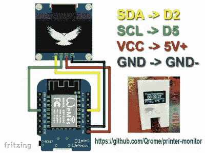

# ESP8266 监视器关注 OctoPrint

> 原文：<https://hackaday.com/2018/11/05/esp8266-monitor-keeps-an-eye-on-octoprint/>

至此，你几乎肯定听说过 OctoPrint。3D 打印机基于网络的控制界面特别受那些主要计算机运行的操作系统有偶尔崩溃倾向的人的欢迎。即使你没有在常见的软件障碍下工作，OctoPrint 也提供了大量引人注目的功能。其中最主要的可能是通过网络监控你的打印机，如果你坚持的话，还可以通过互联网。但是，虽然 OctoPrint 提供了让你的打印机上网的服务器端，但对于客户机来说，你只能靠自己了。

 【大卫·佩恩】没有像 peon 那样使用网络浏览器，而是使用 WeMos D1 Mini ESP8266 板设计出了一个非常光滑的桌面 [OctoPrint 显示器。由于零件数量非常少，并且装在(还有什么)3D 打印外壳中，这是一个便宜而简单的 OctoPrint 附件，我们怀疑它将在不久后装饰许多黑客的桌子。](https://www.instructables.com/id/3D-Printer-Monitor-Wemos-D1-Mini-ESP8266/)

电子设备非常简单，只需将一个 128×64 有机发光二极管·I2C 显示器的 4 根电线连接到 ESP8266 电路板的相应引脚上，就可以上传[David]提供的 Arduino 代码了。

他的代码非常完美，从使用 WiFiManager 进行初始网络设置，到提供自己的基于 web 的配置菜单来将设备链接到 OctoPrint 实例，[David]显然希望最终用户的体验尽可能流畅。当 3D 打印机不工作时，显示器甚至会切换到显示时间和天气。我们已经看到一些商业产品并不如此用户友好。

我们也喜欢这个小玩意的外壳设计。虽然美学可能有争议(有点让我们想起达尔文的小家伙们)，但我们欣赏任何不需要支撑的功能性印刷品。你需要提供几个小螺丝来固定背板，但除此之外，所有东西都固定到位。

当然，你可以一直用你的智能手机关注 OctoPrint ，即使远程管理功能不能引起你的兴趣，[还有很多有趣的插件让你忙个不停](http://hackaday.com/2018/07/02/coolest-way-to-watch-3d-printing-lights-camera-octolapse/)。

 [https://www.youtube.com/embed/niRv9SCgAPk?version=3&rel=1&showsearch=0&showinfo=1&iv_load_policy=1&fs=1&hl=en-US&autohide=2&wmode=transparent](https://www.youtube.com/embed/niRv9SCgAPk?version=3&rel=1&showsearch=0&showinfo=1&iv_load_policy=1&fs=1&hl=en-US&autohide=2&wmode=transparent)

