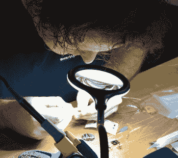
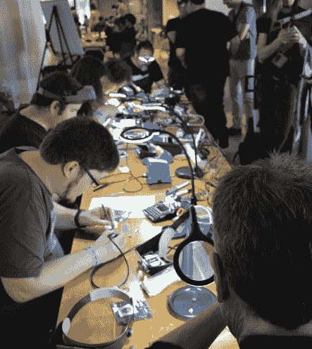
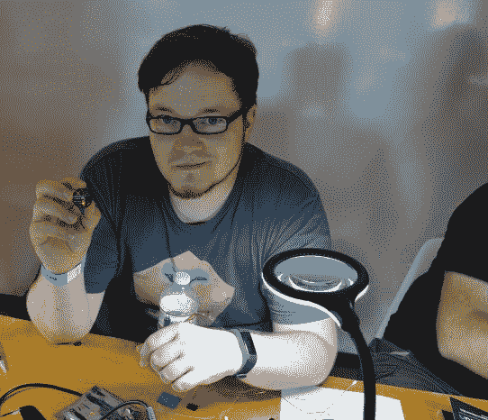
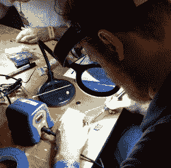
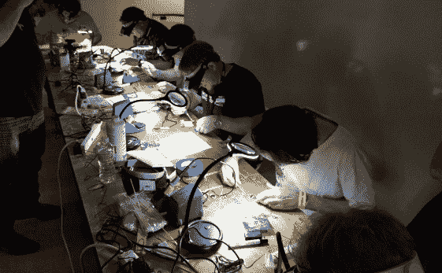
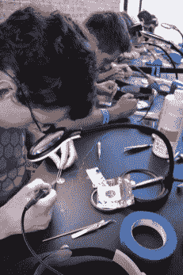
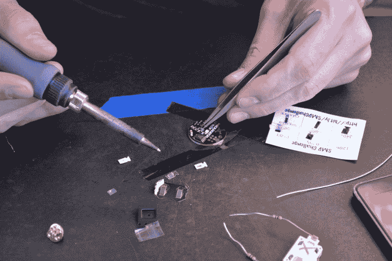

# Hackaday 超级大会上竞争激烈的焊接

> 原文：<https://hackaday.com/2018/11/03/competitive-soldering-gets-heated-at-hackaday-superconference/>

[黑客日超级大会](https://hackaday.io/superconference/)正在如火如荼地进行，除了最伟大的硬件黑客、修补匠的大聚会、精彩的演讲、徽章黑客等等，我们还举办了竞争性焊接。今年，我们让焊接与[的 SMD 焊接挑战](https://hackaday.io/event/162043-smd-soldering-challenge-at-2018-supercon)竞争。这始于周五早上，黑客们热火朝天，手工焊接令人沮丧的微小零件。

规则很简单:给你一盏灯、一个放大镜、一些焊料、灯芯、助焊剂和标准的 Hakko 烙铁(带标准尖端)。任务是焊接我们自己的特殊版本的 makers box SMD 挑战套件，包括一个 SOIC8 ATtiny85，用于驱动 1206、0805、0603、0402 和 0201 封装中的 LED/电阻对。评分基于时间、完成度、功能性、整洁度和焊点质量。愿最稳健的手和最敏锐的眼睛获胜。

我们已经经历了 SMD 焊接挑战的几轮预赛，六名黑客坐下来，有五分钟的检查时间，然后拿出他们的烙铁。所有这些都由我们自己的[Al Williams]负责，他是优秀焊接的最终仲裁者。这是一个令人惊叹的竞争，如果你不认为 0201 封装是可手工焊接的，你就没有见过 Hackaday Supercon 的与会者。顺便说一下，完成整个挑战的最高时间在 20-30 分钟之间，[Sprite_tm]目前位于排行榜的首位。

你可以在我们的直播流上查看 Hackaday 超级会议[的所有演讲，稍后我们将(最终)宣布 SMD 焊接挑战的获胜者和徽章黑客竞赛的获胜者。不要错过今晚晚些时候公布的 2018 Hackaday 奖](https://www.youtube.com/c/hackaday/live)得主[！](https://hackaday.io/prize)

      Competitive soldering            Kapton tape and tweezers at work