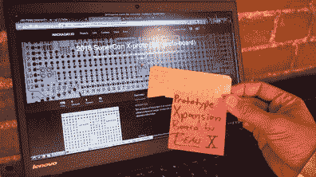
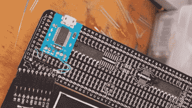
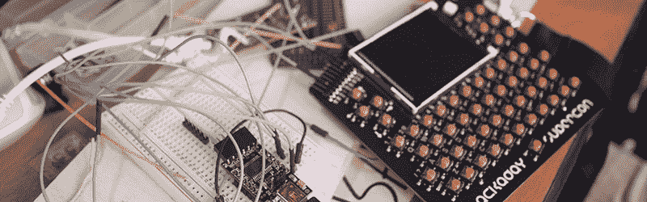
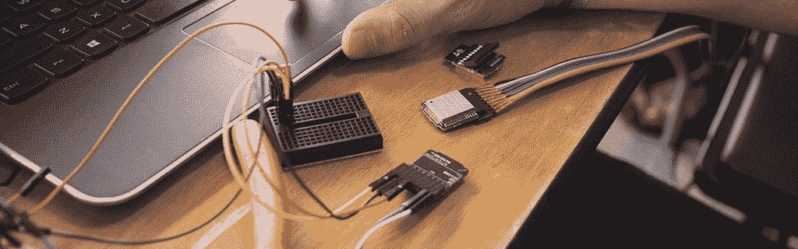
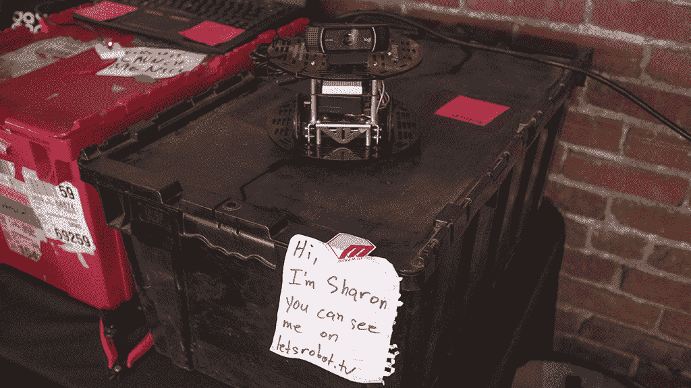

# 绿色 led 表示进行超级警察徽章黑客攻击

> 原文：<https://hackaday.com/2018/11/04/green-led-means-go-for-supercon-badge-hacking/>

除了优秀的演讲者和富有启发性的研讨会，我们还为与会者留出了一块区域，供他们在会议徽章上刻字。除了有徽章和愿意动手之外，没有任何先决条件。从硬件初学者到专业嵌入式系统开发人员，我们欢迎所有技能水平！

上图是[ [4C1dBurn](https://twitter.com/h4ck7h3pl4n37) ]创作的一个自由形状的 LED 灯光雕塑，他刚刚学会焊接，这就是一项新技能如何付诸实践的。背景是徽章黑客竞技场:7 张桌子排成一排，每张桌子 6 个座位。上午 9 点开门，几乎所有的座位在上午 9:30 都坐满了。人们离开去参加一个讲座或研讨会，其他人来填补空缺，这是一个持续的流动。

在我们的[硬件黑客概述](https://hackaday.com/2018/10/25/supercon-badge-hardware-hacking-heres-what-to-bring/)中，我们分享了一个由 badge 使用移位寄存器控制的 LED 阵列[的例子。几个徽章黑客建立在这个想法之上。[X]正在为表面贴装 led](https://hackaday.io/project/162054-shift-register-for-supercon-badge)制作一个版本，而[[macegr](https://twitter.com/macegr)的变体在板上集成了 USB 到串行适配器，以减少电线混乱。他称之为“生活质量的提高”,我们认为这很棒。

    

电线杂乱的任何减少只会有助于分散在各处的电线的许多辉煌的爆炸。这个特殊的例子是[[carfucar](https://twitter.com/carfucar)]将一个徽章变成一个大阵列 WS2812B LED 灯条的无线遥控器的一个进展中的工作。

根据我们在硬件黑客概述中的行动号召，至少有两项工作正在进行中，以将无线通信功能添加到徽章中。[ [Preston](https://github.com/ptone) ]在教授徽章与 AVR-IoT 模块对话方面取得了良好的进展。[ [摩根](https://hackaday.io/captain.morgan)和[ [本](https://twitter.com/im889) ]正在用 ESP32s 构建网状网络。如果它开始运行，他们已经带来了一堆 ESP32s 来添加更多的节点到他们的网络。

对于目前正在进行的会谈，请进入 [Supercon 活动页面](https://hackaday.io/superconference/)，点击右上角的“直播”查看官方直播。徽章黑客攻击将在整个 Supercon 继续进行，其中部分将通过非官方的[徽章黑客攻击直播](https://letsrobot.tv/robocaster/h4x0r)从像【X】的机器人【Sharon】这样的参与者处可见。

