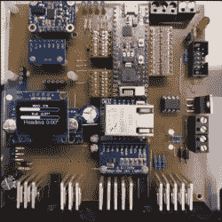

# 由于 ESP32 和开源，拖拉机可以自动驾驶

> 原文：<https://hackaday.com/2018/11/09/tractor-drives-itself-thanks-to-esp32-and-open-source/>

【coffee TRAC】的基于 ESP32 的 Autosteer 控制器板，配有~~老式~~有机发光二极管显示器，用于调试和方便的状态参考。

现代农业设备已经取得了长足的进步，包括各种智能功能和电子控制。虽然一些制造商更愿意成为这些高级功能的唯一守门人，但这并没有阻止好奇和有进取心的人们努力寻找 DIY 解决方案。一个这样的例子是[这个由【Coffeetrac】制作的自动转向拖拉机演示](https://www.youtube.com/watch?v=SL1M6wUr3jA)，它演示了如何让计算机绘制并引导拖拉机通过最佳覆盖模式。

需要将一些不同的部分组合在一起，才能使这一切正常工作。这一切的核心是[Coffeetrac]基于 [ESP32 的 Autosteer 控制器](https://github.com/Coffeetrac/Autosteer_ESP)，它是连接拖拉机的硬件，允许转向和电子读取传感器。 [AgOpenGPS](https://agopengps.jimdosite.com/) 是读取 GPS 数据，与 Autosteer 控制器接口，告诉设备做什么的软件；它可以被认为是一个任务规划器。

[Coffeetrac]通过安装在拖拉机驾驶室中的平板电脑控制所有这些。视频嵌在下面，通过网络摄像头完成了“驾驶舱视图”，旁边是绘制的路线和传感器数据。

 [https://www.youtube.com/embed/SL1M6wUr3jA?version=3&rel=1&showsearch=0&showinfo=1&iv_load_policy=1&fs=1&hl=en-US&autohide=2&wmode=transparent](https://www.youtube.com/embed/SL1M6wUr3jA?version=3&rel=1&showsearch=0&showinfo=1&iv_load_policy=1&fs=1&hl=en-US&autohide=2&wmode=transparent)

我们之前曾报道过 John Deere 与 DRM 的恋情，这体现了该行业的大部分努力方向。但并不是一切都是为了做得更多更快。其他项目如[除草机](https://hackaday.io/project/53896)旨在小规模自动化，目标是提高质量和可持续性。

非常感谢[Baldpower]发送了这个提示！