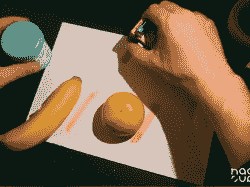

# Sprite_TM 的神奇画笔

> 原文：<https://hackaday.com/2018/11/12/sprite_tms-magic-paintbrush/>

说到我们热爱的黑客，没有比耶鲁安·多姆伯格更好的例子了。雪碧现在为神奇的 ESP8266 和 ESP32 的制造商 Espressif 工作，在那里他创造了一个微型游戏机，并将这个袖珍雪碧变成了真正的产品。他在硬盘上安装了 T2 的 Linux 操作系统 T3，并创建了 T4 虚拟电子鸡 T5。简而言之，如果你正在寻找一个正在建造最酷、最有技术含量的*东西*的人，你只需要看看 Sprite_tm 就可以了。

Sprite 回到了今年的超级大会，他再次带来了令人敬畏的硬件黑客大枪。不过，这一次，雪碧正在挖掘他艺术的一面。Sprite 在制作 PCB 艺术和 DaveCAD 图纸方面非常出色，但实际的艺术是遥不可及的。没问题，因为你可以买一台喷墨打印机，制作你自己的艺术作品。雪碧正在做一些不同的事情，他正在把他的喷墨打印机变成一支神奇的画笔。

 [https://www.youtube.com/embed/KjACWDPQ8nw?version=3&rel=1&showsearch=0&showinfo=1&iv_load_policy=1&fs=1&hl=en-US&autohide=2&wmode=transparent](https://www.youtube.com/embed/KjACWDPQ8nw?version=3&rel=1&showsearch=0&showinfo=1&iv_load_policy=1&fs=1&hl=en-US&autohide=2&wmode=transparent)

The schematic for the first inkjet cartridge

这个黑客从花 28 美元从中国购买一台简单的惠普喷墨打印机开始。这台廉价打印机中有一些有趣的硬件——一个可能运行 Linux 的 ARM 处理器，一个所有代码都完全未加密的 big 'ol 串行闪存芯片，还有一个输出调试信息的串行端口。在打印机托架本身上，有一个编码器，但真正的故事是在墨盒本身。喷墨墨盒比打印机本身贵是有原因的。在每个喷墨墨盒里，都有一个墨水容器和一系列小孔。就在这些洞旁边，有一个小加热元件。当电流施加到加热元件上时，墨水就会沸腾(是的，这就是“Bubblejet”商标的由来)，并从喷嘴喷射到一张纸上。

第一个惠普墨盒有 12 个这样的喷嘴，这很容易从计算机或微控制器直接控制。然而，为了打印得更快，你需要更多的喷嘴，这意味着更多的加热元件。为了做到这一点，惠普工程师只需将喷嘴布置成网格，并用 MOSFET 和矩阵控制每个喷嘴，这些矩阵将单独加热这些喷嘴。Sprite 打印机中的惠普墨盒要复杂得多，在移除打印机墨盒上的金属掩模并仔细检查下面的硅之后，他看到了数百个喷嘴，所有喷嘴都通过几个引脚控制。没关系，因为示波器是存在的，这是最终可以被逆向工程的东西。

试了几次后，Sprite 让他的喷墨墨盒喷得到处都是墨水，这意味着只有一件事:他必须把它变成一个可以画任何颜色的魔法标记。不久之后，KiCAD 和 Sprite 有了一个 PCB，包裹着墨盒，可以在任何东西上打印 nyan 猫。

 当然，能够在从皮肤到拿铁的一切东西上打印 nyan 猫很酷，但只要简单地添加一个颜色传感器，Sprite 的魔法标记器就可以成为任何颜色的标记器。是的，如果你把这支魔法笔举到香蕉旁边，它会用黄色书写。把它举到苹果面前，它会变成绿色或红色。如果这听起来很熟悉，你是对的:这是 Kickstarter 永久骗局背后的想法，[涂鸦笔，](https://hackaday.com/2014/09/04/scribble-and-the-failings-of-tech-journalism/)但这一个有效。

如果你没有看过视频，请看看。雪碧的演示既幽默又有趣，同时还具有知识性和技术性。再次感谢雪碧的精彩演讲！