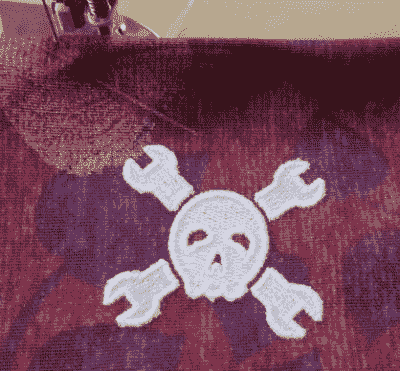

# 数控刺绣机一次冲压出一针图案

> 原文：<https://hackaday.com/2018/11/17/cnc-embroidery-machine-punches-out-designs-a-stitch-at-a-time/>

值得怀疑的是，早期的 CNC 先驱们能够想象出这项技术的应用范围。曾经仅限于切割金属的数控机器现在可以使用激光和高压水射流刺穿材料，喷射熔化的塑料来构建 3D 物体，并且[显然甚至使用针和线来创建刺绣设计](https://inkstitch.org/tutorials/embroidery-machine/)。

 这可能看起来不像一个典型的数控应用，但[詹姆斯·科尔梅]的数控刺绣机看起来肯定很熟悉。坐在我们见过的最漂亮的缝纫机前面的是一个相当典型的 X-Y 龙门系统。步进器控制的龙门移动缝纫机针下的刺绣环，实际上是机器的 Z 轴。在布料被正确放置后，一个 NEMA 23 步进器通过链轮和传动链连接到缝纫机上，形成一针一线，慢慢地形成一个图案。将刺绣图案翻译成 g 代码是通过 Inkstitch 完成的，并扩展到 Inkscape。[詹姆斯]“写得很好，下面的视频展示了它的实际应用。

我们之前已经见过[一台数控刺绣机](https://hackaday.com/2018/02/21/vintage-sewing-machine-to-computerized-embroidery-machine/)或[两台](https://hackaday.com/2014/06/10/diy-embroidery-machine-sews-your-name-in-your-undies/)，但我们明显没有刺绣的帽子在这一台上向【詹姆斯】致敬，因为它的建造质量和文档。刺绣的快乐扳手也不会痛。

 [https://www.youtube.com/embed/0lERsPc5gEk?version=3&rel=1&showsearch=0&showinfo=1&iv_load_policy=1&fs=1&hl=en-US&autohide=2&wmode=transparent](https://www.youtube.com/embed/0lERsPc5gEk?version=3&rel=1&showsearch=0&showinfo=1&iv_load_policy=1&fs=1&hl=en-US&autohide=2&wmode=transparent)

谢谢，[baldpower]！