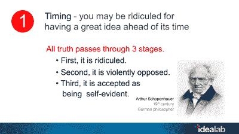

# 比尔·格罗斯谈为什么你的创业会成功

> 原文：<https://hackaday.com/2018/11/27/bill-gross-on-why-your-startup-will-succeed/>

谈到科技孵化器，比尔·格罗斯是一个伟大的英雄。20 年前，他创立了 Idealab 公司，其商业计划是创造更多的企业。这个项目在 1996 年开始时只有几家公司，从那以后已经建立了 150 家公司，总共筹集了 35 亿美元。在这些公司中，超过一半的公司要么已经成功上市和收购，要么目前正在运营。这项投资产生了 13.5 倍的回报，并创造了 10，000 多个就业岗位。

显然，当你想谈论成功创业的要素时，比尔·格罗斯是你想找的人。我们很高兴今年他在 Hackaday Superconference 上做了主题演讲，他分享的经验可能会让你大吃一惊，尤其是如果你有兴趣自己创业的话。

 [https://www.youtube.com/embed/-66i7vM00vo?version=3&rel=1&showsearch=0&showinfo=1&iv_load_policy=1&fs=1&hl=en-US&autohide=2&wmode=transparent](https://www.youtube.com/embed/-66i7vM00vo?version=3&rel=1&showsearch=0&showinfo=1&iv_load_policy=1&fs=1&hl=en-US&autohide=2&wmode=transparent)

## 给创业公司的教训:

 比尔给超级公司的人和任何企业家上了几课，总结起来有七点。首先，时机就是一切。如果埃隆在 2000 年创立特斯拉，它早就失败了；电池技术还不存在。第二，找到一个反向但真实的想法。同样，我们的 Elon 提供了另一个例子——火箭科学*是*火箭科学，航空航天业不会被颠覆，因为它都与政府合同挂钩。事实证明，即使你不是波音公司，你也确实可以制造火箭并找到付费客户。

## 给所有公司的教训:

这些都是简单的想法，但是接下来比尔谈到的几点更多的是关于建立一个成功的公司，而不仅仅是开一家公司。任何一家公司的目标都是成为一家成功的公司，这意味着要以高股权参与度来构建公司。如果员工被投资到一个公司，他们会更加努力。此外，产品与市场的契合度也是全部。你需要迭代，你需要让你的客户感兴趣。公司创始人的工作是建立一个互补的团队——你不可能面面俱到——你应该雇佣最好的人，获得最好的投资者，并激励你的团队。

虽然 Hackaday 超级会议名义上是关于硬件的，但我敢肯定，很多与会者和 Hackaday 的读者都对创业感兴趣。毕竟，我们在这里不仅仅是为了建造某样东西。几十个 Hackaday 奖项的参赛作品已经成为可持续发展的业务，甚至 Hackaday 的作家也用他们的硬件设计涉足业务发展领域；例如， [Mooltipass](https://www.tindie.com/products/stephanelec/mooltipass-mini-offline-password-keeper/?pt=ac_prod_search) 最早是在 Hackaday 上开发的。

比尔的人生故事和他从三十多年和数百家企业中学到的技巧和诀窍对每个人来说都是无价的。从他保证每一项努力都将花费时间在“绝望的黑暗沼泽”中，到他剖析一个互补团队取得成功所需的特质，这是一个每个人都必须观看的精彩演讲。

### 比尔·格罗斯:我希望 30 年前有人告诉我的事情

1.  时机——你可能会因为有超前的伟大想法而被嘲笑
2.  想法——找到正确的反向想法
3.  不要对稀释敏感，要对成功敏感
4.  这不仅仅是产品与市场的契合度，而是产品与市场的契合度
5.  坚持——创造伟大事物的情感旅程
6.  建立一个互补的团队——性格类型&公司的阶段
7.  最好的企业家是善于讲故事的人