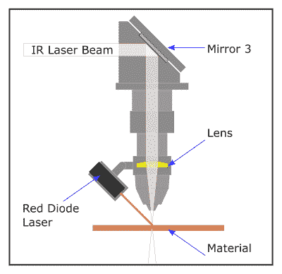

# 激光切割机瞄准的方式和原因

> 原文：<https://hackaday.com/2018/11/09/the-how-and-why-of-laser-cutter-aiming/>

激光爱好者[Martin Raynsford]多年来积累了各种激光切割机的经验，并认为他应该写一篇博客，详细介绍他的第一手发现，以及这些机器经常被忽视的一个方面:瞄准它们。廉价的二极管激光切割机和雕刻机在光谱的可见光部分工作，但当你进入更强大的二氧化碳激光器时，如流行的 K40 机器中使用的那种，红外光束是肉眼不可见的。次级低功率激光器有助于在不实际切割目标的情况下观察主激光器的对准。有几种方法可以安装这样的瞄准系统，但是哪种方法更好呢？

 【马丁】解释说，基本上有两种思想流派:头戴式激光器，或者光束组合器。在这两种情况下，一个小的红色二极管激光器(激光笔中使用的那种)被用来指示主激光将击中的位置。这使得用户可以确切地看到激光切割机在激活时会做什么，如果你正在做像雕刻设备这样的事情，并且只有一次机会做对，这是非常重要的。在启动主激光器之前，用红色激光器运行“模拟”消除了任何疑问。

反正就是这个想法。根据他的经验，这两种方法都有各自的问题。头戴式激光器更容易安装和维护，但它们的精度会随着机器 Z 轴的移动而变化:随着头部的上下移动，红色激光点会水平移动，并很快失去对准。理论上，使用光束组合器的方法应该更准确，但是[马丁]指出，他很难让红色和红外激光通过机器的镜子遵循相同的路线。不仅调整起来很棘手，而且实现起来也复杂得多，由于涉及到额外的光学器件，甚至可能会剥夺激光器的功率。

最终，[马丁]并不认为真的有一个明确的赢家。这两种方法都不能给出 100%准确的结果，而且都很挑剔，尽管在不同的场景下。他建议你使用工厂提供的激光切割机的任何方法，因为试图改变它可能不值得努力。但是，如果你的机器目前没有任何东西，头戴式激光器肯定是更容易改造的。

在过去，我们已经介绍了第三种稍微有点非传统的 K40 瞄准方式，以及任何想要拿起易贝最喜欢的激光切割机的[的人的通用入门。](https://hackaday.com/2018/09/27/laser-noob-getting-started-with-the-k40-laser/)