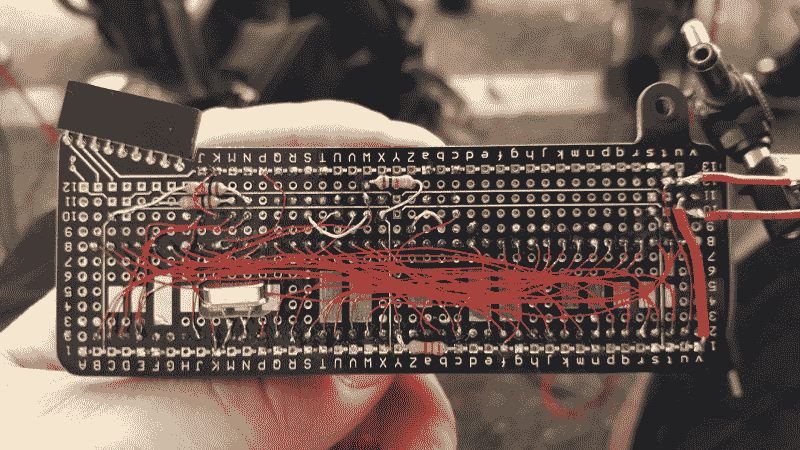

# 苹果 1 模拟器是一个完美的适合超级徽章

> 原文：<https://hackaday.com/2018/11/13/apple-1-emulator-is-a-perfect-fit-for-supercon-badge/>

Supercon 徽章黑客必须在周日晚上 6 点之前准备好展示他们的演示。这个无情的固定期限意味着舞台上的每个徽章黑客都代表着时间管理的成就，以及一些运气，除了他们自己的技术优点。但这个截止日期也意味着一些梦幻般的项目失去了与时间的赛跑。我们支持[Jac Goudsmit]构建一个 Apple I 模拟器作为他的徽章扩展，但当我们的徽章破解仪式开始时，他还没有完全完成。在 Supercon 之后，他回家了，完成了项目，并在一份详细的书面报告中记录了所有的事情。

我们的[2018 super co 徽章](https://hackaday.com/2018/10/17/the-supercon-badge-is-a-freakin-computer/)是建立在复古计算主题上的，默认固件带有一个基本的解释器以及一个运行 CP/M 的 Z80 仿真器。因此，Apple 1 仿真器应该与它的同时代产品有相同的感觉。从机械的角度来说，所有的部件都紧密地安装在发给每位与会者的徽章扩展板上。如此之紧，以至于[Jac]不得不将两个主芯片锉平，以便并排安装。扩展板上类似试验板的连接孔图案，旨在帮助初学者轻松进行徽章 hack 焊接，但在这种紧凑的布置中证明是不方便的。

在[Jac]投入的所有工作中，当知道他只有 5 分钟的焊接时间和 30 分钟的编码时间时，这是令人心碎的。时间压力是每个超级徽章黑客面临的挑战的一部分，虽然我们很难过 Jac 错过了舞台时间的最后期限，但我们很高兴看到他完成并写下这一切。我们希望每个徽章黑客将写下他们疯狂的周末项目的故事。鼓励那些在 [hackaday.io](https://hackaday.io) 上这样做的人给他们的项目贴上“超级”标签，并把它们添加到我们的[徽章黑客列表](https://hackaday.io/list/162221-2018-supercon-badge-hacks)中，供每个人欣赏。