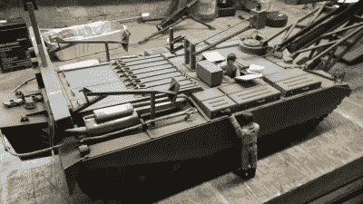

# 百夫长桥梁层，现在在钢筋混凝土

> 原文：<https://hackaday.com/2018/11/14/centurion-bridge-layer-now-in-rc/>

无线电控制模型非常有趣。我们大多数人小时候都有过几辆遥控汽车，偶尔可能会玩玩直升机或无人机。然而，这是一种罕见的建模者，能够驾驶无线电控制的桥梁铺设坦克。

The lads prepare to fight the good fight.

该模型是英国百夫长架桥兵的复制品，这是一种改进的坦克，旨在使机械化部队能够在欧洲战场上轻松穿越河流和类似的障碍。虽然真正的文章依赖于液压，钢筋混凝土版本采取了不同的策略。[hawkeye3guns]用马达、齿轮和黄铜制造了定制的线性致动器来部署舰桥。

该构建展示了进取建模者的其他智能技术。“百夫长”不是从零开始，而是在一艘改装的 KV 坦克船体上建造。改装完成后，坦克被涂上了必要的英国军绿色。最后的结果相当令人印象深刻。

它显示了一些现成的零件和独创性可以实现什么。我们以前见过其他令人印象深刻的遥控坦克——像这个法国制造的自制瞄准计算机。