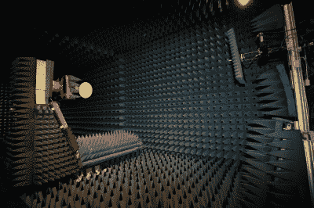

# 暗室测试的一瞥

> 原文：<https://hackaday.com/2018/11/17/a-sneak-peek-at-anechoic-chamber-testing/>

[Mathieu Stephan]正在研究新的东西，虽然他还没有准备好揭开它的神秘面纱，但他还是记录下了他在消声室里测试这个神秘的新玩意的经历。考虑到我们中的大多数人永远不会进入这些房间，更不用说有机会在其中测试我们自己的硬件，他认为这是他至少可以做到的。

 如果你不熟悉电波暗室，也不要觉得不好。这并不完全是你在当地创客空间会有的那种东西。简而言之，这个房间的设计不仅是为了消除内部的回声，也是为了与外部完全隔离。但是我们不只是在谈论隔音，这个原理也可以适用于电磁波。因此，在消声室内部不仅是听觉上的无声，也可以是无线电上的无声。

如果你想测试天线之类的东西的性能，这是很重要的，因为它允许你排除外部干扰。正如[Mathieu]解释的那样，接收器和发射器都可以放在小室中，并连接到矢量网络分析仪(VNA)上。该设备能够量化两个设备之间传输的能量，但只有当这是 VNA 在其输入端口上看到的唯一内容时，结果才会准确。

[Mathieu]不能透露硬件的图像或分析的结果，因为这会在这一点上泄露太多，但他在休息后提供了经过巧妙编辑的视频，以及一些关于天线分析的通用信息和人们从这种测试中获得的结果类型。如果你想继续通过其他人的叙述来替代生活，我们自己的[【珍妮列表】有更多关于这个主题的信息。对于我们其他人来说，我们只能满足于](https://hackaday.com/2017/02/20/an-overview-of-the-dreaded-emc-tests/)[一些铁丝网和一个木箱。](http://hackaday.com/2018/09/26/building-a-hardware-store-faraday-cage/)

 [https://www.youtube.com/embed/giwDKEiCaX0?version=3&rel=1&showsearch=0&showinfo=1&iv_load_policy=1&fs=1&hl=en-US&autohide=2&wmode=transparent](https://www.youtube.com/embed/giwDKEiCaX0?version=3&rel=1&showsearch=0&showinfo=1&iv_load_policy=1&fs=1&hl=en-US&autohide=2&wmode=transparent)

