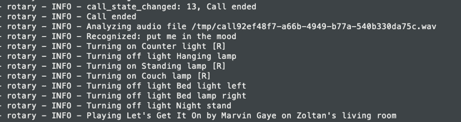

# 老式旋转电话变成虚拟助理

> 原文：<https://hackaday.com/2018/11/17/vintage-rotary-phone-turned-virtual-assistant/>

像我们许多人一样，[Zoltan·托特-齐弗拉]已经完全接受了 21 世纪的生活。他的家里充斥着各种智能设备和 dodads，从变色灯泡到联网摄像头。但他也对老式硬件的外观和感觉情有独钟，比如他一直在踢来踢去的旋转式电话，让他想起了过去的日子。他最近决定将旋转式电话变成一个现代的声控助手，从而在这两个世界之间架起一座桥梁。

难题的第一部分是将老式的学校电话连接到更现代的东西上，也就是树莓派。他不想拆开老式手机，所以他拿起了 Grandstream HT801，这是一种用于将模拟电话转换为 VoIP 的适配器。[Zoltan]说这种型号特别适合这个要求，因为它有一个功能，可以让你配置一个电话号码，一拿起听筒就拨打。这使得用户只需拿起电话就可以开始通话，而不必手动拨号。如果你想完成一个类似的设置，你应该在扣动扳机之前检查确保适配器有这个功能。

随着旋转式电话现在谈论一个更现代的协议，[Zoltan]只需要得到树莓派方面的整理。他安装了一个 SIP 服务器，这样它就可以与 HT801 适配器通信，然后开始组装他的虚拟助手。他没有插入现有的系统，而是通过将用于控制各种智能设备的开源包与名副其实的 Python 语音识别库结合起来，推出了自己的系统。

目前，他只编写了一些命令，他的系统可以响应这些命令来控制他的灯光和音乐，但他提到，该系统足够模块化，他可以轻松地添加新功能。他把虚拟助手框架的[源代码放到了 GitHub](https://github.com/tcz/rotary) 上，他指出这是用不到 200 行源代码编写的，因为利用了现有的库来完成大量繁重的工作。开源是一件美好的事情。

在过去，我们已经看到[旋转式手机由于 GSM 升级而变得移动](https://hackaday.com/2015/11/18/old-school-rotary-phone-gets-gsm-upgrade/)并且通过内置的树莓派把又踢又叫的[拖进现代电话网络。但我们认为,( Zoltan)采取的保留手机原始硬件的方法特别有吸引力。](https://hackaday.com/2015/03/09/convert-a-rotary-phone-to-voip-using-raspberry-pi/)

 [https://www.youtube.com/embed/0aUafbHrKxA?version=3&rel=1&showsearch=0&showinfo=1&iv_load_policy=1&fs=1&hl=en-US&autohide=2&wmode=transparent](https://www.youtube.com/embed/0aUafbHrKxA?version=3&rel=1&showsearch=0&showinfo=1&iv_load_policy=1&fs=1&hl=en-US&autohide=2&wmode=transparent)

