# 收集、修理和佩戴古董电子表

> 原文：<https://hackaday.com/2018/11/28/collecting-repairing-and-wearing-vintage-digital-watches/>

电子发烧友有机会站在复古数字手表(VDW)潮流的最前沿。老式数字手表是指从 70 年代末到整个 80 年代的手表。它们不同于今天的任何手表风格，对于任何初次亮相的人来说，这些手表都带来了健康的怀旧情绪。

从金钱上来说，付钱给手表制造商来修复数字手表是不值得的，但对于我们这些拥有基本电子技术的人来说，我们可以花时间和精力让它们再次运行，并成为少数几个拥有功能 VDW 的人之一。这是一种声明，也是你自身能力的标志。

今年早些时候，Steven Dufresne [带我们回顾了数字手表](https://hackaday.com/2018/03/19/inventing-the-digital-watch-again-and-again-and/)的历史。在这篇文章中，我们将深入到老式数码手表维修的世界。

## LED 手表很难买到

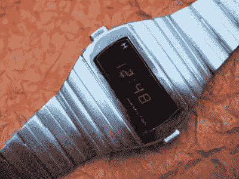

LED 手表是最早的数字手表，因为 LED 显示技术先于 LCD 技术。第一款商用 LED 手表是 1972 年推出的[汉密尔顿时间计算机](https://www.wired.com/2015/03/tech-time-warp-week-1972-digital-watch-cost-car/)，随后出现了许多其他产品。凭借 LED 技术，美国手表制造商[在 70 年代早期主导了数字手表市场](https://www.bloomberg.com/news/articles/2018-02-27/before-apple-america-dominated-watchmaking-then-history-forgot)

这些早期的数字手表消耗大量的电力，即使在轻度使用的情况下，每三到六个月也会烧光电池。大多数 LED 手表都有星期、日期、月份、秒和万年历。有些甚至以字母数字段显示日期为特色。很难找到可用的 LED VDWs。计划支付一个公平的市场价值，或者购买大量模块(模块是 VDW 机芯的名称)或完整的手表，使一个工作。鉴于这种稀缺，如果你能让 LED 工作，你将成为极客之王。

 [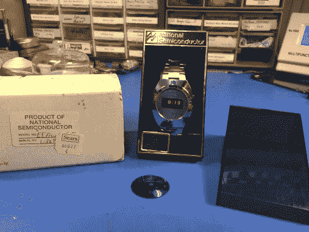](https://hackaday.com/2018/11/28/collecting-repairing-and-wearing-vintage-digital-watches/nos-vdw-led/)  [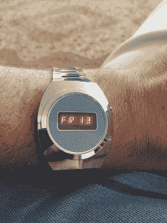](https://hackaday.com/2018/11/28/collecting-repairing-and-wearing-vintage-digital-watches/friday-the-13th-on-led-watch/) 

我买了这块手表，由国家半导体公司制造，作为新老库存(NOS)。它完全没电了，并且受到电池腐蚀，甚至损坏了连接到 IC 的焊线。我最后又买了两块手表，才让这块手表正常工作。

## **20 世纪 70 年代的液晶显示(LCD)手表**

如果你想穿不同的衣服，可以考虑 70 年代中后期的 LCD VDW。这些手表相当便宜，易于维修，大多数时候只需要清洁电池和按钮接触端子。

 [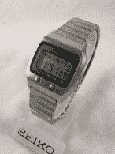](https://hackaday.com/2018/11/28/collecting-repairing-and-wearing-vintage-digital-watches/4315d38e14450943cfd5bdc8ea1d675f/)  [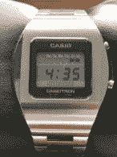](https://hackaday.com/2018/11/28/collecting-repairing-and-wearing-vintage-digital-watches/c15e8633-d726-41a5-b7b2-d7f04fa23ee4/)  [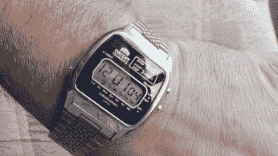](https://hackaday.com/2018/11/28/collecting-repairing-and-wearing-vintage-digital-watches/maxresdefault-10/)  [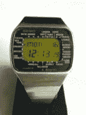](https://hackaday.com/2018/11/28/collecting-repairing-and-wearing-vintage-digital-watches/seiko-pan-am/) 

有了 1970 年的 VDWs，你可以找到从万年历、计时表、闹钟到世界计时器的所有东西。在 20 世纪 70 年代，数字表壳建造过度，又大又重。这些大胆的设计在今天仍然适用。

## 飞兆半导体、国家半导体、Commodore 计算机公司、德州仪器

我们年轻一代的传奇科技公司只有一个共同点；他们都在 20 世纪 70 年代制造数字手表。显然，销售价格和商品成本与这些科技巨头的商业计划一致，包括；Commodore 计算机、国家半导体、德州仪器和飞兆半导体。

 [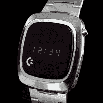](https://hackaday.com/2018/11/28/collecting-repairing-and-wearing-vintage-digital-watches/commodore1/)  [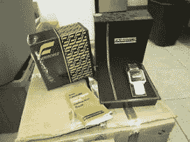](https://hackaday.com/2018/11/28/collecting-repairing-and-wearing-vintage-digital-watches/fairchild-watch/)  [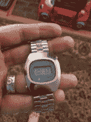](https://hackaday.com/2018/11/28/collecting-repairing-and-wearing-vintage-digital-watches/natl-semi/)  [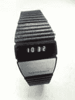](https://hackaday.com/2018/11/28/collecting-repairing-and-wearing-vintage-digital-watches/texas-instruments-watch/) 

## 计算器手表

迈克尔·J·福克斯穿着它参加了有史以来最具标志性的电气工程活动*回到未来*。在影片中，他穿着卡西欧 CA-50。令人惊讶的是，今天你可以用 18-24 美元[买到一台新的](https://www.nautica.com/long-sleeve-quarter-zip-sweater/SR8309.html?dwvar_SR8309_color=303&dwvar_SR8309_size=0105)。

 [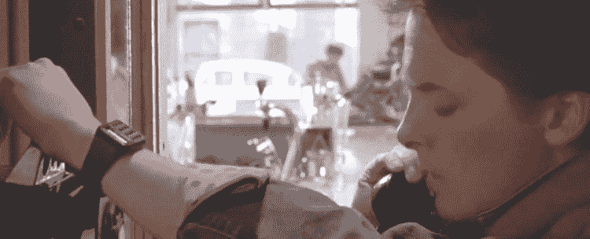](https://hackaday.com/2018/11/28/collecting-repairing-and-wearing-vintage-digital-watches/back-to-the-future-marty-mcfly-s-calculator-watch-750x304/)  [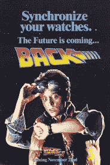](https://hackaday.com/2018/11/28/collecting-repairing-and-wearing-vintage-digital-watches/download-8/)  [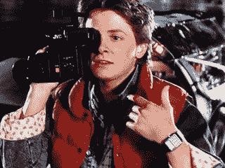](https://hackaday.com/2018/11/28/collecting-repairing-and-wearing-vintage-digital-watches/53446ae56da811fb7872c350-320-240/) 

如果这还不够酷，那么可以考虑 70 年代末的计算器手表，其中许多手表都有不锈钢按钮。在我收藏的所有手表中，下面这张照片最受关注。我喜欢告诉我年幼的女儿，这只手表上有一个“精灵键盘”。

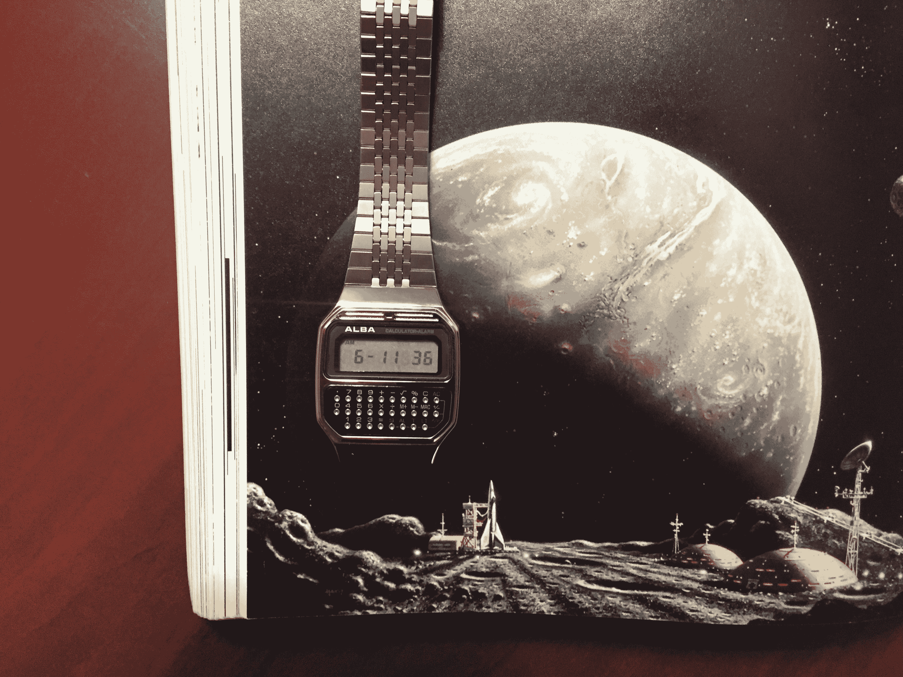

但是如果你认为简单的乘法、除法、加法和减法手表不足以满足你的需求，那么你应该考虑升级到科学计算器手表，比如下图所示的卡西欧 CFX-200。看看那些按钮！

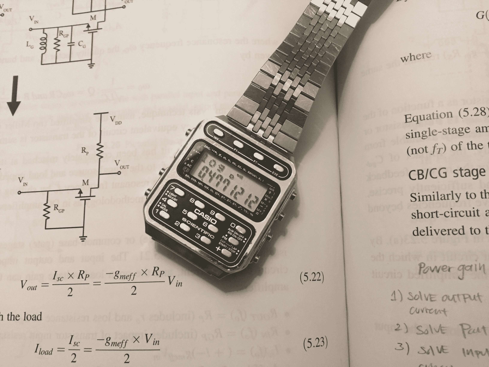

## 首款智能手表，精工 UC-2000

BASIC 是 20 世纪 80 年代的编程语言，如果你想在手腕上运行 BASIC 程序，只有一种方法；配精工 UC-2000 和 3000 系列手表:

 [https://www.youtube.com/embed/bc4aI9h--NU?version=3&rel=1&showsearch=0&showinfo=1&iv_load_policy=1&fs=1&hl=en-US&autohide=2&wmode=transparent](https://www.youtube.com/embed/bc4aI9h--NU?version=3&rel=1&showsearch=0&showinfo=1&iv_load_policy=1&fs=1&hl=en-US&autohide=2&wmode=transparent)

每一个认真的 VDW 收藏家都必须在她的/他的收藏中有一个这样的。精工 UC-2000 仍然领先于时代，甚至连 Apple watch 都还不能运行基本程序。

## VDW 之王，Ana-Digi

所有 VDW 中的王者是模拟数字(所谓的“anadigi”)。Ana-Digi 的特点是在同一只手表上既有数字显示又有模拟显示。最棒的是模拟显示和数字显示是电子同步的，两者同步。数码制表和机械制表的技术杰作。

     [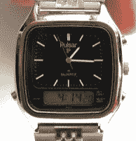](https://hackaday.com/2018/11/28/collecting-repairing-and-wearing-vintage-digital-watches/s-l300/) 

## VDW 社区

手表[收集和维修社区](https://nawcc.org)传统上一直专注于机械计时器，但最近 Tibi Fleseriu 通过他的 [YouTube 频道](https://www.youtube.com/channel/UCgl5Qu5T00E7GMFNkMxby-g)在 VDW 产生了巨大的兴趣和关注。像这个日益增长的爱好中的许多其他人一样，我通过 Tibi 的频道发现了 VDW 的世界。

Tibi 对 VDW 的兴趣始于年轻时，

> *让我开始在 VDWs 工作的是，我一直是一个手表爱好者，但从未对机械表感兴趣，我对高度计表和罗盘表感兴趣，所以你手表中的一些讨厌的电子设备“它能显示时间，还能做这个…”。我最终想在系列中添加一款数字手表，但对今天的新产品不太满意，所以我最终选择了数字手表的全盛时期。而五年后的我却在这里痴迷:)。此外，我一直对电子学特别是早期小型化技术感兴趣。*

Tibi 描述了非典型的 VDW 收集器，

> 她/他首先是一个手表发烧友，但他不是那种渴望劳力士、JLCs 或 Patke Phillippes 的人
> 她/他不渴望我们所说的“高级钟表”产品
> 
> 她/他通常有一个业余爱好，或者更多的爱好，比如老式电子产品、游戏或计算机
> 她/他喜欢摆弄东西，或者至少比换手表电池知道得多一点
> 无论我们谈论的是手表还是电子产品，她/他都是一个书呆子
> 她/他在 70 年代到 90 年代有过一段生活

听起来熟悉吗？你在 VDW 社区有一个家。

## 如何修理 VDW

这是没有办法的事，迟早你的手表会坏，或者你需要一块需要修理的表来让它走。幸运的是，大多数 VDW 维修都在 Hackaday 读者的能力范围之内。作为参考，你会想要一本 [*的电子表维修手册*](http://www.zantechinc.com/store/product.php?id_product=143) ，这是维修电子表的最佳维修手册。一旦你熟悉了 VDW 的工作原理，我建议你观看这个视频，学习如何维修一个普通的 VDW，大多数 VDW 维修甚至都不涉及这个:

 [https://www.youtube.com/embed/T3NBUyX5_LA?version=3&rel=1&showsearch=0&showinfo=1&iv_load_policy=1&fs=1&hl=en-US&autohide=2&wmode=transparent](https://www.youtube.com/embed/T3NBUyX5_LA?version=3&rel=1&showsearch=0&showinfo=1&iv_load_policy=1&fs=1&hl=en-US&autohide=2&wmode=transparent)

结合两种传统的机械制表技术，现在你可以[修理 anadigi，如视频](https://youtu.be/xXDc3V4zq5w)所示。以下是[如何修理 Sieko UC-2000](https://youtu.be/fW6JyqMSbe0) 的方法，Sieko UC-2000 最常见的问题是用于加载和读取手表数据的感应通信线圈损坏。

## 去哪里买

一旦你找到了你的 VDW 缪斯，并渴望为你的收藏买一个，这里是我的建议；

### *买新的:*

进入 VDW 最简单的方法就是买一个新的。卡西欧继续制造自 20 世纪 80 年代以来一直未变的众多型号，包括计算器手表 [CA53W](https://www.casio.com/products/watches/databank/ca53w-1) ，无处不在的 [F91W](https://www.casio.com/products/watches/classic/f91w-1) ，以及[“皇家赌场”](https://www.youtube.com/watch?v=WOBMenHtrGQ)等。有了新手表，你就不必担心弄湿或需要修理了。

### *购买新老股票(数量):*

体验拥有一只 20 世纪 70 年代的新手表。数以百万计的数字手表被生产出来，其中一些从未售出。这些手表被束之高阁，直到在线拍卖网站的出现才被发现。今天你可以找到很多 NOS VDW 手表的例子。

### *购买二手:*

没有什么比二手手表更好的了。这听起来可能很奇怪，手表收藏家喜欢在表壳上留下划痕，在古董表的水晶上留下豁口，因为这能讲述一个故事。换句话说，你手表的磨损类似于一条好牛仔裤的磨损。所以不要担心划痕和磨损。如今，佩戴功能齐全的手表是一种令人向往的外观。

## VDW 的未来

古董表的价值近年来直线上升。如果不支付大约 4 倍于 7、8 年前的价格，我甚至买不起 40 年代晚期的宝路华机芯。同样，电子表也即将受到广大手表界的广泛关注。根据 Tibi 的说法:

> 这些宝石数量有限，他们不再生产了，至少不再像以前那样生产了。如今，机械表仍在以多种形式和价格生产，但电子表就没那么多了……

## 别忘了戴上你的老式电子表

作为黑客和电子工程师，我们第一次可以站在时尚的前沿。穿着 VDW 是一项成就，因为你可以让它再次运行。这是一个声明，也是一个话题，因为没有人再戴 20 世纪 70 年代和 80 年代的电子表了。出于这些原因和更多原因，让我们不要忘记戴上我们的数字手表。