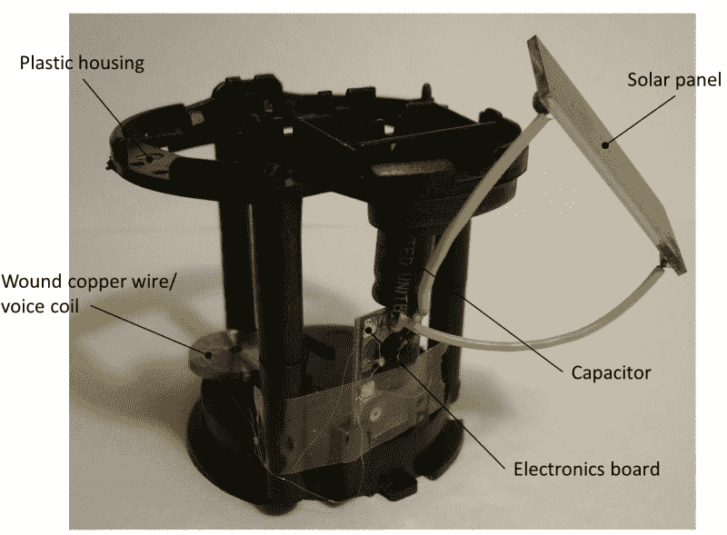

# 吸能钕球继续旋转

> 原文：<https://hackaday.com/2018/11/23/energy-sipping-neodymium-sphere-keeps-on-spinning/>

在这一点上，我们相信你已经意识到了，但是围绕这些部分，我们不会对那些我们不能立即看到实际应用的项目扣分。作为一名独立的黑客，我们不会说什么是值得的，什么是不值得的。如果你乐在其中，那很好。学到了什么？甚至更好。如果你做了这两件事*和*并花时间记录下来，那么这就是我们正在做的事情。

 所以当【科学工具栏】发来这个项目，记录了[一个异常节能的旋转钕球](https://hackaday.io/project/162341-low-consumption-electric-motor-dc-generator)的建造，我们知道这是我们的东西。在文档中，它被称为电机，尽管它似乎没有做任何有用的工作的扭矩。但是，如果它可以依靠计算器式光伏电池提供的能量持续旋转，这仍然是一个巧妙的技巧。

但是它是如何工作的呢？它从打开一个太阳能小玩具开始；一有光线照到底座的面板上，它们就会摆动或跳舞。正如[科学工具栏]所解释的那样，在这些看似神奇的小工具内部是一个电容器和经典的黑色环氧树脂滴，其中包含一个振荡器电路。电荷在电容器中积聚，并以大约 1 Hz 的频率注入线圈，这提供了足够的推力来推动机械装置运转。

在休息后的视频中，[科学工具栏]演示了如何将这些内部部件与一个更大的线圈配对。这个版本中的线圈提供了钕球旋转的动力，而不是促使一个小向日葵或草裙舞女孩做它的事情。为了有所帮助，他们甚至使用了一个由木螺钉和磁化螺丝刀头组成的垃圾盒零摩擦磁性轴承。

这是一个有趣的例子，说明微小的电荷是如何随着时间的推移而积累起来的，如果有一个足够好的外壳，这将成为一个非常酷的桌面玩具。我们之前看到过类似玩具的拆卸，这揭示了小小的环氧树脂团内部惊人的复杂性。然而，没有消息表明这个版本[科学工具栏]是否被抄袭了。

 [https://www.youtube.com/embed/3qr0PBhojwk?version=3&rel=1&showsearch=0&showinfo=1&iv_load_policy=1&fs=1&hl=en-US&autohide=2&wmode=transparent](https://www.youtube.com/embed/3qr0PBhojwk?version=3&rel=1&showsearch=0&showinfo=1&iv_load_policy=1&fs=1&hl=en-US&autohide=2&wmode=transparent)

