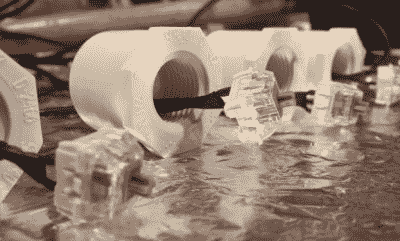

# 爸爸为孩子定制的 Xbox 自适应控制器

> 原文：<https://hackaday.com/2018/11/21/dads-custom-xbox-adaptive-controller-build-for-his-child/>

当微软今年早些时候宣布 Xbox adaptive controller 时，许多人对它真正的适应性感到惊喜。该控制器具有 3.5 毫米插孔，可轻松连接任何外部输入设备，并且鉴于其价格标签，其制造质量令人印象深刻，但最令人印象深刻的是其设计在本质上是如此开放。自适应控制器更多地充当社区设计的枢纽，而不是寻求创建为用户子集定制的特定设计解决方案。其中一个出色的设计来自[Colton]，他为他的女儿发布了一个由五部分组成的[系列。](//techreport.com/blog/34119/building-a-custom-xbox-adaptive-controller-peripheral-part-one)

他的女儿 Ellie 患有 Cornelia de Lange 综合征，这使得她无法使用传统的压力感应输入设备。所以[科尔顿]设计了一种利用交替运动范围按下按钮的方法。通过将泡沫按摩插入物连接到标准油漆滚筒上，可以通过允许泡沫的波峰和波谷在每个按钮的顶部滚动来触发按钮。他可以通过在钮扣上系上编织带来防止打结，从而达到更高的精确度。

发现这个装置成功后，[科尔顿]开始设计一个框架。他使用 PVC 管，并利用三通作为滚轴的定位点。几个钢制软管夹足以将每个泡沫辊固定到位，接触距离可以通过螺纹 PVC 适配器中的按钮来调节(如右图所示)。在各处添加了一点彩色包装后，这个建筑有了一个明显欢快的外观。

然而，如果没有一个定制的软件与之匹配，构建是不完整的。[Colton]向他的侄子寻求帮助，编写了一个“RGB 蚀刻草图”程序，他们称之为 Sundoodler。这款游戏运行在一台连接到投影仪的小型电脑上，这样 Ellie 就可以躺着玩了。[Colton]对他女儿的定制 Xbox 自适应控制器构建有一些未来计划，但现在你可以在下面的视频中看到结果。

 [https://www.youtube.com/embed/2VtNTvQZrzQ?version=3&rel=1&showsearch=0&showinfo=1&iv_load_policy=1&fs=1&hl=en-US&autohide=2&wmode=transparent](https://www.youtube.com/embed/2VtNTvQZrzQ?version=3&rel=1&showsearch=0&showinfo=1&iv_load_policy=1&fs=1&hl=en-US&autohide=2&wmode=transparent)

要了解整个系列是如何展开的，下面是构件每个部分的快速链接:

第一部分 || [第二部分](https://techreport.com/blog/34137/building-a-custom-xbox-adaptive-controller-peripheral-part-two) || [第三部分](https://techreport.com/blog/34185/building-a-custom-xbox-adaptive-controller-peripheral-part-three) || [第四部分](https://techreport.com/blog/34195/building-a-custom-xbox-adaptive-controller-peripheral-part-four) || [第五部分](https://techreport.com/blog/34215/building-a-custom-xbox-adaptive-controller-peripheral-part-five)