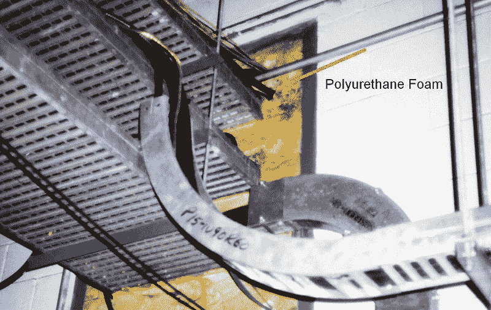
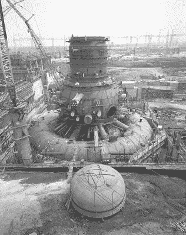
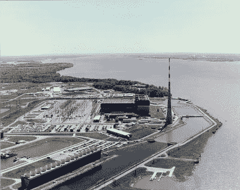

# 本周失败:一根蜡烛引发了布朗斯渡口核事故

> 原文：<https://hackaday.com/2018/12/06/fail-of-the-week-1975-the-browns-ferry-nuclear-incident/>

我的一个同事曾经说过他杂耍了很多球；钢球、塑料球、玻璃球和纸球。诀窍是不要掉玻璃球。你怎么知道哪个是哪个？例如，假设你的任务是确保核电站的安全。什么是重要的？一个自动防故障的方法，把控制棒放进堆里，也许？厚厚的防护墙？两个冷却回路，这样只有内部回路会有放射性？我不是核工程师，所以我不知道，但确保核电厂的电工不使用明火不会是我最关心的事情。你可能会认为这是显而易见的，但如果你回顾历史，你会发现这是一个被扔掉的玻璃球。

在 20 世纪 60 年代和 70 年代，美国对核能非常乐观。布朗斯渡口——田纳西流域管理局(TVA)的一座核电站——于 1966 年在两座核电站上破土动工。1 号机组于 1974 年开始运行，第二年 2 号机组开始运行。到 1975 年，这两台机组生产了大约 2200 兆瓦的电力。

同年，一名电气检查员和一名电工正在检查配电室的漏气情况，配电室是控制电缆从一个控制室分支到两个不同单元的地方。为了找到气流，他们使用点燃的蜡烛，观察火焰随着气流被吸入。在这个过程中，他们意外引发了一场大火，差点导致一场大规模的核灾难。

## 使用易燃材料

 你可以建造 30 英寸厚的墙，但是你仍然需要公共设施进出该地区。这种情况发生在配线间——电厂各处的电缆汇集到公共控制室的地方。

工人们在电缆槽附近发现了一个 2×4 英寸的开口。他们用泡沫塞住洞，又检查了一遍。仍然有气流，火焰被吸入洞中，点燃了泡沫。检查员试图扑灭大火，首先用手电筒，然后用破布。这时，墙壁着火了，使用了几个灭火器来解决问题，但没有成功。火继续燃烧。事实上，灭火器可能将燃烧的物质吹出了洞外，使情况变得更糟。

## 消防计划的失败

由于努力灭火，火灾在 15 分钟后才被正式报道。关于使用什么电话号码来报告火灾也很混乱。也许最令人惊讶的是，不管出于什么原因，尽管发生了火灾，操作人员还是选择继续运行反应堆。根据官方报告，他们随后注意到应急堆芯冷却系统中的泵正在运行:

> 控制板指示灯随机亮、变暗、熄灭；出现大量警报；以及从面板 9-3 下面冒出的烟，面板 9-3 是应急堆芯冷却系统(ECCS)的控制面板。操作员关闭了他认为不需要的设备，却让它们重新启动。

我不会那样开我的车，更不用说核反应堆了。重启几次后，他们开始讨论关闭系统。就在那时，1 号机组的功率输出莫名其妙地下降了。他们减少了运行中的泵的流量，这些泵很快就出现了故障。最后，操作人员放下控制棒，停止了核反应。

## 尽一切努力冷却核心

正如你所料，关闭一个反应堆并不容易。1 号机组的几个系统失去供电，包括几个关键的仪表和冷却系统。在第二单元，面板变得疯狂，有许多警报。然后，在 1 号机组反应堆开始减少输出约 10 分钟后，2 号机组也跟着减少了输出。

不幸的是，那里的设备也失灵了，他们失去了紧急冷却和对一些安全阀的控制。1 号机组在很少的仪表和数量减少的泄压阀的情况下苦苦挣扎。人们担心的是，如果核心不再浸在水中，它会熔化。

为了让核心保持在水下，他们使用减压阀将内部压力从 1020 磅/平方英寸降至 350 磅/平方英寸以下，以便低压泵可以迫使水进入室内。这个决定遇到了另一个问题；低压泵也不起作用，因此他们不得不使用不同的泵搭建一个变通办法。

在 1 号机组，水位通常在堆芯顶部以上约 200 英寸，但它下降到约 48 英寸。2 号机组有更多的泵容量，但仍然不够。他们装配了同样的临时水泵装置。

## 电力和控制故障的多米诺效应

在这一切开始之前，2 号机组的计算机已经发生了故障，1 号机组的计算机很快也出了故障。几乎所有的仪器都失灵了，柴油发电机也停了，他们的现场电力很少。电话系统出现故障，导致控制室无法向外拨打电话，而这些电话正被用来向手动操作阀门和其他关键设备的人员发送指令。

Unit 1 under construction

与此同时，火还在燃烧。有一个内置的灭火器，可以用手摇曲柄手动启动。但在建造过程中，这些启动曲柄下面都放置了金属板，以防止灭火系统意外启动。当建筑完工时，几乎没有一块板被移走。当他们最终能够操作该系统时，它并没有完全阻止火灾，并产生了将浓烟驱入控制室的效果。

两名工人被派去调查。他们戴上呼吸装置，进入吊具室，发现电缆上的氯丁橡胶护套正在燃烧，并冒出浓浓的黑烟。宿舍很拥挤，一名男子描述说，他不得不把气瓶从背上拿下来，把它们和面前的灭火器一起推到大约 30 英尺的托盘下面，才能够到火焰。

灭火系统并不是唯一一个对紧急情况准备不足的安全设备。工厂里的许多呼吸面罩都不起作用。有些油箱装得不合适，有些则缺少零件。现场的主罐压力明显较低，无法完全注满工作罐，这导致那些试图灭火的人每次注满大约 18 分钟的空气。

## 红色卡车大队

当地消防部门到达现场，但他们不被允许进行这项工作——大概是因为你想让受过专门训练的人去扑灭反应堆里的火灾。然而，消防队长确实反复暗示水是灭火的正确方法，因为它实际上并不具有电的性质。然而，工厂管理层不同意。

大火燃烧了六个多小时后，工厂人员决定试一试水。不幸的是，消防水管没有完全展开，所以他们的压力很低。在最激烈的时刻，工人们错误地认为喷嘴有缺陷，并从消防部门借了一个，但它有不兼容的螺纹，不会留在软管上。即使有这些问题，水在 20 分钟内就把火扑灭了。

## 处于崩溃的边缘

你可能会认为火被扑灭是故事的结尾，但事实并非如此。损害已经造成——对两个反应堆的控制被极大地抑制了，保持堆芯冷却仍然是一个紧急情况。1 号机组的泄压阀最终关闭，压力上升超过了临时泵系统的运行能力。

有一个辅助泵在运行，但它跟不上，似乎有可能发生熔毁。回想起来，有一种方法可以使用 2 号机组的一些设备，但当时没有人发现这一点。

相反，幸运的是他们能够在时间用完之前进行修理。工人们努力让压力阀恢复运行，并取得了成功。这使得压力下降到足以让水泵继续提供淡水。

## 一场近乎灾难的时间线

蜡烛的火焰大约在下午 12 点 20 分开始燃烧。一号机组在凌晨 4 点达到完全关闭，这是它的结束。尽管听起来一切都出了问题，但情况甚至更糟。从电灯到录音机，设备都有很多问题。

说到录音机，当时 TVA 核能发电部门的主管 J. R. Calhoun 和 NRC 的 Frank Long 之间有一段非常有趣的电话对话(加拿大网站报道了这段对话):

> 卡尔霍恩:是的，你知道这两个单元的所有东西都来自那个房间。两个单元共用，就像控制室是两个单元共用一样。
> 
> Long:这有点像解雇你的多余人员。

由于创造性地解决问题，这一事件似乎没有造成公共风险——尽管许多人批评公众如何被告知(或不告知)。据报道，该核电站从未发生任何放射性泄漏。

## 分析

这么多问题。既然有其他方法，他们为什么还要用蜡烛呢？他们为什么用易燃材料做绝缘材料？调查发现，有缺陷的测试表明，泡沫中使用的聚氨酯在固体状态下是耐火的。然而，泡沫非常易燃，许多人都知道这一点。很多人不知道蜡烛是用来检漏的。

也许最糟糕的消息是两天前一场类似的火灾已经开始，但很快被扑灭。值班工程师开了一个会，已经决定推荐一种不需要蜡烛的不同方法来检测泄漏。但是什么也没有做。

不用说，核管理委员会对他们的防火标准进行了许多修改，并强制要求防火材料使用硅酮泡沫。它甚至影响了其他行业的实践。如果你想看 NRC 发布的关于 2009 年事件的 DVD，你可以。

这场火灾造成了大约 1000 万美元的直接损失和高达 5 亿美元的间接损失。(如果将 2018 年的价值更新为 1976 年的数字，这大约是 4400 万美元和 22 亿美元。)在 18 个月的恢复过程中，花费了大约 1000 人工年的努力。

我知道关于我们是否应该拥有核能的争论是两极化的，我不会在这里讨论这个问题。但令人惊讶的是，一件高科技设备——不管它是做什么的——可能被一支蜡烛和一些糟糕的程序搞垮。你知道，那里有各种各样的安全装置和程序，那里的每个人肯定都知道出了差错可能造成的后果。然而，你忽略了一个已知的火灾问题，糟糕的空气和消防设备，以及许多其他问题。

因此，不仅要考虑你在每个项目中有什么球，还要问问你自己哪些是玻璃球。不要忘记关注那些看似无关紧要的小事。假设你不需要对系统中的所有球有至少一些了解，这也是一个危险。毕竟，如果高层有人意识到泡沫着火了，工人们用蜡烛围着它，这可能会是一个不同的故事。