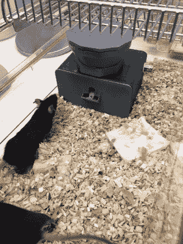

# 卡特里娜阮自动化她的老鼠

> 原文：<https://hackaday.com/2018/11/29/katrina-nguyen-automates-her-mice/>

当开始从事生命科学的职业时，选择研究哪种模式生物似乎与它如何适应研究人员的生活有很大关系。我曾经有一个研究龙虾的教授，表面上是因为它们是细胞生物学中许多问题的一个伟大模型；事实上，他只是真的喜欢吃龙虾。我的另一位同事研究了鲨鱼直肠腺中的盐运输，不是因为他特别喜欢收获这些腺体——这让鲨鱼有点暴躁——而是因为他真的喜欢每年夏天在海滩上度过。

然而，并不是每个人都能选择有趣或美味的模式生物，大多数生物学家在某些时候都不得不与老鼠打交道。很难相信这些生物在照顾和喂养方面会有多么需要，尤其是当喂养是你试图从它们身上收集的数据的一部分时。研究生卡特里娜·阮(Katrina Nguyen)通过艰难的方式了解到这一点，但她没有让自己的生活被一群啮齿动物控制，而是破解了一个解决方案，不仅改善了她的生活，也改善了她的科学。她友好地来到 Hackaday 超级会议，告诉我们她是如何实现研究自动化的。

## 你的大脑只想让你吃东西

人们倾向于对往嘴里塞什么和什么时候停下来做出糟糕的选择，这并不奇怪，但是控制这些行为的神经机制却知之甚少。卡特里娜在美国国立卫生研究院做了一段时间来探索这个问题，用老鼠作为人类的代理。

为此收集数据似乎很容易:称出食物，给老鼠吃，然后称出剩下的食物。但正如卡特里娜所说，这远比那更沉重。首先，一只老鼠并不能产生很大的统计数据，将喂食过程扩展到几十或几百只老鼠也不是小事。处理日常事务也是如此，比如按时去实验室喂动物。这花费了太多的时间，更糟糕的是，它只提供了一个关于吃了多少食物的广泛观点。

## 自动化关键质量的啮齿动物喂食器

为了找回自己的生活并获得更详细的数据，Katrina 为她的老鼠设计了一个自动喂食器。当然，这种设备是可以买到的，但是成本太高，她的实验室无法承受。她的 [3D 打印喂食系统](https://hackaday.io/project/72964-feeding-experimentation-device-fed-20)是完全开源的，可以使用小型步进电机将单个食物颗粒从料斗分配到托盘中。当鼠标捡起小球时，Arduino 用光电晶体管检测到它，将事件记录在数据记录屏中，并分发新的金块。

这听起来很简单，但它需要多次迭代才能达到最终的设计，即使如此，它也不是完美的——颗粒有时会在下降的过程中行为不端。它也没有连接，所以下一个版本将添加 WiFi，以便于集成和数据捕获。也就是说，这个设计足够好，已经吸引了世界各地实验室的注意，他们已经下载了 Katrina 的设计，并建造了他们自己版本的设备。这就是开源的力量，向 Katrina 致敬，她为了所有人的利益分享了她来之不易的经验。

从个人经验来说，我对卡特里娜有一句警告:小心，因为你可能会发现建造这样的设备最终会比它所支持的科学更有趣。反正对我来说就是这样。

 [https://www.youtube.com/embed/DKjZjgLX7D8?version=3&rel=1&showsearch=0&showinfo=1&iv_load_policy=1&fs=1&hl=en-US&autohide=2&wmode=transparent](https://www.youtube.com/embed/DKjZjgLX7D8?version=3&rel=1&showsearch=0&showinfo=1&iv_load_policy=1&fs=1&hl=en-US&autohide=2&wmode=transparent)

