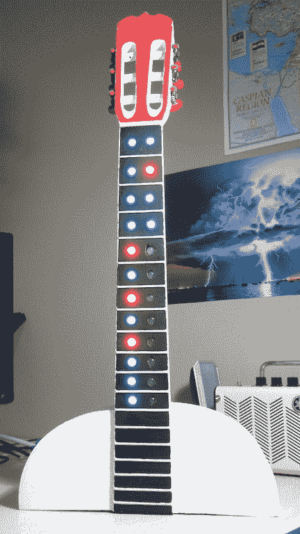

# 项目宝库提供了无数的例子

> 原文：<https://hackaday.com/2018/11/27/treasure-trove-of-projects-provides-endless-examples/>

有时候，在互联网上旅行感觉有点像探索一个无尽的洞穴系统寻找宝藏。很多黑暗的通道，没有光和生命，偶尔会有一些微光，因为你发现一个散落在角落里的金币或翡翠。如果我们把这个比喻说得太远，那么找到[Paul]的[“小 Arduino 项目”库](https://github.com/tardate/LittleArduinoProjects)就像转过一个不起眼的角落却发现了龙的宝藏。

LEAP(保罗也称之为收藏)是一个编号的收藏，看起来或多或少是他在过去几年里完成的每一个电子项目。在撰写本文的时候，GitHub 资源库中有 434 个项目(T0)在[一个方便的博客风格界面(T3)中被标记和索引。有些是熟悉的，比如对 T4 bold port T5 项目的修改。其他的是特定概念的一次性测试，如](https://leap.tardate.com/)[驱动七段显示器](https://github.com/tardate/LittleArduinoProjects/tree/master/playground/LED7Segment/DirectDrive)(如果你在索引中搜索“7 段”，实际上有 16 个类似的项目)。另一端是项目构建，包含更详细的日志和文档，比如安装在吉他品板上的 [LED 标志牌](https://fretboard.tardate.com/)，用于监控 24 个正在进行的项目的状态。

LEAP 让我们想起了过去在互联网上的美好时光，在那之前，感觉就像 50%的钓鱼和 50%的跟踪 cookies。花几分钟查看一下[Paul]的项目档案，看看是否有什么有趣的发现！我们只是触及了表面。当然，如果你发现了一些需要写下来的东西，就发一个小贴士吧！