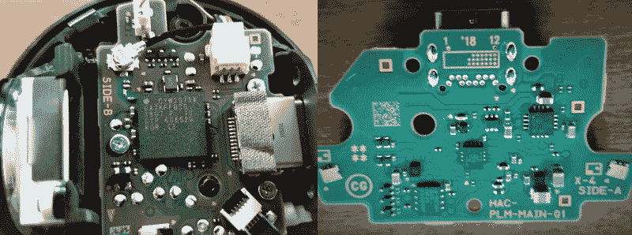

# 神奇宝贝球加拆卸揭示里面没有皮卡丘

> 原文：<https://hackaday.com/2018/11/26/poke-ball-plus-teardown-reveals-no-pikachu-inside/>

本月早些时候，粉丝最喜欢的特许经营神奇宝贝的最新作品与一个特别有趣的控制器一起发布。这款控制器名为神奇宝贝球 Plus，能够控制完全独立平台上的神奇宝贝游戏，并在它们之间传输数据。它会响，会说话，会发光，是无线的，而且【Spawn】上传了[一段视频，揭示了](https://www.youtube.com/watch?v=t3wJ-SkmWus&feature=youtu.be&ytbChannel=null)里面的真实情况。

整个控制器直径仅约 2 英寸(50 毫米)，重量约 2.3 盎司(65 克)，但在如此小的外形中却包含了相当多的技术。它通过一个 [Cypress CYW20734 蓝牙收发器](http://www.cypress.com/file/298401/download)连接到 iOS、Android 和任天堂 Switch 设备，并包含一点闪存，以允许将神奇宝贝数据从 Pokémon Go 手机游戏传输到最近的任天堂 Switch 版本。驱动一切的是一个专有的 220 毫安时锂离子电池，据任天堂称，可以持续大约三个小时。它有一个 USB-C 充电端口，但没有提供快速充电功能的确认。

神奇宝贝球 Plus 表面的模拟棒是一个实际的模拟棒，类似于 PlayStation Vita 掌上电脑上使用的模拟棒。有趣的是，在《神奇宝贝 Go》手机游戏和《神奇宝贝:让我们去任天堂 Switch》游戏中，这根棍子是可以点击的，可以作为菜单选择的按钮。长期粉丝会记得 90 年代末的口袋皮卡丘数字宠物，它可以通过手持设备的红外端口与 Game Boy Color 上的神奇宝贝金色/银色进行通信。进一步证明可能没有新的想法了。

除了蓝牙收发器，还有一个加速度计，单声道扬声器和表面贴装 RGB LED，它们都可以对游戏中的事件做出一致的反应。所有这些似乎都是应用于大量其他应用程序的完美设置。不管结果如何，最好是“最好的”。

 [https://www.youtube.com/embed/t3wJ-SkmWus?version=3&rel=1&showsearch=0&showinfo=1&iv_load_policy=1&fs=1&hl=en-US&autohide=2&wmode=transparent](https://www.youtube.com/embed/t3wJ-SkmWus?version=3&rel=1&showsearch=0&showinfo=1&iv_load_policy=1&fs=1&hl=en-US&autohide=2&wmode=transparent)

via [ [PokemonGoHub](https://pokemongohub.net/post/pokemon-lets-go/poke-ball-plus-tear-down-is-there-really-a-mew-inside/) ]