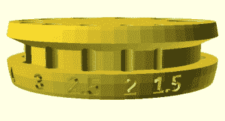
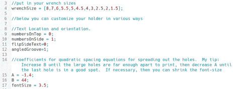
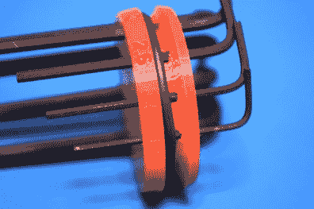
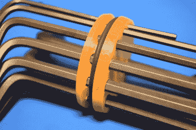

# 印刷它:参数六角钥匙持有人

> 原文：<https://hackaday.com/2018/12/27/printed-it-parametric-hex-key-holder/>

桌面 3D 打印无疑是一项令人难以置信的技术，但它不是万灵药。如果你对大批量生产感兴趣，或者担心生产速度，3D 打印可能不是你想要的。但另一方面，如果你想制作一些高度专业化或定制化的物品，桌面 3D 打印代表着个人黑客和制造商能力的一场绝对革命。

在我们不断努力证明桌面 3D 打印不仅仅是一种新奇事物的过程中，我们密切关注发挥该技术优势的可打印对象。你在这里找不到任何基准或集尘器；*中的每样东西都是真实的实用物品。这个系列的理想条目是，你不需要打印超过几次，不容易通过传统方式获得或制作，如果可能的话，提供某种形式的定制，使其比商业上可用的更适合个人的需求。*

并非我们展示的每个物体都符合所有这些标志，但是这个由丹尼尔·莱特纳设计的参数化六角钥匙扣绝对符合。创建这个对象是为了解决我们想象的大多数黑客读者共有的问题:驯服不断增长的十六进制密钥集合。更重要的是，这个设计是一个开源的成功故事。这是一个经过多个社区成员之手的想法，随着它的发展变得越来越完善和实用。即使你个人不需要争论一些难以驾驭的六角键，这个对象也是一个有趣的视角，它展示了 3D 打印和围绕它兴起的社区是如何真正演变从概念到执行的过程的。

## 定制设计

沿着这条线的某个地方，决定了每一个套件，无论是娱乐中心还是激光切割机，都将包括一把六角键。所以很快你就会淹没在这些东西中，但是当然你永远也不会有一套完整的东西，你总是会有某些流行尺寸的复制品。[因为像我们这样的人一开始就很难处理掉任何东西](https://hackaday.com/2017/11/10/the-clutter-manifesto/)，他们最终只是填满一些黑暗和积满灰尘的抽屉，直到有足够多的东西，他们开始计划起义。

为了帮助平息起义，[Daniel]利用 OpenSCAD 的参数化功能为您的十六进制密钥集合创建了一个完全自定义的容器。通过在脚本顶部的一个数组中输入不同大小和数量的十六进制密钥，他的代码将生成一个符合您的具体规格的可打印模型。因此，如果你需要持有半打 2.5 毫米六角键，这种设计可以满足你的需求。

在一个特别好的接触中，脚本甚至会将十六进制键的大小直接输入到持有者中，这样就不会怀疑哪个是哪个。虽然承认这是一个小细节，但这是 OpenSCAD 强大功能的一个很好的例子，并且是用更传统的 CAD 工具很难重现的。

    

## 提炼概念

虽然他负责参数化 OpenSCAD 代码，但[Daniel]实际上并没有提出 hex key holder 的原始设计。这项荣誉属于[【亚历克斯·里奇】，他在几年前创造了一个“静态”版本的持有者](https://hackaday.io/project/12379-improved-allen-wrench-hex-key-holder)。该版本非常适合将您从商店购买的六角钥匙套移到更符合人体工程学的支架上，但缺乏任何定制，并且依赖于顶部的印刷(如在纸上)标签来显示哪个插槽用于哪个钥匙。

Render of original hex holder design.

最初的设计非常受欢迎，很快[Alex]开始收到定制版本的请求。他试图适应这些要求，并对核心设计进行不同的修改，但这是一场失败的战斗。对于一个人来说，有太多的排列来不断更新每个人的场景设计。他之所以公布这个设计，是因为他认为其他人可能会觉得有趣，而不是去做兼职。

[Daniel]看到这种情况，认为这将是 OpenSCAD 的一个完美应用。他重新创造了设计的基础:一个周边有各种大小开口的圆盘形支架，但也做了一些超越参数方面的关键改进。首先，最初的设计需要凹槽内的支撑材料，但新的 OpenSCAD 版本在顶部使用了一个斜面，在不影响功能的情况下消除了这一要求。

在其他社区，这可能会被认为是“敲竹杠”，并引发某种形式的火拼，但在这里不会。[Alex]不仅欣赏他设计的 OpenSCAD 版本，现在还主动向任何向他索要原始支架定制版本的人指出这一点。

## 打印您自己的

由于这是一个可定制的设计，第一步是在 OpenSCAD 中打开它，并在文件顶部进行修改。你可以输入任何你想要的尺寸，但是要注意这里似乎没有任何错误检查。因此，举例来说，如果你输入的尺寸是 2.2 毫米而不是 2.5 毫米，没有什么可以阻止你。代码也出奇的复杂，所以如果 OpenSCAD 生成 STL 需要一到两分钟的时间，不要惊讶。

一旦你有了你的 STL，这个设计就很容易打印出来，而且相对较快。您可以使用更高的图层高度来加快速度，但如果您使用集成大小的参数版本，文本可能会很差。我以 0.15 毫米的厚度打印它，这在表面细节和速度之间取得了很好的平衡，支架在不到一个半小时内完成。

印刷后，你需要提供一个橡皮筋或一个合适大小的 O 型圈来配合凹槽。在原始版本和参数版本的固定器中，每个键的孔都做得足够宽松，以至于它们不会仅仅因为摩擦而被保留。橡皮筋或 O 形圈的张力实际上可以固定所有东西，这样支架的夹持力就不会像使用紧密配合的孔那样随着时间的推移而下降。在实践中，我发现 O 型圈比橡皮筋效果更好，尽管我在当地唯一能找到的 O 型圈实际上比设计要求的要薄得多。当我试着用橡皮筋的时候，钥匙在插入时有卡住的趋势，但是如果你找不到足够大的 O 型圈，它肯定会工作。

    

## 利用你所拥有的

批评者会说，这种六角固定器的形状使其独特地适合传统制造:用车床将 O 形环槽切割成一块圆坯，然后放在钻床上制作各个键孔。你会丢失写在边上的钥匙尺寸，但是它会生产得更快并且比一块塑料更坚固。虽然这都是真的，但我们谈论的是数千美元的设备和专门的工作室，而不是黑客公寓中的廉价 3D 打印机。

关键不在于 3D 打印总是生产这些设计的唯一方式，甚至是最好的方式。但这绝对是最平易近人、最实惠的方法，而且对定制实物的创建民主化大有帮助。