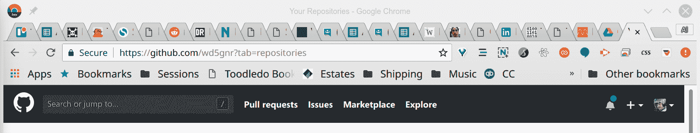
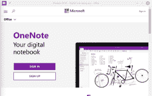
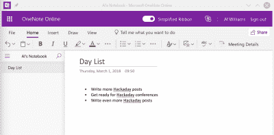
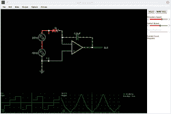
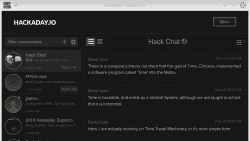

# Linux Fu:把一个网络应用变成一个完整的程序

> 原文：<https://hackaday.com/2018/12/05/linux-fu-turn-a-web-app-into-a-full-program/>

我讨厌承认它。我不再在我的桌面上使用 Linux 了。嗯，严格来说我有。我启动进入 Linux。然后我 95%的工作都是在 Chrome 上完成的。我现在唯一使用的本地应用程序是开发工具、shell、emacs 和 GIMP。如果我真的想的话，我可能会找到几乎所有在浏览器中运行的软件的替代品。我不使用它，但浏览器中甚至有一个 ssh 客户端。邮件客户端？Gmail。博客？WordPress。笔记？OneNote 或 Evernote。将它们作为实际的应用程序而不是浏览器中的标签来运行不是很好吗？你可以，我会告诉你怎么做。

在 Chrome 中安装应用可能是一个真正的问题。我最终打开了几十个标签——反正我不喜欢这样。重启 chrome 是一场噩梦，因为它很难一次加载 100 个标签。(相关提示:进入 chrome://flags，关闭“离线自动重新加载模式”，开启“仅自动重新加载可见标签页”。)我也浪费了很多时间搜索，因为我试图按窗口组织标签。所以我必须找到那个有 Gmail 的窗口，然后在那个窗口的大约 20 个标签中找到 Gmail。

我想要的是一种方法，将 web 应用程序包装在自己的窗口中，这样它们就会以自己的图标出现在任务栏中，但从这些应用程序打开的外部网页应该在 Chrome 中打开，而不是在同一个窗口中打开。如果应用程序在单一浏览器窗口之外，我可以将它们移动到不同的桌面，像组织任何其他程序一样组织它们，包括将它们添加到启动器中。希望这能让我有更少这样的窗口:

[](https://hackaday.com/wp-content/uploads/2018/11/tab.png)

## 电子

有一个叫做电子的库，它允许网络开发者将他们的内容打包到桌面应用程序中。这有点争议，因为——坦率地说——什么不是？批评者说网络应用程序效率不高。然而，在这种情况下，你似乎没有办法制作一个“合适的”GMail 桌面应用程序，所以它可能不会比一直在浏览器中打开 GMail 差太多。

理论上，你可以使用电子邮件来“开发”你自己版本的 GMail 或任何你喜欢的应用程序。然而，这需要一点时间。相反，我一直在使用 [nativefier](https://github.com/jiahaog/nativefier) 来自动完成这项工作。该程序可以将任何网页或应用程序转换成 Windows、Linux 或 Mac 应用程序。

这个程序努力做正确的事情。所以如果你安装了它，然后用一个 URL 运行这个程序，它应该能找出正确的名字，正确的图标，等等。然而，有几件事你应该知道。

## 快速测试

假设你想把微软的 OneNote 做成 Linux 应用。是的，已经有一个 OneNote 应用程序，但不是针对 Linux 的。它可以在 Wine 下工作，但 web 应用程序现在可以获得更新，并且比使用 Wine 工作得更流畅。

[](https://hackaday.com/wp-content/uploads/2018/11/onote.png) 你的第一次尝试可能是:`nativefier onenote.com`。不过，这有个问题。虽然该程序提取了所有相关数据，但它不会保留你的主浏览器的密码和缓存的登录凭证。因此，您需要登录。

哎呀。单击“登录”按钮会将您带到另一个 Microsoft 网站，这将导致该程序在您的常规浏览器中打开该网站。在那里登录对你没有任何帮助。

这是否意味着你不能在 OneNote 或其他任何有登录权限的地方使用 nativefier？一点也不。

## 解决方案

如果你寻求帮助(使用`--help`选项),你会看到令人眼花缭乱的命令行选项。例如，您可以覆盖默认图标或标题。您可以设置各种浏览器选项。如果你愿意，你甚至可以插入自定义 CSS，设置窗口大小，并启用浏览器菜单。但是有一件事可以帮助我们解决问题，那就是`--internal-urls`选项。这是一个正则表达式，当一个 URL 在一个新的窗口或标签中打开时，程序会查看它。如果 URL 匹配，它将留在窗口中。这可能需要一点尝试和错误，当然，匹配可以根据你的需要而紧或松。我以下面的命令行结束:

```
nativefier onenote.com --internal-urls ".*(\\.office\\.com)|(\\.onenote\.com)|(go\\.microsoft\\.com)|(\\.live\\.com).*"
```

[](https://hackaday.com/wp-content/uploads/2018/11/onenote.png) 英文中说如果网址以. office.com、. onenote.com 或. live.com 结尾，那就是内部的。它也抓住了 go.microsoft.com。我或许也可以抓取整个 microsoft.com，但是如果你有一个真正的外部链接，你可能希望它进入外部浏览器。

同样，您可以根据需要对此进行调整。如果你知道你永远不会链接出应用程序，你可以只使用。*作为正则表达式，但这似乎有些懒惰。

## 程序

任何你想当作独立程序的网页都可以。我甚至把 Hackaday.io 聊天放在了自己的窗口中，这很方便。尽管它使用 GitHub 进行身份验证，但它不会混淆`nativefier`，默认命令在那里工作良好。其他一些运行良好的网站:messages.android.com(需要一个自定义图标)、WordPress，当然还有 GMail。对于另一个收藏夹，请尝试以下命令行:

```
nativefier http://falstad.com/circuit/circuitjs.html?cct=$+1+0.000005+10.20027730826997+50+5+50%0A --name 'Falstad Circuit Simulator'
```

[](https://hackaday.com/2018/12/05/linux-fu-turn-a-web-app-into-a-full-program/fal/)

Circuit Simulator Comes to the Desktop

[](https://hackaday.com/2018/12/05/linux-fu-turn-a-web-app-into-a-full-program/hio/)

Chatting on the Desktop

如果你不像我一样使用浏览器，这似乎是浪费时间。或者，您可能有另一种技术来处理浏览器选项卡膨胀。但是如果你想把那个网络应用变成一个程序，`nativefier`看起来很好用，而且肯定会让我的工作流程更简单。

不过，还是有一些问题。首先，拼写检查在这些应用程序中不起作用。所以也许 WordPress 毕竟不是一个好的转换工具。但对于一些应用程序，如电路模拟器，你可能不会错过拼写检查。GitHub 上有一个添加这个功能的请求，如果他们能做到这一点，它会变得更加有用。