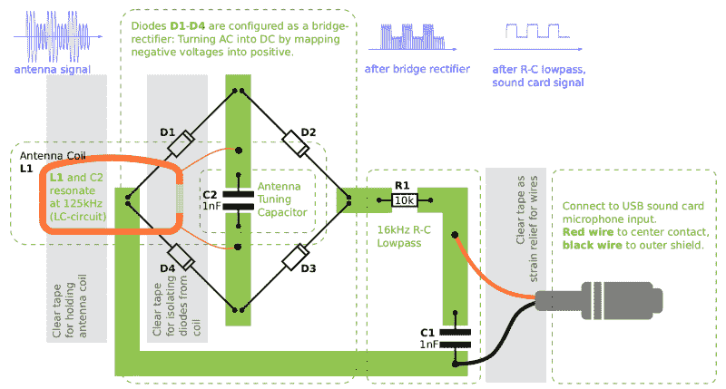

# 用一张纸嗅 RFID 阅读器

> 原文：<https://hackaday.com/2018/11/28/sniffing-rfid-readers-with-a-piece-of-paper/>

我们在 Hackaday 上展示了大量的打印项目，尽管由于廉价 3D 打印机的激增，它们往往是三维类型的。但在这种情况下，[Milosch Meriac]已经设法将一个可打印的设计放在一起，这不仅是一个非常酷的黑客，而且是由一个不足两维组成的。他的发明，也许可以被认为是一种交互式电路图，允许任何人用一台[纸打印机和一些无源元件制造一个功能性低频 RFID 嗅探器](https://github.com/XenithLabs/rfid-workshop)。

【Milosch】告诉我们这个项目的目标是降低 RFID 技术实验的门槛，RFID 技术越来越成为我们日常生活的一部分。实验者可以简单地将他们的 DIY RFID 嗅探器插入他们计算机的线路输入插孔，并使用开源工具探索产生的波形，而不必使用示波器等昂贵而复杂的工具。

要创建一个纸质 RFID 嗅探器，首先要将图像打印在一张厚纸上，比如卡片纸。然后，在指示的地方贴上箔带，作为这个临时 PCB 中的走线，并按照文本中的描述开始焊接元件。[Milosch]说组装过程非常简单，甚至一个小孩都能做，每个组装好的嗅探器的总成本几乎是几分钱；这对于学校或者任何大型团体来说都是一个很好的项目。

如果你想玩得安全，嗅探器可以连接到 USB 声卡，而不是你的机器的主要声音硬件，而且仍然非常便宜。[Milosch]没有解释这个特定项目中软件方面的事情，但是任何可以使用声卡输入作为临时示波器的工具都应该是一个好的开始。

过去，我们已经看到[Milosch]使用强大的 baudline 工具通过声卡执行[低频 RFID 嗅探，但是如果您想要一个功能更强大的硬件，](https://hackaday.com/2011/07/09/live-cd-for-rfid-hacking-on-the-go/)[我们可以为您指出正确的方向](https://hackaday.com/2012/05/27/reading-rfid-cards-from-afar-easily/)。