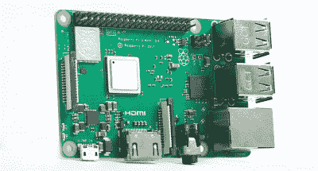
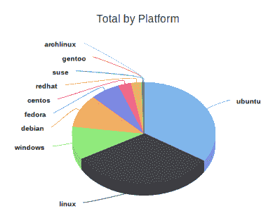
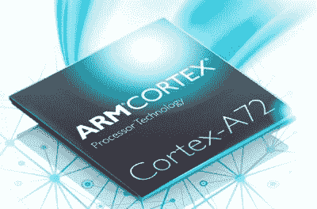

# 亚马逊认为 ARM 比你的手机大

> 原文：<https://hackaday.com/2018/12/03/amazon-thinks-arm-is-bigger-than-your-phone/>

就计算机架构而言，ARM 没有什么可羞愧的。由于地球上几乎每一个移动设备都是由精简指令集计算机(RISC)家族的某个成员驱动的，所以这些单词很有可能正通过 ARM 芯片进入你的眼睛。几十亿的用户群当然不容小觑，这还不包括 ARM 处理器涉足的无数其他设备:从儿童玩具到智能电视。

ARM 也是单板计算机的事实上的架构，在过去几年中，单板计算机一直主导着黑客和 making 场景。树莓 Pi，BeagleBone，ODROID，Tinker Board 等。如果它是一台运行 Linux 或 Android 的小型计算机，它几乎肯定会由某种 ARM 变体驱动；另一个市场几乎完全占据主导地位。

公平地说，从机顶盒到智能手表，*小型*设备如今都是 ARM 处理器的领域。但如果我们谈论的是人们可能认为的“传统”计算机，如台式机、笔记本电脑或服务器，ARM 本质上是一个失败者。市场上有少数 ARM Chromebooks，但实际上其他所有东西都运行在英特尔或 AMD 制造的 x86 处理器上。你不可能走进商店就买到 ARM 台式机，除了那些使用 Raspberry Pis 托管个人网站的黑客之外，ARM 服务器是非常罕见的。

或者至少，直到最近还是如此。在 re:Invent 2018 大会上，[亚马逊宣布为其亚马逊网络服务(AWS)客户立即提供他们自己内部开发的 ARM 服务器](https://aws.amazon.com/blogs/aws/new-ec2-instances-a1-powered-by-arm-based-aws-graviton-processors/)。对于许多开发人员来说，这将是他们第一次为非 x86 处理器编写代码，虽然一些成长的烦恼是可以预料的，但与标准 x86 选项相比，ARM 实例的成本更低，这似乎有可能推动采用。这将是 ARM 最终打入服务器市场，甚至可能打入台式机市场所需的推动力吗？让我们来看看 ARM 面对的是什么。

## 一把双刃剑

 冒着过分简化情况的风险，ARM 由于固有的架构效率，已经成为小型设备的首选。ARM 芯片消耗的能量少得多，因此不会像 x86 芯片那样发热。对于小型电池供电设备来说，这是一个完美的组合，因为提高的能效不仅允许更长的运行时间，而且意味着处理器通常只需要一个无源散热器来保持冷却(如果有的话)。

但是，在性能驱动的桌面和服务器计算领域，ARM 处理器的效率并不令人信服。在这些应用中，能耗通常不是选择硬件的决定性因素。现代的台式机处理器在负载时可以消耗近 100 瓦，对于服务器芯片来说甚至更高。没有人否认这是一个巨大的功耗，但它在很大程度上被视为一种必要的邪恶。

也就是说，有人可能想知道为什么 ARM 笔记本电脑在这一点上还没有流行起来。不幸的是，还有另一个因素在起作用:为 x86 编译的软件不能在 ARM 硬件上运行。在 Linux 下，这不是什么大问题；有几个发行版已经针对 ARM 处理器进行了改编和重新编译，这在很大程度上要归功于 Raspberry Pi 等设备的流行。但是在 Windows 下，情况就大不一样了。虽然微软几年前推出了 ARM 兼容的 Windows 版本，但这并没有改变一个事实，即市场上已经存在了几十年的 Windows 软件如果不借助仿真就无法使用。

## AWS 机会

传统软件支持的问题可能会使 ARM 退出通用计算市场，但对于像 Android 或 iOS 这样的移动操作系统来说，这不是一个问题，因为这些操作系统采用 ARM 处理器，并且没有需要担心的软件备份目录。在 Windows 主导的台式机和笔记本电脑市场，这种软件“干净的石板”可能是不可能的，但对于 AWS 客户来说，情况并非如此。

AWS Operating System Usage

对于一直使用 Linux AWS 实例([，其中绝大多数是](https://thecloudmarket.com/stats#by_platform))的开发人员来说，ARM 环境与他们习惯的环境不会有太大的不同。事实上，如果他们的软件是用 Python 这样的解释型语言编写的，他们应该能够将现有代码按原样转移到 ARM 服务器上。如果它是用 C 或另一种编译语言编写的，由于架构的变化，它需要从源代码重新构建，但在大多数情况下，几乎不需要修改。

简而言之，将 AWS 客户从 x86 转移到 ARM 不会像在其他平台上一样导致“文化冲击”。作为降低运营成本的交换，客户可能会愿意在从 x86 Linux 迁移到 ARM Linux 时进行任何可能需要的最小更改。

当然，从亚马逊的角度来看，让更多的客户使用 ARM 服务器意味着[减少他们数据中心](https://hackaday.com/2012/07/09/pedal-powered-32-core-arm-linux-server/)的能耗。这对所有参与者来说都是双赢的，并提供了一个绝佳的机会来展示 ARM 在服务器市场赢得了一席之地。

## 亚马逊自己的硬件

虽然市场上已经有一些 ARM 服务器，但亚马逊决定使用自己的内部定制芯片来实现 AWS。该系统名为 Graviton，是亚马逊在 2015 年收购以色列芯片制造商 Annapurna Labs 的最终结果。它采用了几年前的 Cortex-A72 微体系结构，拥有 16 个主频为 2.3GHz 的内核。

【Graviton 的早期基准测试表明，其性能与英特尔的低端服务器处理器不相上下，特别是单线程任务。考虑到 Cortex-A72 的年龄，以及亚马逊小心翼翼地不承诺当切换到 ARM 时实际上会有任何性能提升的事实，这并不令人非常惊讶。当然，基准测试可能会产生误导，我们需要等到更多的开发人员获得使用 Graviton 的经验，才能看到它的真实性能。

还应该说，第一代 Graviton 真的只是为了试水。随后几代硬件可能升级到更现代的 ARM 微架构，这将对性能产生巨大影响。例如，Cortex-A76 专为笔记本电脑应用而设计，其性能是旧款 A72 的两倍以上。

## 一小步

随着 Amazon 推出 ARM 服务器，全新一代的开发人员将以可以说是最无缝的方式获得非 x86 架构的第一手经验。细微之处会被学习，极限会被推动，缺点会被克服。随着时间的推移，这些全新的 [ARM 开发人员可能想要一台笔记本电脑](https://hackaday.com/2017/02/05/olimex-announces-their-open-source-laptop/)甚至台式机，其架构与他们部署代码的平台相同。幸运的话，那时自由市场将开始运作，并开始以有竞争力的价格提供它们。

或者不是。换成 ARM 带来的性能损失可能不足以弥补价格的下降，AWS 的客户也不会上钩。无论结果如何，看起来都会很有趣。亚马逊 ARM 实验的结果可能最终决定为我们无数小工具提供动力的无处不在的芯片是牢牢地留在我们的口袋里，还是上升到云端。