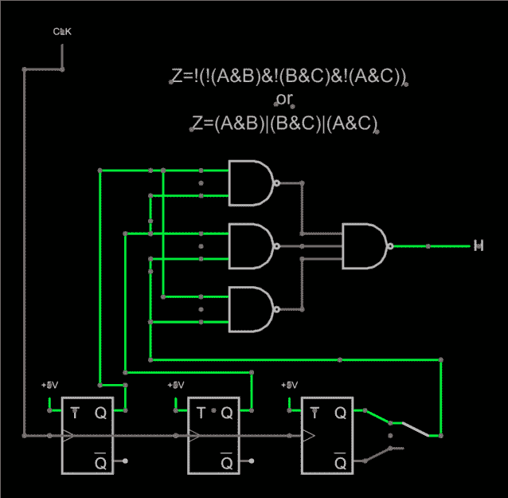
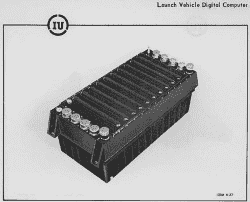
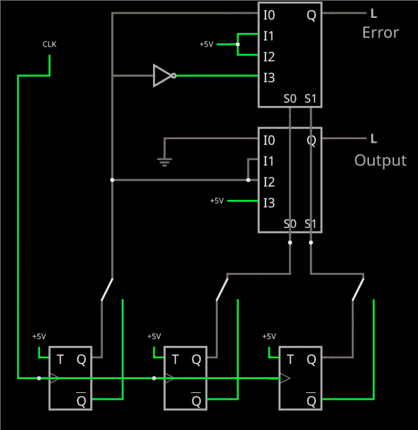

# 电路虚拟现实:冗余触发器和表决逻辑

> 原文：<https://hackaday.com/2019/01/25/circuit-vr-redundant-flip-flops-and-voting-logic/>

我们有点被宠坏了，因为与几十年前相比，今天的电子产品非常可靠。大多数现代电子产品遵循浴缸曲线。如果他们不马上失败，他们很可能在很长一段时间内都不会失败。然而，在一些情况下，这不是一个足够好的答案。一种是当一些真正重要的事情处于危急关头时——比如飞机的控制系统。另一种是当你处在一个可能导致失败的环境中。在那些情况下——例如，在核反应堆或空间附近，你通常实际上是在处理这两个问题。在本期 Circuit VR 中，我将通过一些可以在浏览器中的 Falstad 仿真器中运行的示例，向您展示一些使数字逻辑电路更加鲁棒的常用方法。

处理这个问题最常见的方法是冗余。例如，航天飞机有四台计算机，至少三台必须同意。还有第五台计算机可以代替一台出故障的计算机。这个想法是，如果一个失败了，一切将继续工作。在这样一个方案中使用的计算机数量经常是一个激烈争论的话题，因为像四个这样的偶数，两个故障会造成一个困境。你不可能知道正确的答案是什么。许多系统使用 TMR(三重模块冗余),它在面对一个故障时也能很好地工作。两次失败都是错误的，但至少结果是明确的。

## 电路中的表决逻辑

考虑上图所示的[电路。输出应该是三个触发器的投票。右侧的开关允许您通过选择该级上的反相输出来注入故障，但由于输出是三个触发器的主要部分，该开关应该对输出没有影响。](http://tinyurl.com/y8pmmn4j)

我在这里使用了 T 触发器，但实际上它们可以表示任何类型的逻辑，不管有多复杂。关键是我们期望从他们那里得到同样的输出。事实上，没有理由每个人都必须以完全相同的方式得到答案，尽管这是不寻常的——通常，电路是相同的。我画了一个时钟，但是在现实生活中，每个都可能有自己的专用时钟，因为一个时钟是一个单点故障。

该逻辑仅使用与非门，但如果您将触发器输出视为 A、B 和 C，则更容易将该逻辑视为(A&B)|(B&C)|(A&C)。如果你应用[德摩根定理](https://www.allaboutcircuits.com/textbook/digital/chpt-7/demorgans-theorems/)，你可以把这个表达式转换成所示的与非门——它们是等价的。

用英语来说，如果任何两个输入都是高的，那么输出也是高的。您不需要检查 A&B&C，也不需要显式地测试任何输入较低的情况。

如果你试一下电路，你会发现输出会改变，扳动开关也没关系。例如，如果您断开其中一个输入并使其接地，那么当开关打开时，您会看到一个故障，因为您将有两个故障，而不是一个。即使这样，对地短路也有一半的时间是正确的，电路会工作。投票人不关心你怎么得到正确答案的。

## 关键思想:最终你必须相信一些东西

如果你想一想，你在这个实现中隐含地信任与非门。这可能是一件合理的事情。你可以使用一些非常鲁棒的方法来实现逻辑——记住，如果你加入一个晶体管，用一个二极管和一个上拉电阻合并的两个信号可以[执行 NAND 功能](http://tinyurl.com/ybm3z24v)。你甚至可以使用继电器或不像其他更复杂的部件那样容易出故障的芯片来完成逻辑(或至少是逆变器)。你也可以用二极管很容易地实现电路的[和/或](http://tinyurl.com/y8dcoyfz)版本，因为不涉及反转。

 你也可以复制投票逻辑。例如，这是在[土星火箭的](https://en.wikipedia.org/wiki/Saturn_Launch_Vehicle_Digital_Computer)计算机中完成的。然而，总有一些部分，当你处于最后一道关口时，你通常会有一个可能的单点故障，你希望尽可能地使那个部分可靠。

不过，最终你还是要相信一些东西。通常，你也会决定接受一定数量的失败。例如，许多系统具有双容错功能。即任何两个故障都不会造成操作不当。我们看到的投票是一个容错的。两个触发器失效将导致模块产生错误的答案。

## 去哪里投票

 试图让一切都使用 TMR 是很诱人的。这是一个错误，因为它增加了复杂性，实际上可能使事情变得更糟。在许多情况下，您应该检查电路的输出，并只对输出进行投票。在某些情况下(如 Saturn 计算机),逻辑被分成几个部分，每个部分都被投票表决。在 Saturn 计算机的特殊情况下，有七个管道(每个管道有三个副本)。特定管道的每一个副本馈送给一个表决器，表决器的输出馈送给下一组三个管道。

这也有助于解决故障，如果你试图投票表决一切，这些故障很容易积累。按照上面的例子，如果一个管道比另外两个稍微慢一点或快一点，就会出现小的不匹配。通过将它们引用到系统时钟，您可以确保每个管道在使用投票结果之前已经产生了它的最终答案。

## 使用多路复用器和错误检测

另一种常见的投票方式是使用多路复用器。一些 FPGAs 具有多路复用器，或者可以很容易地配置它们。这里有一个[电路](http://tinyurl.com/ya5f7srv) [，它不仅投票，还使用另一个多路复用器](http://tinyurl.com/ya5f7srv)来检测是否有错误。

这一次，我包括开关，以失败的任何触发器。两个输入选择使用哪个多路复用器通道(哪两个并不重要；我使用 B 和 C 只是为了让布局工作得更好)。如果它们都是零，那就是 I0，输出也是零。如果都高，那就是 I3，输出高。

I1 和 I2 的例子是 B 和 C 不一致的地方。在这一点上，A 是决胜局。我们只是把它放进去，因为它有两种投票方式。

顶部多路复用器检测到一个错误，但需要一个反相器(是的，在这种情况下，如果不希望故障开关在那里，您可以将触发器的反相输出馈入)。如果 I1 或 I2 有效，那么肯定会有某种失败，因为 B 和 C 不一致。在它们确实一致的情况下，输出是一种——某种程度上。在 I0 处，如果 A 也是 0，则没有误差，所以误差信号是 A，在 I3 处，当 A 是 1 时没有误差，所以我们反转 A，这就是答案。当然，如果你愿意，你可以用与非门设计出类似的逻辑。

## FPGA/CPU 连接

在 FPGAs 上进行这种逻辑设计并不罕见。有几种方法可以做到这一点。首先，有些 FPGAs 自动包含非常昂贵的 TMR 触发器。这些通常被称为“空间额定”FPGAs，通常具有其他功能，如其他抗辐射电路、冗余时钟总线等。虽然这些很贵，但它们非常健壮且易于使用，因为您不必在 Verilog 或 VHDL 中指定投票逻辑和多个触发器。

一些综合工具可以被提示为设计中的部分或全部触发器自动生成 TMR 触发器。换句话说，你在你的 VHDL 或 Verilog 中指定一个普通的触发器，工具推断出三个物理触发器并投票给你。具体如何做取决于工具，但可能是合成工具的某种选项或约束。例如，您可以在下面的视频中看到这在 Synplify 中是如何工作的。即使不使用 Synplify，视频也有一些不错的背景信息。

 [https://www.youtube.com/embed/GcPnlvLKy7c?version=3&rel=1&showsearch=0&showinfo=1&iv_load_policy=1&fs=1&hl=en-US&autohide=2&wmode=transparent](https://www.youtube.com/embed/GcPnlvLKy7c?version=3&rel=1&showsearch=0&showinfo=1&iv_load_policy=1&fs=1&hl=en-US&autohide=2&wmode=transparent)

当然，最后的选择是像我们在这里做的那样自己做。取决于你害怕什么，这可能不是最好的选择。一个触发器在没有辐射或其他特定原因的情况下在 FPGA 上失败是不太可能的。如果你需要抗辐射，仅仅做人字拖可能是不够的。

不过，请记住，我只是用一个触发器作为例子。您可以使用相同的投票方法，从任意奇数个输出中投票选出输出。例如，您可以投票选择三个 Arduino 输出。或者，您可能希望对三个传感器输入进行投票，但如果您只担心传感器，也可以在软件中轻松完成。如果输出不完全同步，不要忘记考虑毛刺。

## 了解更多信息

处理冗余电路是一个巨大的话题，我不能指望在一篇短短的文章中涵盖一切。如果你想了解更多，美国宇航局有相当多的文件可以帮助你，包括一些关于[航天飞机架构](https://history.nasa.gov/computers/Ch4-4.html)的讨论和[故障报告](http://klabs.org/DEI/Processor/shuttle/)以及一些[学术论文](https://www.sciencedirect.com/science/article/pii/S1474667017638369/pdf?md5=4f9777a5dede404e8690c01b6a59f22d&pid=1-s2.0-S1474667017638369-main.pdf&_valck=1)。如果你想了解更多其他种类的冗余，以及为什么增加冗余会降低可靠性，如果你不小心的话，你可以查看维基百科的文章或罗格斯大学的页面。专家们花了数年时间研究这种设计，你仍然会发现对于任何给定的应用程序，什么是最好的争论。所以不要指望一夜之间就能掌握这个。

尤其是在构建一个真正健壮的系统时，还有很多东西需要考虑。例如，一个好的设计会定期刷新输出，这样可以自我纠正的错误就不会累积。内存可能需要定期清理和纠错。但是这些简单的电路是我们知道如何制造的一些最可靠系统的核心。