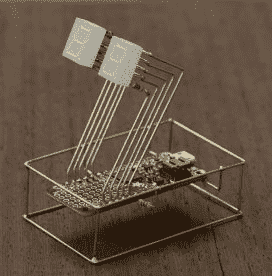
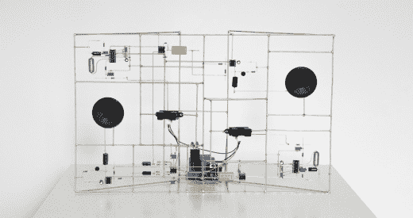
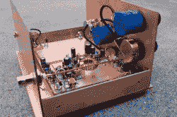
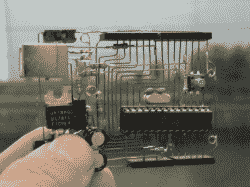
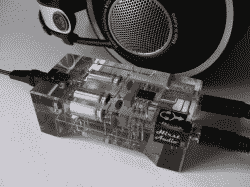

# 电路雕塑大赛

> 原文：<https://hackaday.com/2018/12/04/the-circuit-sculpture-contest/>

许多艺术家都与他们的媒介密不可分:文森特·梵高有油画，奥古斯特·罗丹有青铜，班克斯有喷壶和蜡纸。你有集成电路，无源器件，电线和焊料。电子产品经常被藏起来，但今天不会了！我们希望看到你建造出本身就很漂亮的电子电路。

这是 [Hackaday 的赛道雕塑大赛](https://hackaday.io/contest/162559-circuit-sculpture-contest)，我们打赌你已经拥有了参赛所需的一切。离开单调的 2D PCB 平原，进入第三维度！或者完全脱离 PCB。我们的灵感来自 [Mohit Bhoite](https://twitter.com/MohitBhoite) 和 [Eirik Brandal](http://eirikbrandal.com/) 最近的几个特色项目，这些项目展示了由其自身布线支持的功能性电子电路:

  Work by [@MohitBhoite](https://twitter.com/MohitBhoite) featured on [Hackaday](https://hackaday.com/2018/11/19/flywire-circuits-at-the-next-level/)  Work of [Eirik Brandal](http://eirikbrandal.com/) featured on [Hackaday](https://hackaday.com/2018/11/29/wonderful-sculptural-circuits-hide-interactive-synthesizers/)

这些作品中有一些美丽的东西。他们将那些不被注意的痕迹带到项目的最前沿。挑战的核心很简单:建造一个以电子电路为主要建筑材料的雕塑(如果你更喜欢艺术术语，也可以是媒介)。

## 奖品和如何参加

前往 Hackaday.io，发布一个展示您的 circuit sculpture 的项目页面——使用项目页面左侧栏上的“提交项目至:”下拉菜单进入。

对你分享什么信息没有严格的要求，但这里有一些吸引评委的建议:我们想看看你在项目期间经历了什么。展示你的计划，你用来制作它的方法，如果可以的话，分享一个示意图。讲述这个故事，就像你和你最好的朋友站在车间里一样。

*   ### Three special entries will each win a cash prize of $200

*   ### Four runners-up will each win a Tindie gift certificate worth $100

竞赛页面上有完整的竞赛规则[。](https://hackaday.io/contest/162559-circuit-sculpture-contest)

## 你的电路必须做些什么…

即使只是点亮一个 LED，你的雕塑也必须是一个功能电路。评委将主要考虑你创作的艺术，但也会考虑这个电路的复杂性。但这真的不是谁赢的问题。美化是情人眼里出西施，我们已经看到了许多丑陋的项目，但它们无疑是美丽的！

## 什么算雕塑？

我们正在寻找[项目，摆脱传统的电路板布局](https://hackaday.com/2017/09/05/non-standard-circuits-jazz-for-electrons/)，从元件和连接本身做出一些漂亮的东西。最明显的是如上所述的 flywire 雕塑，但我们认为涉及电路板的项目仍然可以在这场比赛中表现出色——想想 Cordwood 或其他方法，其中 PCB 不是关注的焦点或局限于一个平面。我们也认为曼哈顿风格和死虫风格的建造是一件美丽的事情，所以这些也会被考虑。

Manhattan-style by [Dave Richards AA7EE](https://aa7ee.wordpress.com/2011/07/24/the-wbr-a-simple-high-performance-regen-receiver-for-40m-by-n1byt/)

[Arduino Skeleton](https://hackaday.com/2011/03/31/pcbs-without-any-substrate/) by [Kimio Kosaka]

[Rupert Hirst]’s [headphone amp](https://hackaday.com/2012/04/13/free-formed-circuit-protected-by-a-brick-of-crystal-clear-resin/)

关键是，拓展你创造力的边界！元件和电线都很便宜，所以测试你的想法，重复你成功的测试，我相信你会对你能完成的事情感到惊讶。你在上面看到的是同样的第一步的结果。这是 Hackaday 我们希望看到这些试验性的第一步，就像我们希望看到最终产品一样，因为伟大的想法来自如此之多的地方。[好运](https://hackaday.io/contest/162559-circuit-sculpture-contest)！