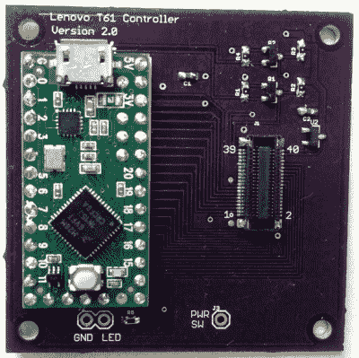

# Teensy 解放了 ThinkPad 键盘

> 原文：<https://hackaday.com/2018/12/04/teensy-liberates-the-thinkpad-keyboard/>

[弗兰克·亚当斯]非常喜欢他的联想 ThinkPad T61 上的键盘，以至于他决定[设计一个适配器，这样他就可以通过 USB 使用 Teensy 微控制器](https://www.instructables.com/id/How-to-Make-a-USB-Laptop-Keyboard-Controller/)。他让 Trackpoint 开始工作，并设法为许多其他笔记本电脑主板添加了支持。不知不觉中，他已经有了一个成熟的开源项目。那些项目可能会在你最意想不到的时候悄悄靠近你…

 这一过程的第一步是将你选择的笔记本电脑键盘连接到电脑上，但正如你所料，这通常说起来容易做起来难。它们通常使用某种类型的柔性印刷电路(FPC)“带状电缆”，但也可能端接于任意数量的古怪连接器。[Frank]讲述了将这些不同的键盘连接到他的 PCB 的细节，从搜索 Aliexpress 和 Digikey 等常见的可疑连接器，到不顾一切地切除有问题的小块和小块以使其适合。

你可能要靠自己找出连接你解放出来的键盘的最佳方式，但是[Frank]已经通过设计一些 PCB 完成了他的工作，这些 PCB 处理将适当的连接路由到 Teensy LC 或 3.2 微控制器。他是个了不起的家伙，他甚至为你写了固件。截至目前，他的软件和硬件设置支持十几个键盘，但如果需要，他也给出了如何为您自己的主板修改固件的提示。

毫不奇怪，是 Thinkpad 键盘让弗兰克走上了这条路；正如我们多年来记录的那样，黑客喜欢他们的 Thinkpads。从[给它们安装更现代的主板](https://hackaday.com/2018/03/12/new-guts-make-old-thinkpads-new/)到[装满俄罗斯套娃，在一台](https://hackaday.com/2018/11/24/the-best-laptop-gets-even-better/)中放入第二台电脑，这是真正的笔记本电脑发动了一千次黑客攻击。

 [https://www.youtube.com/embed/Z1PheqSNNP8?version=3&rel=1&showsearch=0&showinfo=1&iv_load_policy=1&fs=1&hl=en-US&autohide=2&wmode=transparent](https://www.youtube.com/embed/Z1PheqSNNP8?version=3&rel=1&showsearch=0&showinfo=1&iv_load_policy=1&fs=1&hl=en-US&autohide=2&wmode=transparent)

