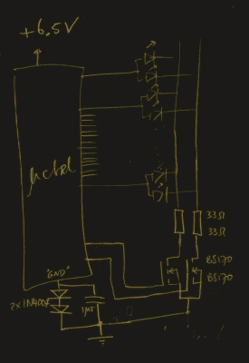

# 负电压将 AVR 推向新高度

> 原文：<https://hackaday.com/2018/12/08/negative-voltage-pushes-avr-to-new-heights/>

如果我们说一个黑客是看着一个“已解决”的问题，仍然可以提出多个备选解决方案的人，那么[查尔斯·欧文兰]绝对符合这个标准。鉴于我们之前从他那里了解到的情况，我们并不需要更多证据来证明他的黑客信誉，但是[他最近写信告诉我们一个有趣的问题解决方案](https://charlesouweland.wordpress.com/2018/11/28/getting-a-few-more-volts-out-of-a-microcontroller/)，我们认为这是该原则的一个完美例子。他想用 AVR 微控制器驱动一个回收的七段 LED 显示器，但只有一个问题:显示器需要 15V，但 AVR 只能提供 5V。那怎么办呢？

 事实证明，解决问题的第一步是先核实确实存在问题。[Charles]做了一些实验，发现显示器实际上不需要*15V 的电压来工作，事实上只需要 6.5V 就足够点亮了。这降低了不少门槛，但仍然太高，无法直接从芯片供电。*

有一些常见的方法来解决这个问题，这无疑是普通读者都知道的。但是[查尔斯]想走一条人迹罕至的路。更确切地说，是他必须在 PCB 上安装的额外元件最少的路径。他开始寻找最简单的方法让他的 5V AVR 点亮 6.5V 的 LED，并最终找到了一个非常聪明的解决方案，一些人甚至不知道这是可能的。

他推断，如果他将两个 BS170 MOSFETs 的源极引脚连接到-1.5V 的电压，即使 AVR 引脚为 0V，它们仍将接收 1.5V 的电压。这种虚拟的“阶梯”意味着，一旦 AVR 引脚变为高电平(5V)，相对电压实际上将为 6.5V，足以驱动他的 led。当然，唯一的问题是你需要一个-1.5V 的电源。

获得负电压通常需要在设计中增加更多元件(这是他一开始就避免的)，但后来他想到了另一个聪明的主意。为了达到这个目的，他实际上给 AVR 供电 6.5V，但通过增加两个 1N4007 二极管将接地电压提高了 1.5V。通过这种方式，AVR 在其能力范围内获得电压，并且仍然可以向 led 提供相对 6.5V 的电压。

有人可能会说[查尔斯]采用了小林丸的方法，只是重新定义了游戏规则。[但这就是令人困惑的负电压的力量](https://hackaday.com/2018/11/09/the-negative-rail-explained/)。