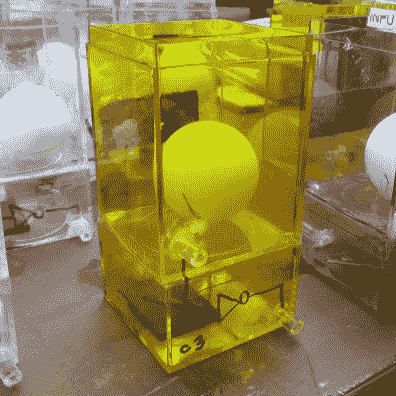
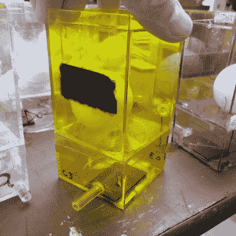
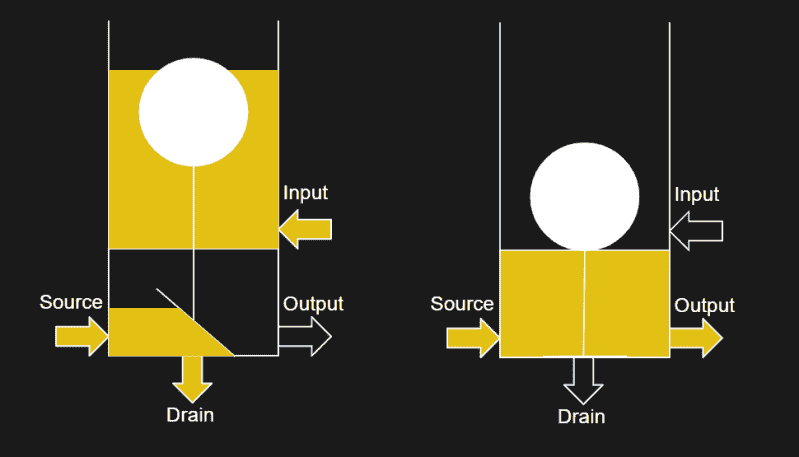

# 安德森的水计算机泄露了数字逻辑的模拟秘密

> 原文：<https://hackaday.com/2018/12/03/andersons-water-computer-spills-the-analog-secrets-of-digital-logic/>

我们对计算机了解的第一件事是二进制 1 和 0 的概念。当我们深入研究数字逻辑的实现时，我们开始了解电压、电流以及模拟世界的其他现实。教科书通常使用水流作为类比来解释电子的流动，而[格伦·安德森]将这种概念性的解释变成了现实。在刚刚过去的这个周末，他带着他的水电脑来到了洛杉矶市中心的迷你创客集市，向人们展示了数字设备背后的模拟现实。

[Glen]的演示是另一个教科书插图的翻译:具有两个 4 位输入和一个 5 位输出的二进制加法器。每个晶体管都是由一个塑料首饰盒制成的，首饰盒的盖子粘在底部，形成两个腔室。一个乒乓球放在上面的腔室中，一个橡胶盖放在下面的腔室中，盖住一个洞，用一根线将它们连接起来，这样一个漂浮的球将提起盖并露出洞。

下面是一个反相器在这台计算机中的工作原理:输入是一根连接到上腔室的管道。进入的水(代表 1)充满上腔使球漂浮。当球漂浮时，它提起阀瓣，将水从下腔排出。输出是连接到该室的管道，因此任何水也从输出管道排出。没有水代表零，输出的倒数，因此这个盒子是一个水非门。

  Front of water computer inverter, with input (top) and output (bottom).  Rear of water computer inverter, with source visible and drain not visible below the flap.

作为创客博览会的展品，[格伦]的水电脑吸引了所有观众。五颜六色的盒子和舒缓的流水声使这种水成为一件吸引人的动态艺术。年幼的孩子很乐意帮助给计算机供电，从排水槽装满水桶，然后举起来重新装满源槽。有电子学知识的人可以看到用水说明的概念。不仅仅是像“源极”和“漏极”这样的基本概念，还有像“漏电流”和“阈值电压”这样更高级的概念。每个连接盒的管道长度代表电线电容，水的流速决定开关速度，这个令人惊讶的忠实教育模型 [NMOS 逻辑](https://en.wikipedia.org/wiki/NMOS_logic)的列表还在继续。

和他的孩子一起建立这个项目当然是帮助解释爸爸作为芯片设计师的职业生涯的一个很好的方式。随着所有的努力投入到这个创作中，它肯定会在另一个地方再次出现。[Glen]希望在圣马特奥举行的 2019 年湾区制造商博览会上再次展出这款水电脑。到那时，它应该有一些改进，比如简化的设置、拆卸、改进的可靠性，以及更好的文档，以便在出现问题时更容易调试。在过分热心的孩子们拉了一堆管子把水射得到处都是后，快速恢复是可取的。

现在，那些仍然想知道两张装满漂浮乒乓球的桌子如何进行计算的人可以向我们的向导 *[寻求用(几乎)任何东西](https://hackaday.com/2017/01/03/make-logic-gates-out-of-almost-anything/)* 制造逻辑门。最后，向所有父母和教育工作者致敬，感谢你们努力教育后代……这偶尔意味着在一天结束时被水浸湿。

 [https://www.youtube.com/embed/zM766uVaDWA?version=3&rel=1&showsearch=0&showinfo=1&iv_load_policy=1&fs=1&hl=en-US&autohide=2&wmode=transparent](https://www.youtube.com/embed/zM766uVaDWA?version=3&rel=1&showsearch=0&showinfo=1&iv_load_policy=1&fs=1&hl=en-US&autohide=2&wmode=transparent)

