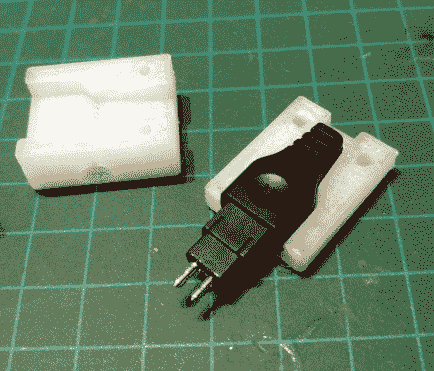

# 高端耳机获得弹性吊杆升级

> 原文：<https://hackaday.com/2018/12/04/high-end-headphones-get-flexible-boom-upgrade/>

这似乎是一个合理的假设，任何愿意花几百美元买一副耳机的人都可能是对高质量音频有热情的人。或者他们为政府工作。不过，我们相当肯定[丹尼尔·哈拉里]属于前一类，考虑到他对为他的森海塞尔 HD650 耳机添加一个像样的麦克风给予了多少思考。

 由于不满意夹在衬衫上或安装在支架上的麦克风的效果，[丹尼尔]意识到他真正想要的是一个灵敏的吊杆式麦克风。这将离他的嘴足够近，不会拾取杂散噪声，但同时不会妨碍他的视野或以其他方式挡道。

他在市场上找到了一些选项，可以让他在 HD650 上安装吊杆麦克风，但他不想在上面粘上任何东西，以免刮伤车身，所以这些选项并不适用。[Daniel]决定走 DIY 路线，并最终决定将麦克风安装到耳机现有的连接器上，该连接器插在杯子底部。

为了制作他的支架，他 3D 打印了一个两件式夹具，可以拧在一起并牢固地连接到连接器上，而不需要做任何永久性的改变。一旦他打印出了基本组件，他就从一个便宜的 USB 灯上回收了柔性金属颈部，并用它来固定 3.5 毫米的母连接器。他把一个通常用于录音机的小型商用麦克风插入其中，[丹尼尔]说这听起来甚至比他测试过的大型麦克风还要好得多。

最后，他使用 Sugru 封装电线，并创建一个灵活的应变消除。整个组件非常轻，易于移动，也许最重要的是，不需要对一副耳机进行任何修改或损坏，因为它的零售价格可能是汽车付款的两倍。

已经有几年没有人敢黑他们昂贵的森海塞尔耳机了。但是在过去，我们报道了一个修改，其中[给他们注入了蓝牙](https://hackaday.com/2012/02/05/improving-headphones-by-voiding-warranties/)，甚至还有一个[逆转了一个偷偷摸摸的制造商硬件限制](https://hackaday.com/2011/02/12/uncrippling-lower-model-speakers/)。