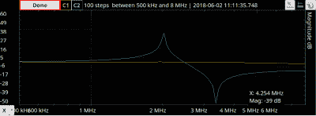

# 晶体振荡器解释

> 原文：<https://hackaday.com/2018/12/08/crystal-oscillators-explained/>

我们读过很多关于振荡器的书，但是晶体振荡器似乎有点神秘。业余爱好水平的书倾向于说，建立一个这样的电路，然后弄乱它，直到它振荡。工程教科书倾向于谈论环路增益，但对实践却不是很清楚。一篇[circuit digest] [的文章延续了振荡器系列文章](https://circuitdigest.com/tutorial/quartz-crystal-oscillator/),对这个主题进行了很好的实际处理。

晶体被制成具有自然共振频率，并在适当的激励下以该频率或其倍数振荡。当然，诀窍在于找到合适的激励。

这篇文章从一个晶体的基本模型开始，这个晶体有串联的电容、电感和电阻。还有一个并联或并联电容。订购晶振时，您需要指定谐振频率是串联还是并联模式，也就是说，您希望模型中的哪个电容与电感谐振，以便模型具有实际应用。

 通过在模型上应用通常的共振公式，你会看到有一个零点和一个峰值，对应着两个共振点。谷值是串联频率，峰值是并联频率。你可以在我们最近关于[模拟探索 2](https://hackaday.com/2018/06/20/analog-discovery-2-as-a-vector-network-analyzer/) 的文章中看到一个真实晶体的踪迹。正如你在右边看到的，它与数学非常吻合。

您可能想知道是否可以放弃水晶，只使用模型中的组件。理论上，是的。但是 Q 值——电抗与电阻之比——将比晶体低得多。晶体也比典型的电阻、电容和电感更稳定，这就是为什么它们能在你需要精确频率的地方得到应用。高 Q 值使得晶体在窄带滤波器中也很有用。

有几种常见的振荡器架构，典型的设计程序是从一种架构开始，然后计算所需的值。这篇文章着眼于科尔皮兹振荡器。记住 Colpitts 振荡器以 C 开头，反馈环路有一个分离电容(与抽头电感相对)，通常就可以分辨出它。这篇文章还介绍了 Pierce 振荡器和一些数字振荡器。然而，这篇文章并没有真正讨论设计计算。但是，还是很多好的信息。如果可以偏置反相放大器，应该没问题。

你可以通过注入[谐振频率到](https://hackaday.com/2018/10/20/the-crystal-testing-method/)来测试一个晶体。我们也已经看到[SDR 投入使用](https://hackaday.com/2018/06/06/classifying-crystals-with-an-sdr-dongle/)进行测试。