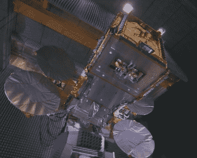

# 欢迎来到美国卫星电视的缓慢死亡

> 原文：<https://hackaday.com/2018/12/17/welcome-to-the-slow-death-of-satellite-tv-in-america/>

在 11 月 29 日的收益电话会议上，AT&T 通信公司的首席执行官约翰·多诺万实际上签署了美国卫星电视的死刑执行令。在花费 670 亿美元收购美国最大的卫星电视提供商 DirecTV 仅仅三年后，他发表了一篇评论，对这家电信巨头为这项服务的大约 2000 万用户制定的计划几乎没有任何疑问:“我们已经发射了最后一颗卫星。

如果你是 DirecTV 的用户，这个消息可能会让你大吃一惊，但这种情况已经存在多年了。当将 DirectTV 带入 AT & T 家族的交易签署时，他们没有隐瞒这样一个事实，即实际的卫星内容传输基础设施是他们最不关心的。他们真正想要的是数以百万计的用户群，以及 DirecTV 已经达成的利润丰厚的内容交易。这个计划总是把 DirecTV 的用户从他们的卫星天线上拉下来，唯一的问题是需要多长时间，以及最终他们会使用什么技术。

既然约翰·多诺万已经明确表示，他们的卫星舰队将不会继续更新，时钟已经正式开始计时。今年不会，后年也不会。但最终，目前向地球传送 DirecTV 内容的每一颗卫星都将停止工作，随着每一只沉默的小鸟，卫星电视(至少在美国)将逐渐成为历史。

## 互联网杀死了卫星明星

如果 2015 年美国电话电报公司收购 DirecTV 时，对家庭视频内容交付的未来有任何疑问，现在肯定没有了:点播流媒体。每年都有越来越多的消费者通过互联网从网飞、亚马逊 Prime 和 Hulu 等服务获取流媒体内容；传统的电视服务提供商陷入了大麻烦，他们在追赶发展自己的流媒体服务。消费者希望自己决定何时、如何以及看什么节目。他们应该在特定时间“收看”的想法正变得越来越过时，特别是对于那些从未生活在没有 YouTube 和其他即时满足视频服务的世界中的年轻客户来说。

至少“有线电视”提供商(如今可以采取多种形式，包括光纤到户)可以依靠向客户提供互联网服务。你可能不想看他们的品牌电视服务，但你仍然要向他们购买互联网接入，因为你的家实际上接入了他们的网络。但是卫星供应商甚至没有那顶金色的降落伞；相对而言，卫星互联网速度慢且昂贵，只有少数几家公司仍在提供这种服务。

DirecTV’s Android streaming device

从这个角度来看，难怪美国电话电报公司不想投资发射更多的电视卫星。他们不能提供有竞争力的互联网服务，谁愿意赌传统电视服务在未来 20 年还会存在？它根本没有足够的价值。当然，这并不意味着他们放弃了将视频传送到消费者家中的想法。

就在一年多前，美国电话电报公司(AT & T)的安卓机顶盒(T1)通过联邦通信委员会(FCC)的一份文件披露，该机顶盒旨在通过客户现有的宽带互联网连接提供电视服务。这款带有 DirecTV 品牌的设备目前正在由工作人员进行内部测试，通常被称为“狗食化”；换句话说，在让消费者看到你自己的产品之前，先对其进行内部测试。这种新的 IP 电视服务预计将在 2019 年全面推出，试图让卫星用户转向基于互联网的节目的营销活动可能不会太久。

## 盘点 DirecTV 车队

比方说，你每天从 DirecTV 的一颗地球同步卫星上接收闪烁的数字鸦片，这颗卫星目前在我们头顶上方 35，786 公里(22，236 英里)处，并且不太热衷于用另一种互联网流媒体设备来取代这种设置。在选择权被剥夺之前你还有多长时间？

DirecTV-15 during testing

简短的回答是，相当一段时间。最后加入舰队的卫星 DirecTV-14 和 DirecTV-15 分别于 2014 年和 2015 年升空。这两颗卫星的名义寿命为 15 年，如果不出问题的话，它们应该会一直工作到 2030 年。目前组成 DirecTV 舰队的其他 11 颗卫星都相当老了，在未来几年里，我们可能会看到它们一颗接一颗地退役。

由于这些卫星运行的高度，将它们发送到更深的太空比将它们减速到足以迫使它们重返地球大气层所需的能量要少得多。因此，没有一颗 DirecTV 卫星会坠落回地球；相反，当它们到达运行寿命的终点时，它们将耗尽剩余的推进剂，将自己定位在所谓的“[墓地轨道](https://en.wikipedia.org/wiki/Graveyard_orbit)”上。

有趣的是，据报道，美国电话电报公司向 DirecTV-15 的制造商空中客车公司订购了另外两颗卫星(DirecTV-16 和 DirecTV-17)。事实上，根据空间分配号码管理局(SANA)的注册官，DirecTV-16 甚至被暂定于 2018 年 8 月发射。考虑到建造一颗主要的地球同步通信卫星的准备时间，人们想知道在这些卫星被取消之前，空中客车公司在建造这些卫星上已经走了多远，现在在& T 公司决定退出这个行业后，它们会怎么样。

## 一个时代的终结

安全的钱是在直播电视上，至少在下一个十年里仍然从他们的一些卫星上播放电视，但除此之外的事情谁也说不准。当然，还有其他公司提供卫星电视，一旦 DirecTV 正式将其所有业务迁回 terra firma，他们甚至可能会蜂拥而至，但谁能说那些较小的公司到那时会处于什么状况。

有太多的因素与卫星电视竞争，让它无法长期生存。宽带变得越来越快，越来越容易获得，甚至在农村地区也是如此，内容消费者对播放数以千计广告的数百个频道越来越不感兴趣。鉴于其悠久的历史和与黑客社区的交集，看到卫星电视慢慢淡出历史舞台将是令人难过的。但至少我们可以感到些许安慰，因为我们知道不会缺少废弃的卫星天线，我们 T2 可以用它来进行 T4 的各种项目和实验。