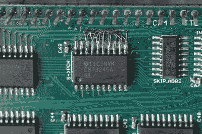

# 由 74 系列逻辑制成的 6502 可以在 20 MHz 下运行

> 原文：<https://hackaday.com/2018/12/15/this-6502-made-from-74-series-logic-can-run-at-20-mhz/>

如果你总是希望在你的经典微型计算机中用 6502 更接近硬件，你是幸运的，因为[Drass]已经用 TTL 逻辑芯片创造了一个漂亮的 6502 实现。它的特别之处在于它位于一组非常整洁的 PCB 上，并且由于它使用 74AC 系列逻辑，它可以以比原来高得多的速度运行。20 MHz 6502 在 20 世纪 70 年代中期将是革命性的。

Neat reworking of what looks to be a reversed bus.

通过一根飞行带状电缆，它可以直接插入经典微型计算机的 6502 插座，网站显示它可以在 Commodore VIC20 上运行各种软件。作为套件的一部分，还有一个定制的 SBC，所以如果你想测试 CPU 的速度，不需要经典的微处理器。这些电路板并不完美，网站上有一张非常整洁的返工图片，看起来总线被反向应用到芯片上，但它确实有专业设计的感觉。

这是一个非常整洁的 6502，但它不是我们第一次看到的，也不是最不完整的。有一个 74 个逻辑 CPU 的迷人世界有待探索，所以[很难只挑选一个给你看](https://hackaday.com/2017/03/28/another-74xx-series-cpu/)。

谢谢[杰夫]的提示。