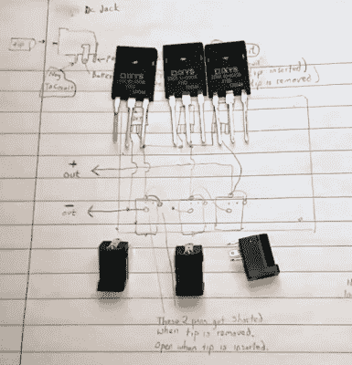

# 笔记本电脑充电器合作，让电力流动

> 原文：<https://hackaday.com/2018/12/10/laptop-chargers-team-up-to-get-the-juice-flowing/>

也许没有什么比一个好的电源更难扔掉的了。无论是伴侣早已被放错地方的经典“壁瘤”，还是你从一台废弃电脑中取出的一辆结实的 ATX，似乎总有一些事情*你可以用这些现代电力转换的小奇迹来做。所以它会被放进零件箱，永远呆在那里。但对[the rainhavester]来说并非如此，他发现[将一抽屉旧笔记本充电器投入使用的秘密是像黑客*Voltron*T5]一样梳理它们。](https://www.youtube.com/watch?v=FcN_ZcztjXo)*

 使用三台旧的 IBM 笔记本电脑充电器，他能够以 4.5 安培的健康电流产生高达 48 伏的 DC。他拼凑的电源甚至具有可变输出，尽管有一些强大的粗调。由于每个充电器单独额定为 16V，他可以拔掉其中一个适配器以获得 32V。

在休息后的视频中,[TheRainHarvester]向观众展示了他的简单适配器的构造，这种适配器可以很容易地用回收的零件制成。该适配器建立在一块无痕纤维板上，由三个充电器插孔和三个结实的肖特基二极管组成。

筒式插孔(一旦拔掉插头，就会使一个引脚短路)和二极管的特性允许[TheRainHarvester]将三个适配器的输出串联起来，而不会有损坏它们的风险，例如，如果一个适配器插在适配器上，而不是墙上。他还希望添加一些状态 led，以显示哪些充电器正在通电。

不幸的是，[TheRainHarvester]意识到他认为是惰性的一块板实际上有一个接地层时有点太晚了，所以他必须想出一种新的方法，在下一个版本中将整个事情联系在一起，他说现在他知道这个概念似乎可行了。

与此同时，如果你正在考虑用我们知道的在实验室里到处乱放的大量旧笔记本充电器来破解某个东西，你可能想看看我们的初级读本，以便理解这个东西背面的所有象形文字。

 [https://www.youtube.com/embed/FcN_ZcztjXo?version=3&rel=1&showsearch=0&showinfo=1&iv_load_policy=1&fs=1&hl=en-US&autohide=2&wmode=transparent](https://www.youtube.com/embed/FcN_ZcztjXo?version=3&rel=1&showsearch=0&showinfo=1&iv_load_policy=1&fs=1&hl=en-US&autohide=2&wmode=transparent)

