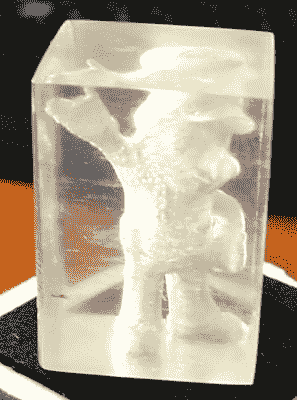

# 桌面 3D 打印机的真正透明零件

> 原文：<https://hackaday.com/2018/12/11/true-transparent-parts-from-a-desktop-3d-printer/>

我们对看到半透明的 3D 打印部件并不陌生:如果你在一根足够薄的透明细丝上打印，你就可以透过最终的部件看到。它并不完美，但如果你想做灯罩或装饰品，它已经足够好了。你当然不能打印任何实用的东西，比如观察窗或透镜，这样“清晰”的 3D 打印更多的是一种新奇的东西，而不是一个实用的过程。

 但是经过几个月的完善过程，[【托默·格里克】终于在一台标准的台式 FDM 机器](http://fenneclabs.net/index.php/2018/12/09/3d-printing-transparent-parts-using-fdm-fff-printer/)上完成了他的透明打印指南。他说，它甚至不需要任何特殊的灯丝，它可以在 PLA、ABS 或 PETG 上工作，尽管为了这次演示的目的，他使用了新的 Prusament ABS。这个过程需要一些特定的打印设置和一些后期处理，但他所取得的结果非常值得一试。

根据[Tomer]的说法，秘密就在打印设置中。本质上，你希望打印机将各层压得比正常情况下更紧密，同时使用高温和 100%填充。最终的结果(希望如此)是打印机放置的塑料与前面的塑料完全融合，使得打印出来的东西比我们过去用 FDM 打印看到的更像一个字面上的固体。事实上，你可以认为这些设置产生的内部结构几乎与你在普通印刷品上看到的完全相反。

这些不寻常的打印设置的缺点是打印的外部异常粗糙和丑陋(当尽可能多地将塑料压在一起时，您可能会想到这一点)。为了暴露出清晰的内部，你需要用相当强烈的砂纸将外部打磨掉。[Tomer]说，他从 600 到 4000，甚至提到当你达到真正的高粒度时，你可能会用一块纸板来打磨印刷，因为这大概就是砂纸的粗糙程度。

[Tomer]接着演示了一个打印的激光透镜，甚至展示了如何通过有意地在打印内容中加入你喜欢的任何形状的空隙来重现激光雕刻丙烯酸的效果。这是一个非常棒的效果，老实说，我们永远不会相信这是一台标准的桌面 3D 打印机。

过去[我们已经看到专业灯丝提供一些相当半透明的部分](https://hackaday.com/2017/05/13/transparent-3d-printing/)，但这些结果仍然不如【Tomer】用标准灯丝得到的结果好。我们非常有兴趣看到更多的这种过程，并很兴奋地看到黑客们可以提出什么样的应用程序。

 [https://www.youtube.com/embed/7LpQwnupQPU?version=3&rel=1&showsearch=0&showinfo=1&iv_load_policy=1&fs=1&hl=en-US&autohide=2&wmode=transparent](https://www.youtube.com/embed/7LpQwnupQPU?version=3&rel=1&showsearch=0&showinfo=1&iv_load_policy=1&fs=1&hl=en-US&autohide=2&wmode=transparent)

