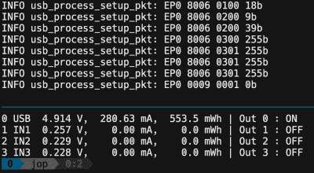

# 开放式硬件板支持强大的 USB 电源监控

> 原文：<https://hackaday.com/2018/12/11/open-hardware-board-for-robust-usb-power-monitoring/>

我们都见过小型 USB 功率计变得流行，因为几乎每个便携式设备都采用了某种形式的 USB 充电。放置在电源和被测设备之间，可以让你实时看到电压和电流。非常适合确定 USB 供电设备使用电池可以运行多长时间，或者确定 USB 电源是否有足够的电流来工作。

 【乔纳斯·佩尔森】喜欢这些廉价小玩意的想法，[但是想要更科学一点的](https://github.com/jonpe960/upm)。他的设计被他称为 UPM，本质上是那些无处不在的 USB 设备的“智能”版本。现在可以在电脑上查看和分析数据，而不仅仅是在小小的液晶显示屏上显示数据。他的小工具甚至允许你切断被测设备的电源，潜在地允许自动测试诸如浪涌电流之类的东西。

本质上，UPM 的工作方式与简单的 USB 电表非常相似:设备的一端朝向上游电源，被测设备插入另一端。两个器件之间是一个 16 位 ADC 和差分放大器，用于测量电压和电流。如果您想将 UPM 连接到外部微控制器或其它数据记录器件，板上有一个接头可以连接到 ADC。

但最有可能的是，您将使用内部微控制器来分析 I2C 上 ADC 的输出，该 ADC[Jonas]非常巧妙地通过集成的 USB 集线器连接到上游端口。集线器的一端连接到被测设备，另一端连接到微控制器。因此，主机设备将同时看到 UPM 的集成微控制器和目标设备。在那里，您可以使用 ncurses 用户界面实时监控设备。

虽然硬件看起来差不多完成了，但[Jonas]对 UPM 的软件方面有更多的计划，包括支持远程控制和 TCP/IP 监控以及强大的日志功能。这绝对是一个非常有趣的项目，我们很高兴看到它的进一步发展。

在过去，我们已经看到[自制 USB 功率计构建](https://hackaday.com/2015/09/07/simple-usb-power-meter/)，甚至[商业产品吹嘘基于计算机的记录和分析](https://hackaday.com/2015/06/19/review-friedcircuits-usb-tester/)，所以有人将它们合二为一只是时间问题。