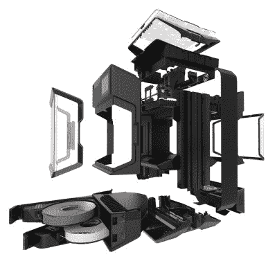
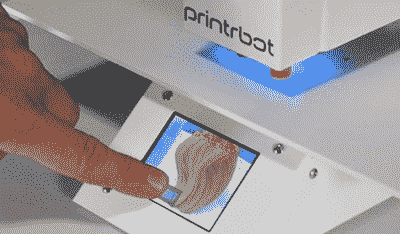

# MakerBot 用新打印机远离制造商

> 原文：<https://hackaday.com/2018/12/11/makerbot-moves-away-from-makers-with-new-printer/>

如果你在过去几年一直关注桌面 3D 打印市场，你可能知道现在的主要参与者。像 Creality 这样的中国公司正在主导入门级市场，其价格低到足以接近冲动购买的机器，Prusa Research 正在迭代他们的 i3 设计，并为中端价格点带来许多令人兴奋的新功能，如果你有现金，Ultimaker 仍然是高端主力的可靠选择。但是，在 3D 打印制造商的“名人录”中，有一个名字明显缺席，那就是 MakerBot 尽管有效地创造了桌面 3D 打印市场，但今天它们在很大程度上已经变得默默无闻。

因此，当 Thingiverse (MakerBot 的 3D 打印库)上弹出一条横幅广告，宣传即将发布的新打印机时，社区中普遍感到惊讶。一段时间以来，人们一直认为 MakerBot 在 2013 年被工业 3D 打印机制造商 Stratasys 收购后一直是一家僵尸公司；本质上是用这个名字作为一种廉价的方式来维持在消费 3D 打印机市场的立足点。在一个已经充斥着知名敏捷公司的市场上，他们真的会发布一款新的消费级 3D 打印机，这种想法似乎很难让人相信。

但是现在 MakerBot 已经正式发布了他们称之为“方法 T1”的打印机模型，这一切都变得有意义了。简单地说，这不是我们的打印机。通过 Method，MakerBot 正式脱离了它的名字来源的创客社区。虽然可以说，他们后来的型号复制器打印机已经从消费者市场上挤走了，但这种方法不仅从其令人垂涎的 6500 美元的价格标签上，而且从其功能集和设计上，都清楚地表明了这种转变。

也就是说，这仍然是一个有趣的设备，值得仔细看看。它借用了许多其他公司和打印机的概念，同时引入了一些自己的合理的引人注目的功能。虽然这种方法可能不在任何黑客读者的假日愿望清单上，但我们不禁对这种机器的未来感到好奇。

## 疯狂的方法

Method 在很大程度上依赖于从母公司 Stratasys 继承的概念和技术，与以前的 MakerBots 甚至当代的桌面 3D 打印机几乎没有相似之处。它代表了桌面和工业 3D 打印市场的融合，许多人认为这将在 MakerBot 收购后发生，只是实现的时间比任何人预期的都长。

 与之前的 MakerBot 打印机一样，该方法坚持使用其他制造商已经放弃的双挤出机设计，转而使用具有材料切换功能的单挤出机。众所周知，双挤出机很难校准和维护，但这是一种更快的多材料打印方法，因为喷嘴不必在每次材料变化时进行清洗。由于 MakerBot 将该方法宣传为“第一台高性能 3D 打印机”，坚持使用双挤出机的速度优势显然值得他们应对一些额外的工程挑战。

其他有趣的功能包括加热建造室，它利用对流来保持整个内部体积的一致温度。我们习惯于在桌面 3D 打印机上看到加热床，它在保持下层温暖以防止翘曲方面做得不错，但超过几十毫米就没什么用了。然而，使用加热外壳时，整个打印过程保持在相同的温度下，以获得更加一致的结果。这是个人经常尝试为自己的桌面 3D 打印机 DIY 的东西，也是 MakerBot 将通常只在高端工业机器中看到的东西带进主流的一个完美例子。

该方法还具有内部灯丝存储隔间，MakerBot 声称这些隔间几乎与外部环境完全密封。内部传感器甚至监控灯丝的湿度，以验证最佳性能。同样，这是一个我们并不陌生的功能[看到黑客入侵现有的 3D 打印机](https://hackaday.com/2018/02/10/heated-drybox-banishes-filament-moisture-for-under-20/)。像对流加热室一样，这是传统桌面 3D 打印机上不可用的技术；尽管我们确实至少看到了一种新机器的原型，它有望在今年的东海岸说唱节上把这种功能带给大众[。](https://hackaday.com/2018/07/13/errf-18-new-products-make-their-debut/)

 [https://www.youtube.com/embed/O4mRZE8S5yY?version=3&rel=1&showsearch=0&showinfo=1&iv_load_policy=1&fs=1&hl=en-US&autohide=2&wmode=transparent](https://www.youtube.com/embed/O4mRZE8S5yY?version=3&rel=1&showsearch=0&showinfo=1&iv_load_policy=1&fs=1&hl=en-US&autohide=2&wmode=transparent)

## 熟悉的特征

虽然 Method 无疑提供了一些迄今为止在桌面 3D 打印机中几乎闻所未闻的功能，但 MakerBot 显然也在过去几年中密切关注着竞争。这种方法有许多我们已经在消费级打印机上看到的功能，有些人可能会说这质疑机器的天价。

 安装在方法顶部的彩色触摸屏让我们想起了 PrintrBot 的尝试[在他们简单的 Pro](https://hackaday.com/2016/12/16/inside-the-printrbot-printrhub/) 上使用类似的界面使 3D 打印更加用户友好。不幸的是，社区没有接受 Simple Pro 所代表的范式转变，最终导致 PrintrBot 在几个月前关门大吉。尽管如此，3D 打印机似乎不可避免地将获得与 21 世纪其他所有设备一样的触摸用户界面，因此我们怀疑 MakerBot 将是唯一一个试图在未来的打印机上引入这一功能的公司。

方法还具有一些增强功能，Prusa i3 MK3 的拥有者对此已经非常熟悉。可移动的磁性构建板、自动加载细丝和基于编码器的堵塞检测都是 Method 吹捧的功能，这些功能也可在 Josef Prusa 的最新打印机上使用(价格约为 1/6)。

你甚至可以说 Method 的机载摄像头、远程 WiFi 控制和广泛使用传感器来监控当前打印是受 OctoPrint 及其大量社区开发的插件的启发。OctoPrint 社区已经在 3D 打印机控制和监控方面突破了极限，并且已经引起了许多其他 3D 打印机制造商的注意。将 MakerBot 添加到对开源社区用他们的 3D 打印机所做的事情印象深刻的公司名单中似乎是一个安全的赌注。

## 讽刺的工业水平

去年的这个时候，随着“MakerBot Labs”的发布，MakerBot 试图回归本源的希望出现了一丝曙光，在 Method 公布之前，一些人甚至推测新的 MakerBot 可能会采取更名的中国打印机的形式；让他们可以在更便宜的打印机上提供支持和教育课程。现在这个方法被揭示了，我们可以看到，没有什么是远离真理的。凭借这款新机器，MakerBot 在他们的复制器打印机仍有一定影响力的工业和制造业市场上加倍下注，完全忽略了消费者市场。

通过这样做，MakerBot 真正回到了原点。当他们在 2009 年发布第一台 3D 打印机时，正是因为没有人在工业环境之外销售这种硬件。他们为桌面 3D 打印革命搭建了舞台，多年来，其他制造商通过发布自己更便宜的克隆产品，争相追赶 MakerBot 的最新产品。随着 Method 的推出，MakerBot 已经表明，这一次他们不仅急于复制竞争对手的引领潮流的功能，而且他们的首要任务是将这款新机器销售给他们十年前试图反抗的市场。考虑到这一点，你很难找到更便宜的工业 3D 打印机。Makerbot 的定价肯定超出了消费者的水平，但如果你的替代品是一台 20，000 美元的工业打印机，这可能看起来很划算。