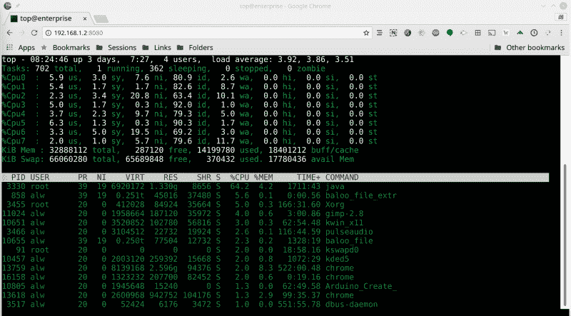
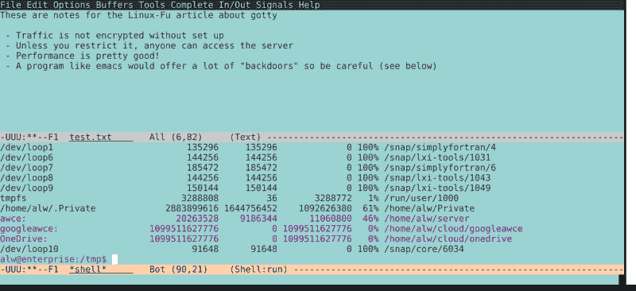

# Linux Fu:在浏览器中共享终端

> 原文：<https://hackaday.com/2018/12/21/linux-fu-share-terminal-in-browser/>

这篇文章的标题说明了一切: [GoTTY](https://github.com/yudai/gotty) 是一个让你在网络浏览器中分享 Linux 终端应用程序的程序。它是一个用 Go 编写的简单的 web 服务器，运行一个非 GUI 程序，并可以将它推出一个套接字，这样浏览器就可以显示它，并可以选择让用户与之交互。

随着如今对安全性的强调，这应该会引起你的警觉。毕竟，为什么要让一个 shell 在浏览器中运行呢？不过，等一下。虽然这是可能的，但并不总是不可取的，这种技术的真正价值是在浏览器窗口中运行特定的命令行程序。这里有一个用例:您希望用户使用`top`(或者`htop`，如果您喜欢的话)远程监控一个系统。但是你不希望用户登录系统，也不希望要求他们拥有`ssh`客户端。你不想安装监控工具，就用你已经有的。

如果您可以让 top 的输出显示在浏览器窗口中——即使用户没有能力输入——这将是一个简单的解决方案。当然，你可以在批处理模式下运行`top`，收集输出，并把它写在 web 服务器可以找到的地方。当然，假设您安装了 web 服务器。但是，如果您确实想要一些其他功能，比如使用命令行选项，或者让(希望)经过身份验证的用户与软件进行交互，那该怎么办呢？这就更复杂了。有了 GoTTY，事情就简单了。

## 装置

您可以在 GitHub 页面上找到完整的安装说明。但是如果你已经走了，最简单的方法就是:

```
go get github.com/yudai/gotty
```

这将程序放在您的 Go 二进制目录中，该目录可能不在您的路径中。对我来说，它在~/go/bin 中。您可以将该目录添加到路径中，在每次运行程序时指定它，创建一个别名，或者在路径中的某个位置创建一个符号链接。

## 简单测试

先说简单的:`gotty top`

[](https://hackaday.com/wp-content/uploads/2018/12/top1.png)

就是这样。它将在您当前机器的端口 8080 上运行。你将不能执行任何输入，所以你不能杀死进程或任何东西。如果你想要选项或者`htop`，你当然可以修改命令行。您在静态图像中看不到它，但是屏幕会更新，就像它在终端中运行一样。

服务器会一直运行，直到你杀死它。如果你没有把它发送到后台，一个控件+C 就可以了。如果还有人连接到服务器，您需要按两次 Control+C 键。很明显，有改变端口(`-p`)和地址(`-a`)的选项。您也可以创建自定义索引文件和标题。甚至有一种方法允许 URL 带有命令行参数，尽管要注意该选项的安全性。所有选项的文档都在 GitHub 上，或者向程序寻求帮助。

## 加密和认证

在这种情况下，我们大概不会太在意随机的陌生人是否能看到`top`的输出。当然，同样，如果你运行`gotty`的机器在入侵防火墙之后，外人无论如何也看不到。对于某些应用程序来说，这就足够了。但是，例如，如果我们允许输入(`gotty`的`-w`选项)，人们可能能够远程终止进程。在网上发布可能不是个好主意。

我们不以为然，但是你可以添加`-r`来获得一些非常低级的安全性。这给 URL 添加了一个随机位，这样不知道该 URL 的人就无法找到该页面。我们宁愿做些更聪明的事情。`-c`选项允许您进行基本认证。

`-c`的缺点是安全交易——连同所有进出浏览器的数据——是安全的。那不理想。有一个`-t`选项可以启用 TLS/SSL，当然，您需要设置证书来使用该选项。您可以在 GitHub 页面上阅读更多关于设置信息。

不过，你真的要好好考虑一下安全性。比如考虑这个看似无关痛痒的命令行:
`gotty -w emacs -nw /tmp/notes.txt`
[](https://hackaday.com/wp-content/uploads/2018/12/emacs.png)

当然，我们可以让人们在浏览器标签中编辑文件，而且效果很好。但是如果他们知道如何打开和编辑其他文件。他们甚至可以打开一个壳！哎呀。有了像`emacs`这样灵活的程序，你可能会想出如何限制它，但是你会非常确定你已经堵住了所有的漏洞。现在，如果你是安全的，经过认证和加密的，这并不比让某人在 T2 上运行 T1 更糟糕。但是，一如既往，你要小心。

## 多用户

另一个问题是，您可能有多个客户端连接到服务器。有一个`--once`选项可以让程序处理一个请求，然后退出。但是 GitHub 页面展示了使用`tmux`和 docker 为每个用户共享一个会话或者为每个用户创建新会话的例子。

有了`tmux`,你甚至可以设置在浏览器上分享你当前的桌面会话，这很方便。文档建议将其绑定到 Control+T:

```
# Start GoTTY in a new window with C-t
bind-key C-t new-window "gotty tmux attach -t `tmux display -p '#S'`"
```

## 因为它的外壳

如果你真的想要一个外壳，而不是一个程序，你可以考虑使用 Chrome 的`ssh`应用程序，或者其他一些在浏览器窗口放置`ssh`终端的方法。毕竟，`ssh`是认证用户和加密流量的黄金标准。如果您设置一个运行脚本的特定登录，您甚至可以获得类似于`GoTTY`的功能。小心点。任何时候你允许用户远程运行程序，你就增加了他们运行你不想要的程序的机会。

另一个选择是浏览 Linux Fu 的历史，阅读关于 XPRA 的文章。它可以在浏览器中共享一个 GUI 程序，也可以轻松地共享运行您想要的 Xterm 或其他终端程序。不过，同样的警告也适用。

是一种不能解决所有问题的解决方案，但是当你需要它所能做的事情时，它就能很好地工作，使原本困难的事情变得容易。对您的 Linux 工具包来说，这是一个不错的补充。