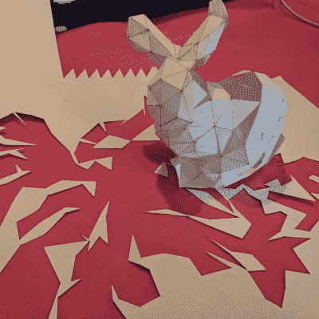

# 当在软件中展开 STL 时，数学不是棘手的部分

> 原文：<https://hackaday.com/2018/12/27/when-unfolding-an-stl-in-software-math-isnt-the-tricky-part/>

前一段时间，[Trammell Hudson]尝试用[创建一个工具，以 STL 格式展开 3D 模型](https://trmm.net/Unfolding_STL)，并输出彩色编码的 2D 图案，可以用激光切割机切割出来。只要稍加弯曲和粘合，3D 模型就可以用纸或纸板重新制作出来。

当然，还有其他更全功能的工具来展开 3D 模型: [Pepakura](http://www.tamasoft.co.jp/pepakura-en/) 被许多人使用，但不是免费的，而且只适用于 Windows。还有一个名为纸张模型的 [Blender 扩展，可以将 3D 形状导出为纸张模型。](https://en.blender.org/index.php/Extensions:2.6/Py/Scripts/Import-Export/Paper_Model)

[Trammell]项目的有趣之处在于他在制作过程中发现的东西。展开 STL 的过程在概念上可能很简单，但是实际的实现有点棘手，因为它与数字处理没有什么关系。

例如，从逻辑上讲，软件选择从哪里开始展开过程并不重要，但在实践中，一些起始点会产生更紧密的形状组，更容易处理。此外，他的软件没有优化折叠模式，所以有时软件会沿着一条完全符合逻辑(但对人来说不直观)的线分割形状，很难弄清楚哪些部分应该连接在哪里。该软件仍处于测试阶段，但感兴趣的人可以在 GitHub 上找到它。事实证明，将一个 3D 模型变成一个展开的形状，并且仍然带有视觉线索或与原始模型相似，这实际上是很有挑战性的。在适当的地方添加像标签这样的东西也不是小事。

展开 3D 模型的工具[在道具制作领域占据显著地位，](https://hackaday.com/2015/11/09/development-tools-of-the-prop-making-world/)这只是[一台经济型桌面切割机](https://hackaday.com/2017/08/01/a-case-for-the-desktop-vinyl-cutter/)可能成为一个人的工作室的有用补充的几个原因之一。