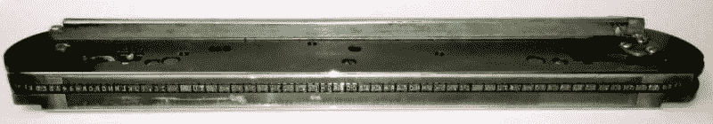

# 老式 IBM 1403 打印机问题逃避一个简单的修复

> 原文：<https://hackaday.com/2018/12/20/vintage-ibm-1403-printer-problem-evades-an-easy-fix/>

山景城的计算机历史博物馆有两台可运行的 IBM 1401 大型机，使用 IBM 1403 高速打印机。它们也不是几十年前的“高速”概念，在今天看起来也并不迟缓。多亏了一串旋转的打字棒和一排电磁锤，这些怪物每秒钟能打出十行字。每隔 11.1 微秒，链条中的一个字符将与一个锤子排成一行，如果控制电路将其识别为需要打印的字符，纸张后面的锤子将纸张推入打印色带和嵌条，将字符的印记印在纸张上。当其中一台打印机因同步错误而出现故障时，[它开始了一些严重的故障诊断，以诊断问题](http://www.righto.com/2018/12/hammer-time-fixing-printer-on-vintage.html)。

The IBM 1403’s type chain has a repeating set of characters that spins around at high speed. Unlike a typewriter or label maker, the hammers are not inside this unit. The hammers are on the outside, and work by pressing the paper onto the type slugs as the required characters line up.

对问题的调查最终导致驱动卡中的间歇性连接，原因是 PCB 走线断裂，但当时一些保险丝也已熔断。最后，打印机重新上线，但可能是其中一个锤子上的线圈有轻微损坏。

[Ken]对维修过程的记录非常详细，并介绍了解决老式电子产品问题时涉及的故障排除和维修。电气基础可能是相同的，但为了有效地排除故障，不仅需要深入了解架构，还需要深入了解老式硬件的故障模式。

如果 IBM 1401 大型机和修复 1403 打印机听起来很熟悉，那是因为在之前[已经完成了一次打印机修复。这是由于一个不同的问题，但仍然是一个具有挑战性的任务来缩小和修复。](https://hackaday.com/2018/09/20/fixing-an-ibm-1401-computer-to-get-it-printing-again/)