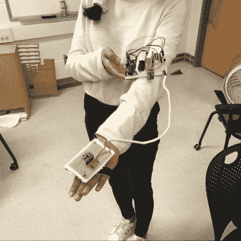

# 一种不同的手控车辆

> 原文：<https://hackaday.com/2018/12/28/a-different-kind-of-hand-controlled-vehicle/>

众所周知，人类日常使用的大多数交通工具都带有某种手控界面。然而，这个由[Avisha Kumar]和[Leul Tesfaye]创作的作品展示了一个完全不同的视角。单个运动输入提供转向和前进/后退油门控制。

The hand controller lives on a protoboard for ease of testing.

该项目包括一辆小型汽车，由后部的电动马达驱动，前部有一个伺服控制的脚轮用于转向。通过蓝牙接收信号的 PIC32 微控制器提供控制。这款汽车由一个手动控制器控制，这是字面上的意思——由一个测量用户手的俯仰和滚动位置的加速度计组成。通过向左和向右倾斜手来影响转向，而手前后旋转来控制油门。休息后的视频。

该项目是为康奈尔大学的一门课程而设计的，因此被很好地记录了下来。它为读取传感器输入和发送/接收数据提供了一个很好的例子。实际使用的微控制器没有机器人概念的“Hello World”的基本演示重要。把这个放在你的后口袋里，下次你想带一个新的筹码出去玩的时候用！

我们以前见过类似的工作，[用手工控制器，只用电位计和砝码](https://hackaday.com/2018/09/29/gesture-control-without-fancy-sensors-just-pots-and-weights/)。

 [https://www.youtube.com/embed/FOQ4aek5ODA?version=3&rel=1&showsearch=0&showinfo=1&iv_load_policy=1&fs=1&hl=en-US&autohide=2&wmode=transparent](https://www.youtube.com/embed/FOQ4aek5ODA?version=3&rel=1&showsearch=0&showinfo=1&iv_load_policy=1&fs=1&hl=en-US&autohide=2&wmode=transparent)

