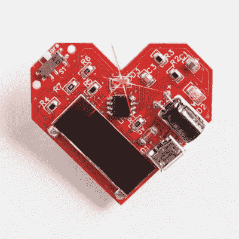
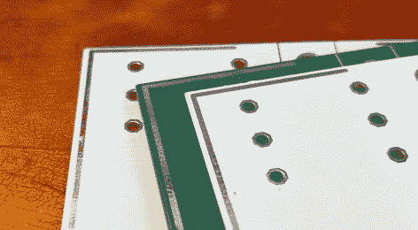
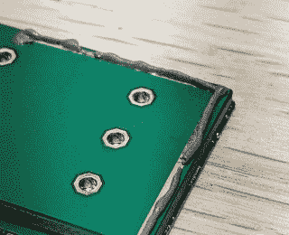
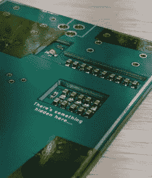
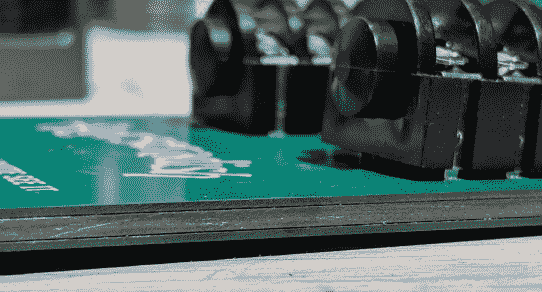
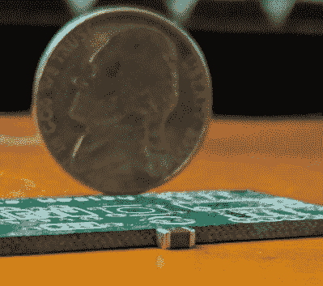
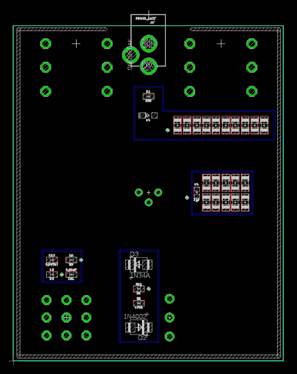
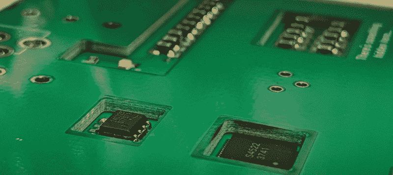
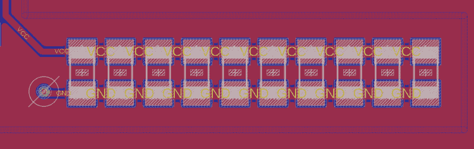

# 奥利奥建筑:把你的元件藏在 PCB 里面

> 原文：<https://hackaday.com/2019/01/18/oreo-construction-hiding-your-components-inside-the-pcb/>

最近几个月，将元件隐藏在电路板内部的能力已经成为人们感兴趣的项目。我们*可以*将此追溯到蓬勃发展的 badgelife 运动，工程师们在那里创造出美丽的电子艺术作品。我们也可以将这种兴趣归因于[彭博的*大黑客*，乔丹·罗伯逊和迈克尔·莱利断言苹果是中国利用嵌入主板的组件进行间谍活动的目标。大黑客的故事是有根据的，但是到目前为止还没有证据表明这种黑客的存在，相关的公司和政府都否认有类似的事情存在。](https://www.bloomberg.com/news/features/2018-10-04/the-big-hack-how-china-used-a-tiny-chip-to-infiltrate-america-s-top-companies)

也就是说，在 PCB 中嵌入元件是一个有趣的讨论话题，由于 PCB 制造价格的下降(整个项目的电路板成本为 15 美元)，现在业余爱好者可以试验这项技术。

但首先，重要的是定义什么是“玻璃纤维内部的填充成分”。我的研究不断回到“嵌入式组件”这个词，这是一个完全不可理解的，也是一个真正可怕的名字，因为“嵌入式”完全意味着别的东西。你不能把一种 PCB 制造技术称为“嵌入式元件”,然后期望人们在互联网上找到它。由于缺乏更好的术语，我称之为“奥利奥建筑”，因为我偏爱“填充”，也因为它需要被称为*什么的*。我们现在都叫它“奥利奥建筑”,因为馅料在中间。这就是你如何用标准 PCB 设计工具和便宜的中国板房做到的。

## 以前的工作

Lumen Electronic Jewelry. Note the capacitor and USB port mounted in a cutout in the PCB.

这个建筑的直接灵感来自于[设计师 2k2 和一个扁平包装的圣诞装饰品](https://hackaday.com/2018/11/28/advances-in-flat-pack-pcbs/)。该项目使用齿形引脚和一系列孔将 SMD 器件安装到 PCB 的侧面，而不是顶部或底部。虽然将电子元件焊接到 PCB 的侧面有些新颖，但是*将*电子元件安装到 PCB 的侧面并不是什么新鲜事。 [Lumen Electronic Jewelry](http://www.lumenelectronicjewelry.com/product/blinky-led-red-heart-pin/) 正在生产一个 PCB“心脏”引脚(右)，它带有一个电容器和 USB 端口，安装在 PCB 铣削层的一个切口内。同样，其他 PCB 项目(主要是 PCB 名片)也尝试在铣削层的切口中安装其他元件。我见过硬币电池座，它使用带有两个“标签”的 PCB 切口，将电池夹在玻璃纤维之间。

在一堆玻璃纤维和铜中嵌入元件的想法在小规模的业余爱好者世界中是我们从未见过的，但这是可以做到的。嵌入式组件——这又是一个不可理解的术语——可以在非常昂贵的产品中实现。这样做的原因包括节省物理空间、更好的 EMI 屏蔽以及使某些东西更难逆向工程。这是一种用于军事和航空部件的技术，价格不是问题。

用于军事和航空航天工作的电路板是一回事，但在过去的一年里，人们对嵌入式元件进行了大量的讨论，尽管理由都是错误的。彭博的大黑客事件是一个关于运送到苹果和亚马逊的超微主板的故事，这些主板有额外的组件给中国黑客提供了后门。这个故事受到了广泛的批评，苹果和亚马逊都强烈否认发现了受损的主板，而且*现在*我期待超微提起诽谤诉讼。然而，这个故事确实引发了许多关于这种黑客攻击如何发生的讨论。Twitterverse 的顶级人士认为，这可以通过在主板的 PCB 中嵌入一个小的微控制器来实现，位于基板管理控制器和闪存之间。这个卡在几层 PCB 之间的小微控制器理论上可以改变 BMC 的一些闪存，给攻击者提供一个后门， [Trammel Hudson 在 CCC 做了一个有趣的演讲，讨论这个虚构的黑客操作的理论](https://trmm.net/Modchips)。这是有可能的，但有消息称，运送到亚马逊或谷歌的超微主板不会出现这种情况。在任何情况下，x 射线检测甚至飞针检测都会发现 PCB 中有任何“嵌入元件”。

## 分层印刷电路板

对于这种构建，我通过用焊料将 PCB 层机械结合在一起，稍微扩展了这些技术。这之前是由 Voja Antonic 和他用 FR4 建造围栏的工作完成的。他的方法是在外壳的四周制造一条裸铜带。通过以正确的角度安装外壳的这些侧面，将 PCB 的两个平面焊接成三维形状就像在周边裸露的铜上运行烙铁一样简单。

  Each layer of the stack has a thin strip of exposed copper running around the perimeter.  For assembly, the perimeter copper layer is covered in solder paste

叠层中的每个 PCB 都有裸露的铜线。通过使用焊膏，将电路板夹紧在一起，就可以进行回流焊接了。

  Assembly is aided with Kapton tape  The finished edge of the PCB stack. This can be cleaned up even more with a bit of 800 grit sandpaper

我用 Kapton 胶带作为夹紧方法，因为它可以承受烤箱的热量。烘焙后，你只需要用砂纸清理边缘。

## 这个电路

这个建筑的电路是一个吉他踏板。更具体地说，这是一个达拉斯 Rangemaster 的轻微修改，实际原理图是从[Fuzz Central](http://fuzzcentral.ssguitar.com/rangemaster.php)(range blaster)借来的。以吉他踏板的形式展示这种 PCB 技术，尤其是使用 Rangemaster 电路，有几个原因。

A capacitor is just barely thin enough to fit inside a PCB

之所以选择 Rangemaster 电路，是因为它非常简单。它只有一个锗晶体管和一些电阻和电容。我之所以选择将 Rangemaster 电路放在 PCB 内部，完全是因为元件数量的原因；它是做某事的最简单的电路。至于在吉他踏板中演示这种技术，我有更险恶的原因。吉他踏板市场比音响发烧友市场更没有意义。如果你想出一个电路，并在环氧树脂涂层，你就做了一个 1000 美元的踏板。不，那不是玩笑。我只是用一个有趣的制作过程来利用消费者的轻信。

电路的基础正是你所期望的吉他踏板:有一个 3PDT 脚踏开关，一对 1/4”插孔，一个 2.1 毫米 DC 插孔(中心负，因为老板)，和一个标准 PCB 安装锅 10k，音频锥。该电路的有源部分是一个采用 TO-5 封装的老式 OC44 晶体管。这些是成品 PCB 上唯一可见的元件。

The completed PCB, traces not shown, but with the layer 200 used for creating cutouts

该电路板首先在逻辑位置布局通孔元件，然后在有意义的位置放置表面贴装元件。同样，在原理图中，这是一个极其简单的电路，只有不到 12 个器件。完成后，只需将 PCB 复制到一个新文件中，并在零件周围添加剪切部分。该板是在 Eagle 中完成的，这使我能够在板上添加许多层，然后可以添加到 CAM 管理器来创建 Gerbers。

这项技术的真正“诀窍”是将元件封装在 PCB 叠层中。虽然这可以通过每层 1.6 毫米的标准 PCB 厚度来实现(完整封装需要三层，最终厚度为 4.8 毫米)，但我在顶层和底层使用了 0.6 毫米厚的 PCB。这导致最终厚度为 2.8 毫米。这是足够薄，组装件不会在你的脑海中注册为一堆 PCB。它足够薄，人们很容易相信这只是一个普通的 PCB。

创建 PCB 很容易，如果你知道你的板房能做什么，在板上创建内部切口也很容易。之前的千言万语绝对没有什么新意。奥利奥构造的诀窍是将各层机械粘合在一起。这可以用胶水和树脂来完成，但借鉴了 Voja 的工作，我决定用焊料将 PCB 的一层连接到另一层。这是通过围绕周界的铜走线实现的，与任何接地层或浇注层断开连接。

组装过程简单到用表面安装元件组装和焊接底层电路板，最好用无铅焊膏。然后，将含铅焊膏涂在周边走线上，将电路板夹在一起，并将整个组件放入回流焊炉。之后，它只是一个简单的问题，填充通孔组件。

To demonstrate this technique further, this PCB includes an SOIC-8 package and a QFN-60 package. These components are thinner than the 1.6mm ‘spacer’ PCB.

我还考虑了其他方法来将这些不同的 PCB 连接在一起。我可以用通孔和通孔将它们“缝合”在一起，使用小金属丝来对齐，并用焊料将各层机械连接在一起。

## 这项技术的局限性和进一步研究的领域

虽然可以在一堆 PCB 中嵌入电容、电阻和微控制器，但还是有一些限制。首先，Rangemaster 克隆电路需要 47 μF 电容。这个值对于小的 SMD 电容来说太大了，我能找到的最小的电容也就 10 毫米厚。除非你想要半英寸厚的电路板，否则这些盖子太大了。解决此问题的方法是并行添加许多 cap。

这就引出了另一个问题。最初的电路使用电解电容，而不是小型陶瓷电容。因为我使用的是陶瓷电容阵列，所以实际电容小于阵列中所有电容的总和。MLCC 电容在偏置时应该降额(当它们用作旁路电容时就是这样)，并且我“构建”的电容在电路中没有正确的值。是的，陶瓷电容器的电容取决于它们的电压，但是你可以通过简单地增加*甚至更多的*电容器来解决这个问题。

To get the required capacitance in the circuit, you need to add caps in parallel.

此外，任何使用这种技术的项目都不能使用大型部件。如果你有一个小升压电源的项目，你可能有一个相对较大的电感。对于大功率电源来说，足够额定值的电感将会太高，无法嵌入到单层 FR4 中。处理高功率的组件也是如此，因为它们通常体积很大，必须散热，后者对于实际上被困在玻璃纤维盒内的组件来说是一个问题。

尽管存在问题，但这是一种有趣的 PCB 制造技术。结合定制 PCB 价格的下降——整个项目的电路板总成本不到 15 美元——我希望看到许多 PCB 工匠采用这种技术。

这个项目只是展示了奥利奥建筑的可能性，但考虑到艺术印刷电路板的巨大进步，这绝不是可能的极限。鉴于我们现在处于反向安装 led 的黄金时代，有可能将驱动器和 led 封装在玻璃纤维内的巨大矩阵中。有了奥利奥的构造，整个 PCB 在关闭时可能只是一块玻璃纤维砖，打开时可能是一个发光的矩形。

如果你想知道这个奥利奥建筑吉他踏板听起来像什么，那么，它是一个 Rangemaster 高音助推器。布莱恩·梅为《皇后乐队》创作的吉他作品是最受欢迎的例子，但是布莱恩·梅有点太独特了，很难真正感受到这听起来像什么。一个更好的例子是《黑色安息日》中的托尼·伊莫米，或者是《蓝调断路器》专辑中的克拉普顿。这是一个很大的声音领域，[但这是一个比我能制作的任何东西都好的 Rangemaster](https://www.youtube.com/watch?v=p5PbyqIdjGw) 的演示。无论如何，这背后的整个想法是在 PCB 内部构建尽可能简单的电路，而不是做任何花哨的事情。Rangemaster 是一个晶体管，这就是我做的。