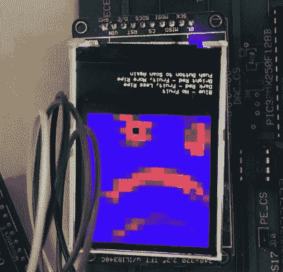

# 老式绘图仪转向水果光谱仪

> 原文：<https://hackaday.com/2018/12/14/vintage-plotter-turned-fruit-spectrometer/>

水果可能是一件棘手的事情:如果你买熟了，你会争分夺秒地在它们变成糊状之前吃掉它们，但如果你买的是稍微提前一点的，就不太容易知道它们什么时候可以吃了。你闻到了吗？挤？把它扔在柜台上，看看它会不会反弹？最终你会忘记它们，它们还是会变坏。这就是为什么在 Hackaday 我们只靠收集雨水和热稳定军用口粮来维持生命。

 但值得庆幸的是[康乃尔大学的学生【克里斯蒂娜·张】、【米歇尔·冯】和【拉塞尔·席尔瓦】已经想出了一个令人欣喜的高科技解决方案来解决这个显然科技含量很低的问题](http://people.ece.cornell.edu/land/courses/ece4760/FinalProjects/f2018/cc2294_mf568_rms438/cc2294_mf568_rms438/cc2294_mf568_rms438/index.html)。他们提出了一种自动化系统，使用电动光谱仪扫描水果排列，而不是依靠人类的感官来确定装满水果的柜台何时成熟。该设备测量水果在 678 纳米的反射率，可用于确定叶绿素 a 的表面浓度；成熟的主要标志。

如果这听起来有点超出你的工资级别，不要担心。学生们能够使用 20 世纪 80 年代的绘图仪、Raspberry Pi 和 SparkFun 的低成本 AS7263 NIR 光谱传感器构建功能原型，该传感器恰好具有 680 nm 的峰值响应度。扫描由 PIC32MX250F128B 开发板执行，该开发板连接有 TFT LCD 显示器，因此可以轻松查看结果。Raspberry Pi 与 Adafruit PCA9685 I2C PWM 驱动器配合使用，控制绘图仪的步进电机。扫描和电机控制可以单独使用 PIC32 来完成，但为了节省时间，学生们决定使用 Raspberry Pi 来命令 PCA9685，因为这正是文档和软件易于获得的。

 为了进行扫描，步进电机将 AS7263 传感器模块归位，然后让它从放在透明丙烯酸板上的水果下面通过。移动丙烯酸片的长度，传感器不仅能够扫描多片水果，而且能够扫描每片水果的整体；允许它确定例如香蕉的一部分是否已经翻转。水果的相对成熟度在 LCD 显示器上以热图的形式显示给用户:颜色越亮，水果越熟。

在他们论文的最后，[Christina]、[Michelle]和[Russell]指出，尽管扫描仪工作良好，但仍有改进的空间。一种更科学的方法来计算每个水果的成熟程度将使设备更加准确，并消除最终用户的猜测工作，颜色较深的水果的问题可能会通过额外的校准来解决。

虽然光谱仪听起来像是只存在于数百万美元的研究实验室中的那种设备，但我们偶尔会看到这样的项目，这使得该技术更容易获得。今年我们在 Hackaday 奖中看到了[一个紧凑型光谱仪，回到更早的时候，我们甚至特写了一篇](https://hackaday.com/2018/05/29/tiny-25-spectrometer-aims-to-identify-materials-with-ease/)[的综述，其中一些最令人印象深刻的光谱仪是基于 Hackaday.io](https://hackaday.com/2016/08/27/hacklet-122-spectrometers/) 构建的。

 [https://www.youtube.com/embed/WIjXaIwiui0?version=3&rel=1&showsearch=0&showinfo=1&iv_load_policy=1&fs=1&hl=en-US&autohide=2&wmode=transparent](https://www.youtube.com/embed/WIjXaIwiui0?version=3&rel=1&showsearch=0&showinfo=1&iv_load_policy=1&fs=1&hl=en-US&autohide=2&wmode=transparent)

感谢布鲁斯·兰德的提示。]