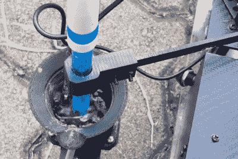

# Hexagrow 机器人包一个严重的传感器包

> 原文：<https://hackaday.com/2018/12/19/hexagrow-robot-packs-a-serious-sensor-package/>

自动化是许多行业的崇高目标，但执行起来并不总是那么简单。在生产线的受控环境中焊接车身相对简单。然而，由于不可预测的有机过程，在温室中维护植物会带来一定的复杂性。Hexagrow 是一个旨在研究该领域自动化的机器人，是作为【Mithira Udugama】及其团队的最后一年项目开发的。

机器人的底盘是一个非常现代的建筑，由碳纤维面板和 3D 打印组件组成。这种强度对于应用来说可能是多余的，但如果材料使用正确，它会成为一个非常轻和刚性的机器人。

Testing soil pH isn’t easy, but Hexagrow is up to the challenge.

然而，这种构造真正闪光的地方是传感器封装。正如我们所料，这里有温度和湿度传感器以及土壤湿度探测器等常规设备。但还有更多，包括一个令人印象深刻的土壤 pH 值测试仪。这涉及到一个带铲子的机器人手臂来收集土壤样本，然后由称重传感器称重。然后用它来确定添加到样品中的正确水量。然后搅拌混合物，然后用探针测试以确定 pH 值。它让人回忆起火星探测器上的科学包，很高兴在大学项目建设中看到这种复杂程度。甚至有一个激光雷达安装在顶部用于导航目的，尽管尚不清楚这种传感器是否在开发的这一点上实际使用。

植物可能对它们的看护者要求很高，[所以也许你最好检查一下你测量的土壤湿度是否正确？休息后的视频。](https://hackaday.com/2017/11/16/sensing-soil-moisture-youre-doing-it-wrong/)

【感谢 Baldpower 的提示！]

 [https://www.youtube.com/embed/OqOk3B07x10?version=3&rel=1&showsearch=0&showinfo=1&iv_load_policy=1&fs=1&hl=en-US&autohide=2&wmode=transparent](https://www.youtube.com/embed/OqOk3B07x10?version=3&rel=1&showsearch=0&showinfo=1&iv_load_policy=1&fs=1&hl=en-US&autohide=2&wmode=transparent)

