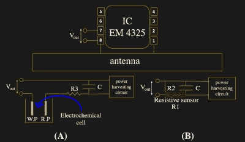

# RFID 不仅仅是 ID

> 原文：<https://hackaday.com/2018/12/30/rfid-doing-more-than-id/>

RFID 是工业、商业和消费市场的主力。无源标签，如工作证和钥匙链，需要基站，但不需要标签。传感器是一个巨大的市场，将传感器放在难以触及、敌对或移动的地方是一个昂贵的提议。在麻省理工学院自动识别实验室的帮助下，价格可能会下降，传感器可能会更容易接近[，他们正在](http://autoid.mit.edu/current-research-topics/tag-antenna-based-sensing-tabs)[试验传感器对 RFID 设备的反馈](http://news.mit.edu/2018/mit-engineers-configure-rfid-tags-to-work-as-sensors-0613)。

 假设你要测量一桶加压酸的温度。你不愿意在上面钻一个洞来插入温度计，但密封在 Pyrex 中的温度传感器可以无线传输数据，并且永远不会耗尽电力，这是一种永久而廉价的解决方案。研究人员将目光投向了葡萄糖传感，这一消息是在 Alphabet 放弃 RFID 探索[通过隐形眼镜](https://hackaday.com/2018/12/03/why-is-continuous-glucose-monitoring-so-hard/)测量葡萄糖后不久传出的。本文顶部显示的是电池辅助无源(BAP) RFID 传感器的原型，该传感器使用商用葡萄糖测试条，在电化学反应发生时发送数据。它使用六个并联的电池来获得足够高的峰值电流来触发传输。但是这篇论文(10.1109/RFID.2018.8376201 [在付费墙](https://ieeexplore.ieee.org/document/8376201)后面)提到了一些改善这种情况的策略。然而，它确实证明了这样的概念，即来自测试条的电流尖峰决定了标签激活的时间，并且可以与检测到的血糖相关联。

我们自己的项目中有多少会因为增加了几个传感器而立即升级，而这些传感器在黑客预算中是无法获得的？如果有更多的监控，啤酒会酿造得更好吗？有多少[可穿戴设备](https://hackaday.com/2018/11/04/touchyou-wearable-touch-sensor-and-stimulator/)可以配备无电池附件？天空是比喻的界限。

谢谢[QES]的提示[via [TechXplore](https://techxplore.com/news/2018-06-configure-rfid-tags-sensors.html)