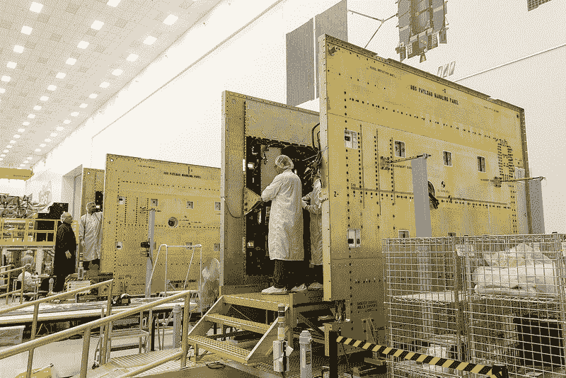
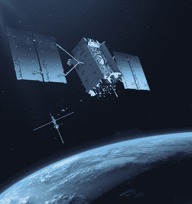

# GPS III 今天发射，但你要到 2022 年才能使用它

> 原文：<https://hackaday.com/2018/12/18/gps-iii-launching-today-but-you-cant-use-it-until-2022/>

想象一下，如果你买了一辆新车，但钥匙要到几年后才能送到你手里。这类似于美国空军发现自己所处的情况。第一颗 GPS III 卫星终于准备好发射了，今天，2018 年 12 月 18 日——比原定计划多了两年多一点。然而，根据 2017 年政府会计办公室(GAO)提交给国会的报告，大多数独特的 GPS III 功能至少要到 2022 年才能使用。

GPS III 是一个发射 32 颗新卫星的项目，对军事用户来说，这些卫星更难被干扰。对于民用用户，新的 GPS 卫星将与其他系统兼容，包括欧盟的伽利略系统。但是大抽奖呢？大约是目前系统精确度的三倍。对于民用，这意味着在良好的条件下 3 到 10 英尺，而不是目前系统的 10 到 33 英尺的分辨率。

## 不会这么快就来

真正延迟的不是卫星本身，而是新的地面控制系统。就目前而言，在 2022 年或 2023 年之前，只有几项军事效益，没有一项民用效益。地面站项目，称为操作控制系统(OCX)，现在已经落后了 4 年，预计将超过预算 25 亿美元。国防部指责解决网络安全问题的需要是造成至少部分入侵的原因。有一点是有希望的:主承包商雷神公司声称他们将在 2021 年交付，超过 GAO 的估计。

Several GPS III satellites under construction

即使是增强的军事性能也是有代价的:他们已经决定升级现有的控制中心，并为许多军事系统开发改装套件，以便他们可以在 OCX 上线之前使用新的卫星。

将这些权宜措施落实到位是一个好主意，因为当前的卫星时间不多了。最近的预测给了卫星舰队比以前想象的更多的时间，但根据目前的估计，到 2021 年 6 月，它们将需要更换。所以一方面，他们想让卫星进入轨道是可以理解的。然而，正如美国政府问责局指出的那样，如果加强协调，不需要采取临时缓解措施，本可以节省相当多的资金。

## GPS、阿波罗和大型项目

 当然，一个政府项目超支并不奇怪。你可以找到很多关于如何激励公司做出现实评估的好主意。然而，有一件事我们注意到似乎总是很奇怪。想想我们去月球的时候。1962 年，当肯尼迪发表他的“我们选择去月球！”演讲，没有一个单一的计划来建造和发射阿波罗太空舱。我们采取了“爬、走、跑”的方法，从小处着手，朝着最终目标不断努力。

那似乎不再经常发生了。我们直接跳到游戏的结尾，如果你能做到的话，那就太好了。但是它确实会导致大量的成本和进度超支以及更高的开发风险。在这种情况下，数百万人所依赖的整个系统正在升级，一些关键的瓶颈导致了当前的痛苦。尽管如此，你会认为你可以在发射卫星之前，或者至少在接近同一时间，把地面站准备好。

当然，从企业利润方面来说，更有意义。想象一下，如果有人付钱给你重铺一段 20 英里长的高速公路。你会一次撕一英里吗？如果你跑了 10 英里后，你超出了预算，有人可能会说，“好吧，让我们停在这里，明年再做剩下的 10 英里。”但是如果你的第一个任务是把整个 20 英里的路都拆掉，他们将不得不继续付钱给你来修理它，即使面临超支。这些替换卫星是向后兼容的，但为了利用所有的新功能，我们需要 OCX 地面站形式的“20 英里的路”。

如果你需要温习一下全球定位系统是如何工作的，请查阅理查德·巴古里的关于全球定位系统的 T2 初级读本。话说回来，GPS 不再是唯一的游戏了。除了欧盟，其他几个政府也在运行类似的系统，包括来自俄国的 [GLONASS](https://hackaday.com/2015/09/08/arduino-tinygps-updated-to-support-glonass/) 。