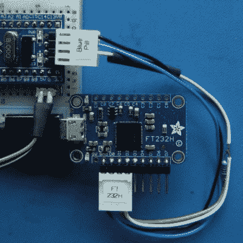

# 在 Python 中使用 FTDI 芯片

> 原文：<https://hackaday.com/2018/12/19/using-ftdi-chips-with-python/>

FTDI 是一家以生产 USB 应用芯片而闻名的公司。我们大多数人都有一些 USB 转串行适配器，其中大多数运行在 FTDI 硬件上(或者，如果我们诚实的话，是假冒的)。然而，FTDI 的硬件提供了更多的东西，而[【Jay Ben】在这里向我们展示了如何使用 Python](https://iosoft.blog/ftdi-python/) 来利用它。

FTDI chips are an effective way to debug ARM projects, using the SWD protocol.

FTDI 的芯片具有不同的功能，但大多数不仅仅是作为 USB 连接的 COM 端口。可以将芯片用于 SPI、I2C 甚至位碰撞操作。[jayben]已经完成了根据您的操作系统确定最佳驱动程序的艰苦工作，然后进一步演示了通过这些不同的接口发送数据的示例代码。这篇文章不仅介绍了代码，还展示了输出的示波器痕迹，让读者很好地理解如果一切正常运行，应该会发生什么。本系列的最后一部分是关于如何使用 FTDI 硬件将 SWD 协议与 ARM 设备进行高级调试的初级读本。

这是关于如何有效地使用这些有用的芯片的很好的入门，我们想象将会有大量的黑客会发现这些信息的巨大用途。当然，在采购硬件时一定要小心，因为 FTDI 驱动程序不喜欢假芯片。