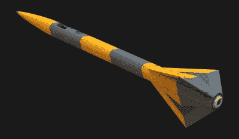

# Cortex 2 是一个真正的 3D 打印实验火箭

> 原文：<https://hackaday.com/2018/12/25/cortex-2-is-one-serious-3d-printed-experimental-rocket/>

Rocketry 是野生的，[Foaly]正在分享完全 3D 打印的 *Cortex 2* 迷你火箭的建造和设计细节。不要让这愚弄你，让你认为这是一个噱头；《T4》Cortex 2 是一项严肃的工程，有一些令人着迷的进展。

* Cortex 1* 作为 [C'Space](https://www.planete-sciences.org/espace/Evenements/C-Space/) 的一部分被发射，这是一项允许学生发射实验火箭的活动。 *S* 装有传感器并完全 3D 打印， *Cortex 1* 飞行良好，但降落伞未能展开，主要原因是粘合组件不完善。舱门找到了，但火箭丢失了。吸取了教训，并在活动结束前起草了 Cortex 2。

一些变化包括调整形状和减轻重量，这些改进还导致鳍的数量从四个减少到三个。皮质 2 的鳍片也用碳纤维插件加固，并用螺栓固定在主体上。

这里有一个有趣的细节:显然保持原来的鳍会导致火箭“过度稳定”。我们真的没有意识到那是一件事。过度稳定的结果类似于增益太高的 PID 回路，并且过度校正导致振荡而不是良好的稳定轨迹。

Cortex 2 使用了与其前代不同的火箭发动机，这导致了另一个有趣的设计问题。这种新型发动机类似于 hobby 固体火箭发动机，发动机顶部的一个小炸药在燃料耗尽后爆炸一段时间。这种充电是为了弹出降落伞，但 *Cortex 2* 不是为使用这种方法而设计的，所以气体必须被排出。[Foaly]对通过主要由 PLA 制成的火箭体排出热气不感兴趣，这是可以理解的。取而代之的是，一个圆柱形的弹药筒被设计成既能包住发动机，又能将炸药中的任何气体从火箭尾部排出。那颗子弹是 SLA 打印出来的，在我们看来像是 Formlabs 的[高温树脂](https://formlabs.com/materials/engineering/#high-temp-overview)。

最后，为了解决 Cortex 1 号坠毁的原因，舱门和降落伞被重新设计以获得更好的可靠性。伺服系统负责激活系统，几个极性相反的磁铁帮助确保舱门畅通。甚至还有一个小型伺服机构负责收回发射指南。

到目前为止，火箭只建造了一半，但看起来绝对棒极了，我们迫不及待地想看到更多。很明显[Foaly]有丰富的经验和知识。毕竟【Foaly】确实[把 Makerbot 打印机改装成了 CNC 电路板雕刻机](https://hackaday.com/2018/06/25/makerbot-printer-reborn-as-pcb-engraver/)。