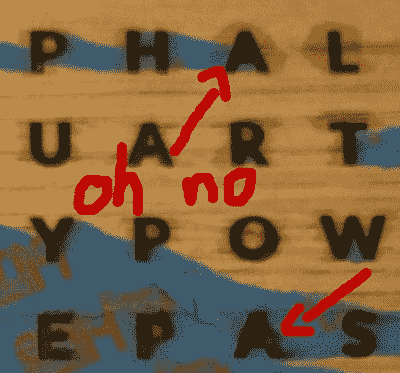

# 字钟不需要模版字体

> 原文：<https://hackaday.com/2018/12/26/word-clock-dont-need-no-stencil-font/>

单词钟使用自然语言来显示时间。在过去 20 年左右的时间里，它们一直很流行，因为低成本的数字技术使它们特别具有成本效益，并且容易为普通制造商制造。硬件和软件是一个已经解决的问题，所以表现就是一切。幸运的是，[watsaig]的努力没有让人失望。

建造开始时只有 7 天的时间——考虑到[watsaig]缺乏激光切割和木工经验，这是一个很短的时间。不满足于让这成为阻碍，是时候开始工作了。在激光切割真正开始之前，木材是从亚马逊采购的，设计也已经布置好了。

 [watsaig]决定用环氧树脂填充所有的字母，以获得平整的表面，同时也作为 led 的扩散器。为了避免使用难看的模板字体，像 O、A 和 R 这样的字母的中心(剪切部分)必须手工放置。不幸的是，他的结果很糟糕。当使用涂刷法将环氧树脂涂在字母上时，嵌入物容易移位，损坏面板。

没有被吓倒，钟面被从头开始重建，并确定移液管是一个更合适的工具，允许字母填充环氧树脂，而不会过度干扰字母插入。最终的结果是视觉上有吸引力的，完成了一个美妙的染色，并给予一个令人愉快的光芒，感谢对扩散和掩蔽的精心注意。隐藏的生日快乐信息可能在匆忙中丢失了，但毕竟是心意最重要。

对于大陆拍摄，[看看这个加泰罗尼亚语的单词时钟](https://hackaday.com/2016/08/24/realize-the-truth-there-is-no-word-clock/)。