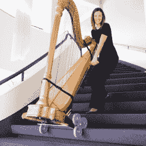

# 激光竖琴听起来很真实，这要归功于卡普勒斯-强波动方程

> 原文：<https://hackaday.com/2018/12/29/laser-harp-sounds-real-thanks-to-karplus-strong-wave-equation/>

竖琴是一种古老的乐器，但在目前的形式下，它显得如此笨拙，以至于有人学习演奏它是一个奇迹。从学校带着租来的小号或单簧管回家练习是一回事，但安全运输音乐会竖琴真的很麻烦。下图与激光竖琴项目无关，但证明了便携式竖琴需要一些好的技巧。

Concert grand harps are so big there’s special equipment to move them around. This thing’s called the [HarpCaddy](https://harpcaddy.com/product/original-model/")

进入[这个激光竖琴](http://people.ece.cornell.edu/land/courses/ece4760/FinalProjects/f2018/ajh322_glz6/ajh322_glz6/ajh322_glz6/index.html)，这是【布鲁斯·兰德】在康奈尔大学的微控制器课程的另一个学期项目。通过用瞄准光电晶体管的激光取代琴弦，[Glenna]和[Alex]能够创造一种更易于管理的乐器，可以用类似的方式演奏。“琴弦”是用手指“拨”出来的，手指挡住了激光，产生了音符。

但是这些不仅仅是旧的微控制器产生的声音。PIC32 不是简单地产生音调或控制合成器，而是使用 Karplus-Strong 算法来模拟拨弦的振动。结果非常真实，包含了您期望从拨弦中听到的所有泛音。[Alex]在下面的视频中很好地展示了竖琴的性能，报道也是一流的。

像激光竖琴这样独特的乐器在这些地区并不罕见。我们已经见过一些看起来像传统竖琴的和需要激光护目镜才能安全演奏的[竖琴](https://hackaday.com/2013/10/30/impressive-laser-harp/)，但是这个实际上看起来和听起来都像真的一样。

 [https://www.youtube.com/embed/kHuugv6sa_U?version=3&rel=1&showsearch=0&showinfo=1&iv_load_policy=1&fs=1&hl=en-US&autohide=2&wmode=transparent](https://www.youtube.com/embed/kHuugv6sa_U?version=3&rel=1&showsearch=0&showinfo=1&iv_load_policy=1&fs=1&hl=en-US&autohide=2&wmode=transparent)

