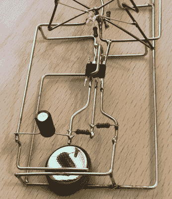

# 我们梦想着一个电路雕塑圣诞节

> 原文：<https://hackaday.com/2018/12/21/were-dreaming-of-a-circuit-sculpture-christmas/>

无论你是否选择相信我们的说法，即我们是这样计划的，这个假期恰好发生在我们正在进行的[电路雕塑大赛](https://hackaday.io/contest/162559-circuit-sculpture-contest)期间，该比赛要求黑客们建造出真正艺术作品的电路。旋转自己的 PCB 变得几乎太容易了，所以为什么不尝试一下在没有网络的情况下构建三维电路呢？假期是一个完美的时间，因为它不仅是工作、学校或强迫劳动营的缓刑，通常会占用我们醒着的时间，但也可以是灵感的来源。

 举个例子，这位[的节日 LED 圣诞树的参赛作品由【文森特·梅克斯】](https://hackaday.io/project/162741-ne555-christmas-tree)提供。这一个真的有它的一切:一个可识别的主题，奇妙的电线工作，大量的发光二极管，并在触摸，肯定会高兴，甚至电子 Scrooges 在我们的读者群中，他做这一切与古老的 555 定时器。这才是赛道雕塑大赛的真正意义所在:选择一条可能非常普通的赛道，将它变成真正独一无二的东西。

精明的黑客读者(好像还有其他类型的)可能会注意到树下实际上有两个 NE555 定时器，每个以不同的频率闪烁各自的 led。这使得最终的结果更有活力，通过一些最后的修改，[Vincent]能够将它们连接到一个电源上，以真正抓住比赛的极简主义精神。

作为给我们所有人的提前圣诞礼物，[文森特]已经做了出色的工作记录这个建筑，所以任何人都希望给他们的年终派对注入一点二极管驱动的节日欢呼可以跟随。他包括了构建说明以及电路图，尽管我们鼓励任何想要自己制作一个的人进行一些实验，并在上面加入自己的想法。毕竟这应该是艺术。

还有足够的时间让你自己报名参加电路雕塑比赛，无论是与圣诞相关的还是其他的。只需在 Hackaday.io 上记录您的构建，并在 2019 年 1 月 8 日截止日期前提交即可。记住，参赛作品不能*只是*看起来很酷，它们还需要功能性。一般来说，这是生活的准则，但当它们成为竞赛的规则时，就更加重要了。